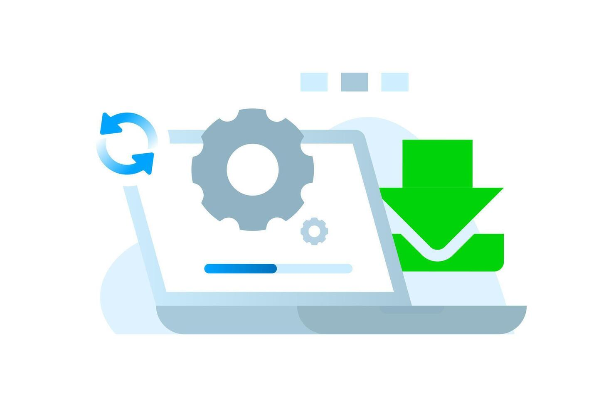

# 📦🍃  Iveco Green Ledger – Guia de Instalação

 <div class="logo-container" align="center">
    
</div>


Este documento específica todos os procedimentos operacionais e técnicos necessários para o planejamento, implantação, configuração de ambiente, validação, manutenção e desinstalação do software **Iveco Green Ledger** nas estações de trabalho localizadas nas portarias e pátios logísticos da IVECO.

---

## **1. Informações Gerais**
- **Nome do Sistema:** Iveco Green Ledger
- **Versão Atual:** 1.0 (Release Operacional Base)
- **Tipo de Aplicação:** Cliente Desktop com execução distribuída em borda e integração em nuvem
- **Arquitetura Técnica:**
   
   * **Frontend Desktop:** Interface rica desenvolvida em WPF (.NET 8);
   * **Persistência em Borda (Local):** Banco de dados relacional leve SQLite para operação offline contigencial;
   * **Backend (API):** Web API desenvolvida em ASP.NET Core responsável pelas regras de negócio e cálculo ambiental;
   * **Persistência Central (Nuvem):** Banco de dados NoSQL Google Firebase Firestore para consolidação corporativa das emissões de carbono (CO2).

---

## **2. Requisitos de Infraestrutura e Pré-requisitos**
Antes de iniciar a implantação nos terminais de atendimento, valide se a estação de trabalho atende integralmente aos requisitos especificados abaixo:

**Hardware:**

| Componente | Requisito Mínimo | Requisito Recomendado |
| :--- | :--- | :--- |
| **Processador** | Dual Core 2.0 GHz (x64) | Quas-Core 2.8 GHz ou superior(Intel i5/i7 ou AMD Ryzen 5 |
| **Memória RAM** | 8GB | 16GB |
| **Armazenamento** | 500MB livres em disco | 2GB livres em disco(SSD) |
| **Resolução de Tela** | 1366 x 768 pixels | 1920 x 1080 pixels(Full HD) |

---

**Software e Dependências Globais:**

- **Sistema Operacional:** Windows 10 ou superior.
- **Framework obrigatório: .NET 8 Desktop Runtime(x64)**
- **Privilégios de Sistema:** Conta de usuário do Windows com permissões de Administrador local.

---

**Matriz de Conectividade e Liberação de Rede**

Para assegurar o correto funcionamento da triagem automatizada, nossa equipe teve que garantir a liberação das rotas e serviços listados abaixo nas portas 80 (HTTP) e 443 (HTTPS):

| Provedor / Endpoint | Finalidade Operacional | Protocolo / Porta |
| :--- | :--- | :--- |
| - | Web API principal do ecossistema Iveco Green Ledger | HTTPS / 443 |
| [*.firebaseio.com / *.googleapis.com](https://firebase.google.com/?hl=pt-br)| Sincronização de dados em nuvem via Google Firebase | HTTPS / 443 |
| https://brasilapi.com.br/ | Validação cadastral automática de CNPJ de transportadoras | HTTPS / 443 |
| https://mapsplatform.google.com/lp/maps-apis/ | Google Places API (Cálculo de rotas e geolocalização) | HTTPS / 443 |
| https://www.nhtsa.gov/nhtsa-datasets-and-apis | NHTSA API (Decodificação de Chassi/VIN do veículo) | HTTPS / 443 |

---

## **3. Mapeamento da Estrutura de Diretórios**

O instalador e a aplicação organizam seus arquivos nos seguintes caminhos padrão do sistema operacional Windows:

- **Diretório de Binários e Executáveis:**
  * `C:\Program Files\GreenLedger` contém o executável principal (`IvecoGreenLedger.exe`), bibliotecas (`.dll`), arquivos de dependência e o arquivo de configuração de parâmetros.

- **Diretório de Dados de Usuário e Cache em Borda:**
  * `C:Users\[NomeDoUsuario]\AppData\Roaming\Iveco\GreenLedger\` contém arquivos de logs de execução e arquivos de estado da sessão do operador.

  ---

  ## **4. Passo a Passo do Processo de Instalação**

  Siga a sequência operacional abaixo para realizar a implantação do sistema no terminal local:

  - **1-) Obtenção do Pacote de Distribuição:**
    * Faça o download do arquivo.
      
    * Extraia o conteúdo do pacote em uma pasta local na máquina.

  - **2-) Execução do Instalador:**
    * Clica com o botão direito do mouse sobre o arquivo (`Setup.exe`) e seleciona **Executar como administrador**.

      (COLOQUE IMAGEM AQUI DO INSTALADOR + EXECUTAR COMO ADMINISTRAR)

- **3-) Navegação pelo Assistente de Instalação:**
  
    * **Tela inicial:** Clique em **Avançar** para iniciar o processo.

       (PRINT DO INSTALADOR AQUI)
      
    * **Contrato de Licença:** Leia os termos de uso restrito corporativo (`Licenca.txt`), seleciona a opção "Aceito os termos do contrato de licença" e clique em **Avançar**.

      (PRINT DOS TERMOS DE USO DO INSTALADOR AQUI)
      
    * **Seleção de Destino:** Mantenha o caminho padrão (`C:\Program Files\GreenLedger`) ou altere para o diretório corporativo.

      (PRINT SELECIONAR DIRTETORIO DO INSTALADOR)
      
    * **Opções de Atalho:** Mantenha habilitada as opções para criação de atalhos na **Área de Trabalho** e no **Menu Iniciar**.

  - **4-) Conclusão:**
    
    * Clique em **Instalar** e aguarde a cópia dos arquivos.

    (PRINT DO INSTALADOR FAZENDO INSTALAÇAO)
   
    * Ao finalizar, clique em **Concluir**. A aplicação estará instalada e pronta para configuração.
   
      (PRINT DO INSTALADOR MENSAGEM CONCLUIDO)
   
    ---

    ## **5. Configuração Inicial**

    Antes de liberar o sistema para uso pelos operadores de portaria, execute as verificações de configuração inicial:

    **1-) Configuração da Web API (`appsettings.json`):**

    * Acesse o diretório `C:\Program Files\Iveco\GreenLedger\`.
    * Abra o arquivo `appsettings.json` com um editor de texto.
    * Confirme se as chaves de conexão estão devidamente apontadas para o ambiente correto:
   
```json
{
  "ConnectionStrings": {
    "LocalDatabase": "Data Source=C:\\Users\\Default\\AppData\\Roaming\\Iveco\\GreenLedger\\localcache.db"
  },
  "ApiSettings": {
    "ApiBaseUrl": "[https://api.ivecogreenledger.com.br](https://api.ivecogreenledger.com.br)",
    "TimeoutSeconds": 30,
    "RetryAttempts": 3
  },
  "Logging": {
    "LogLevel": {
      "Default": "Information",
      "Microsoft": "Warning"
    }
  }
}
```
 * Salve e feche o arquivo.

**2-) Inicialização da Base SQLite Local**

  * Ao executar a aplicação pela primeira vez, o sistema criará automaticamente o banco de dados `localcache.db` e aplicará todas as tabelas necessárias no diretório.

---

## **6. Procedimento de Validação Pós-Instalação**

Para homologar a instalação e confirmar a operacionalidade do terminal:

1-) Abra o aplicativo pelo atalho criado

2-) Verifique o **Indicador de Status de Rede** localizado no canto superior direito da interface:
 * **Status Verde:** Indica a comunicação estabelecida com sucesso com a Web API e Firebase.
 * **Status Vermelho:** Indica que a aplicação iniciou em modo contingência (offline). Verifica o arquivo `appsettings.json` e as permissões.

3-) Realiza uma busca de teste digitando um CNPJ ou VIN válido na tela de triagem para confirmar a resposta das integrações externas.

---

## **7. Procedimento de Atualização (Implantação de Novas Releases)**

Quando uma nova release for disponibilizada, sigamos este protocolo para garantir a preservação do histórico de dados em borda: 

* **Encerramento de Processos:** Fecha a aplicação no terminal. Verifica no Gerenciador de Tarefas do Windows se o processo `IvecoGreenLedger.exe` foi totalmente finalizado.
* **Execução da Nova Release:** Executa o arquivo `Setup.exe` da nova versão.
* **Sobreposição Automática:** O assistente reconhecerá a versão instalada previamente e realizará a substituição segura dos arquivos binários (`.dll` e `.exe`).
* **Garantia de Integridade:** O arquivo de banco de dados SQLite mantido na pasta `AppData`.

---

## **8. Resolução de Problemas:**

| Erro / Sintoma | Causa Provável | Procedimento da Resolução |
| :--- | :--- | :--- |
| O instalador fecha ou exibe mensagem de erro do .NET | O .NET 8 não está instalado na máquina | Faça o download e instale o .NET 8 antes de executar o instalador novamente |
| Erro de comunicação com o servidor / a API não responde | Ausência de conexão com a internet, URL incorreta ou bloqueio | Verificar a conexão da internet, confirmar a chave e apontar para o endereço correto, liberação das portas |
| A validação de CNPJ ou VIN retorna falha contínua| Indisponibilidade das API's | Confirmar a estabilidade da internet |

---

## **9. Desinstalação**

Caso seja necessário remover o software da estação de trabalho:
   
1. Acesse as **Configurações do Windows**, **Aplicativos** e **Aplicativos Instalados**
2. Localiza **Iveco Green Ledger** na lista de programas.
3. Clique em **Desinstalar** e siga as instruções do assistente.
4. E se optar em remover os arquivos temporários de logs da execução mantidos no perfil do usuário, exclua manualmente o diretório.

---

*Projeto desenvolvido para fins educacionais no Curso Técnico em Desenvolvimento de Sistemas – SENAI / Escola de Programação e Robótica.*  
*Última atualização: 06 de agosto de 2026.*
