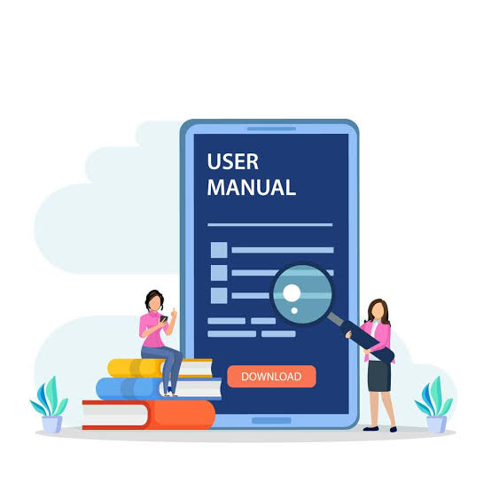
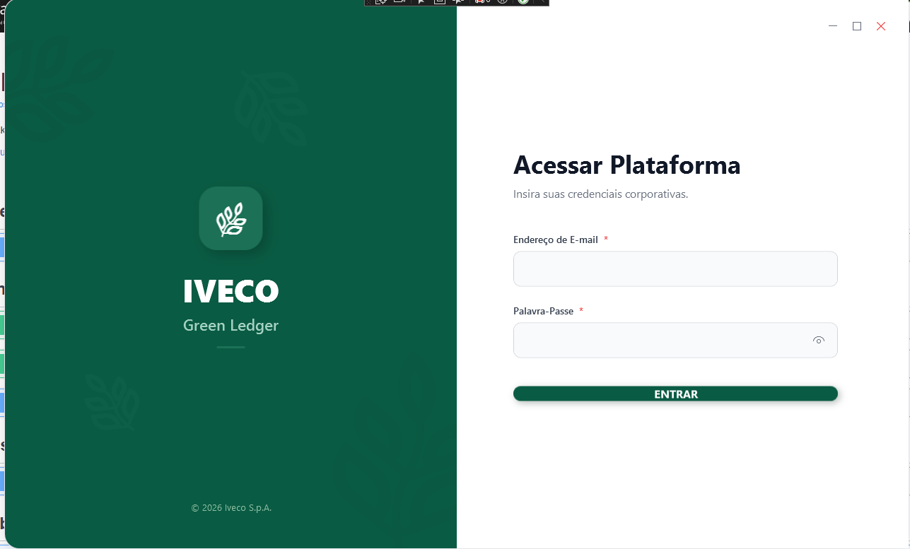
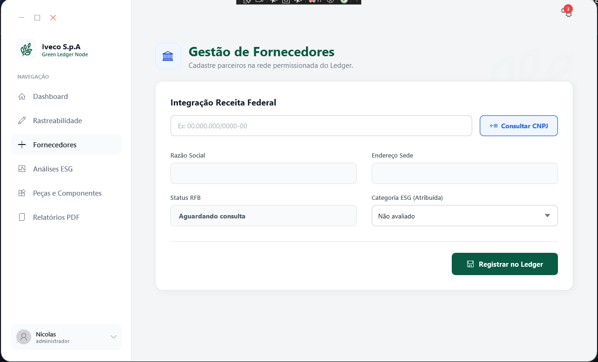
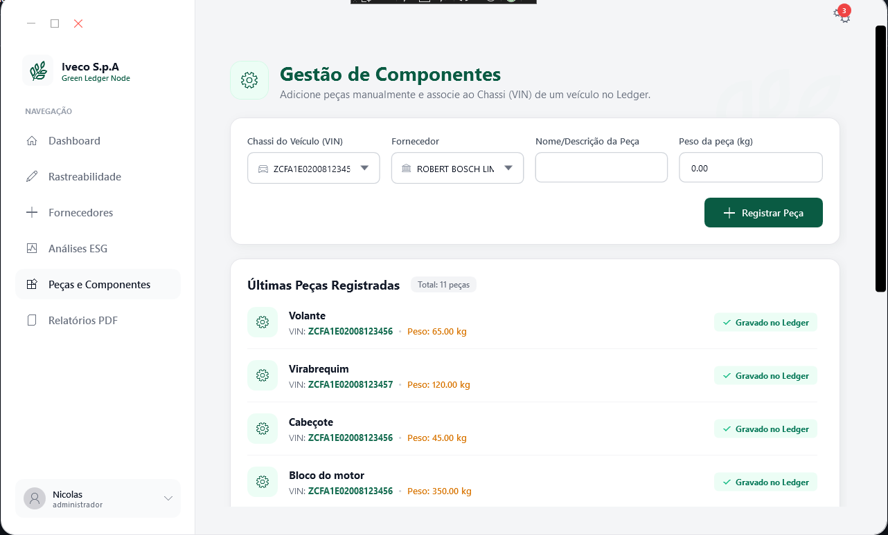
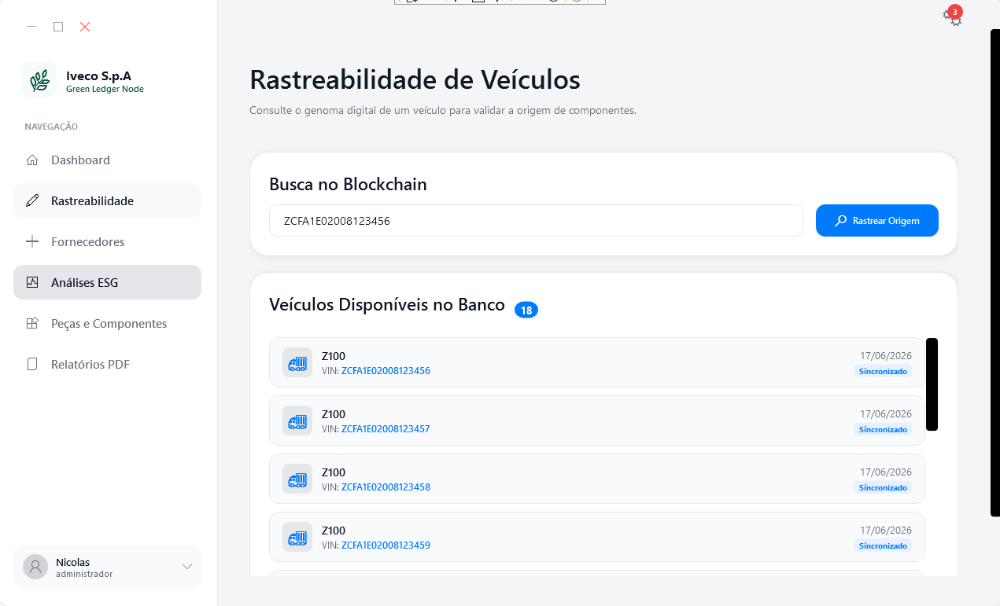
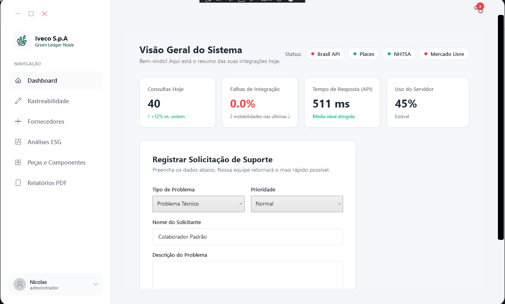
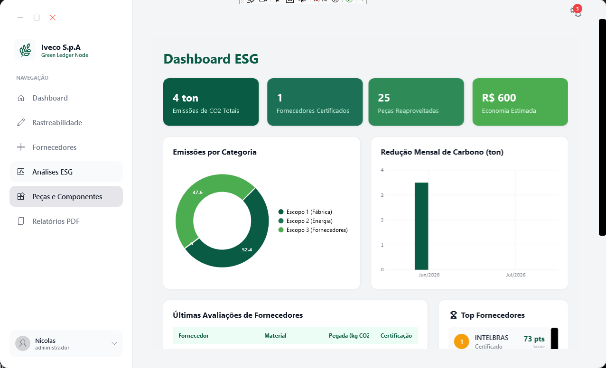

# 📦🍃 Iveco Green Ledger – Manual do Usuário

  

---

## **Apresentação e Objetivo do Sistema**

O **Iveco Green Ledger** é uma solução desenvolvida para a rastreabilidade de suprimentos e o cálculo automatizado da pegada de carbono, alinhado ao Escopo 3. Sendo assim, o principal obejtivo da plataforma é integrar o processo produtivo aos compromissos globais da sustentabilidade da Iveco, fornecendo um ambiente centralizado e auditável onde:

- Fornecedores são qualificados e avaliados por suas práticas ambientais.
- A entrada de componentes e matérias-primas são monitoradas.
- A montagem e composição de veículos são rastreadas peça a peça.
- As emissões de gases de efeito estufa são calculadas e consolidadas em tempo real.

---

## **Requisitos de Acesso e Conectividade**

| Requisito | Especificação Mínima |
| :--- | :--- |
| Sistema Operacional | Windows 10 (64-bit) ou superior |
| Runtime / Framework | .NET 8.0 Desktop Runtime instalado |
| Conectividade | Conexão ativa e estável com a internet (obrigatória para consultas a APIs e Ledger) |
| Credenciais | E-mail e senha previamente autorizados pela administração do sistema |

---

## **Guia Operacional e Navegação**

**1º Etapa - Autenticação e Primeiro Acesso:**

O acesso ao sistema é restrito para garantir a segurança dos dados logísticos e industriais.

 

 **1.** Abra a aplicação **Iveco Green Ledger** em sua estação de trabalho.
 
 **2.** Na tela de login, preencha os campos **E-mail** e **Senha**.
 
 **3.** Clique no botão **Entrar**.
 
 **4.** O sistema consultará a Web API de autenticação para validar o perfil e liberar os privilégios do acesso correspondente.

---

**2º Etapa - Módulo de Fornecedores:**

Módulo dedicado ao cadastramento, consulta automatizada de dados cadastrais e atribuição de classficação ambiental dos parceiros comerciais na rede permissionada.

**Cadastro e Consulta via Receita Federal**

 **1.** No menu lateral de navegação, clique na opção **Fornecedores**.
 
 **2.** Na tela **Gestão de Forncedores**, informe o **CNPJ** da empresa no campo de busca (formato: `00.000.000/0000.00`).
 
 **3.** Clique no botão azul **Consultar CNPJ** para disparar a integração com a API da Receita Federal (`BrasilAPI`).
 
 **4.** O sistema preencherá automaticamente os campos:
   - **Razão Social**
   - **Endereço Sede**
   - **Status RFB** (Situação Cadastral)

 **5.** Revise os dados e confirme o registro do fornecedor no Ledger.

**Classificação ESG e Registro no Ledger**

 **1.** No menu suspenso **Categoria ESG(Atribuída)**, selecione a qualificação correpondente á empresa.
 
 **2.** Após conferir os dados, clique no botão verde **Registrar no Ledger**.
 
 **3.** O parceiro será salvo na rede e ficará disponível para vínculo nos módulos de produção e rastreabilidade.

---

**3º Etapa - Módulos de Componentes e Rastreabilidade (`Peças e Componentes`):**

Utilizado na linha de montagem para associar peças recebidas aos veículos cadastrados no sistema.

 **1.** No menu lateral, acesse a opção **Peças e Componentes**.
 
 **2.** Na tela **Gestão de Componentes**, preencha o formulário de cadastro:
   - **Chassi do Veículo(VIN):** Selecione o código de 17 caracteres do veículo atrelado (ex: `ZCFA1E0200812345`).
   - **Fornecedor:** Selecione o fornecedor responsável pela peça (ex: `ROBERT BOSCH LIM`).
   - **Nome / Descrição da Peça:** Digite o nome do componente (ex:`Volante`, `Virabrequim`, `Cabeçote`, `Bloco do motor`).
   - **Peso da Peça(kg):** Insira o peso do componente em quilogramas (ex: `65.00`).

 **3.** Clique no botão verde **+ Registrar Peça**

---

**4º Etapa - Módulo de Rastreabilidade:**

**Consulta de Veículos(Busca no Blockchain)**

 **1.** No menu lateral de navegação, acesse a opção **Rastreabilidade**.
 
 **2.** Na seção **Busca no Blockchain**, digite o código do Chassi(VIN) desejado no campo de texto(`ex: ZCFA1E2008123456`).

 **3.** Clique no botão azul **Rastrear Origem** para realizar a pesquisa e consultar os dados consolidados do veículo.

**Visualização de Veículos Cadastrados**

 **1.** No painel **Veículos Disponíveis no Banco**, acompanhe a listagem dos veículos registrados no sistema.
 
 **2.** Cada card da lista apresenta o modelo do veículo(`ex: Z100`), o código **VIN**, a data de cadastro e a tag azul **Sincronizado**, confirmando a paridade e a gravação dos dados no banco.

---

**5º Etapa - Módulo de Sustentabilidade,Análises ESG e Dashboard Geral:**

Central de monitoramento de saúde das integrações, visão geral do sistema e emissão de relatórios.

**Visão Geral e Status dos Serviços (`Dashboard`)**

 **1.** No menu lateral, acesse **Dashboard**.

 **2.** No canto superior direito, monitora o tempo real o status de conexão dos serviços externos.

**Análises ESG e Relatório**

 **1. - Análises ESG** Acesse a opção do menu lateral para visualizar métricas de impacto e consolidados ambientais. 

 **2. - Relatórios PDF** Clique em relatórios PDF no menu lateral para emitir e exportar os relatórios oficiais de auditoria e governança.

---

**Solução de Problemas e Perguntas Frequentes (FAQ):**

  

### **O CNPJ não é preenchido automaticamente ao clicar em "Consultar CNPJ"?**
* **Causa Provável:** Instabilidade momentânea no serviço da BrasilAPI ou CNPJ digitado em formato incorreto.
* **Solução:**
  - Verifique se o CNPJ digitado contém exatamente 14 dígitos numéricos (`00.000.000/0000-00`).
  - Acesse a tela **Dashboard** para verificar se a integração com a BrasilAPI está online.
  - Caso esteja indisponível, preencha manualmente a **Razão social** e o **Endereço sede**.

---

**A validação do Chassi (VIN) falhou ou retornou erro?**

* **Causa Provável:** O texto digitado possui tamanho incorreto, contém caracteres proibidos ou a API da NHTSA está inacessível
* **Solução:**
  - Verifique que o código possui exatamemente **17 caracteres alfanuméricos**.
  - Lembre-se de que as letras **I**, **O** e **Q** **não são utilizadas** em números de chassi para evitar confusão com os numerais `1` e `0`.
  - Verifique no **Dashboard** se o indicador da API NHTSA está ativo (verde).

---

**O endereço do Fornecedor não é sugerido no campo "Endereço Sede?"**

* **Causa Provável:** Oscilação de conexão com a API do Google Places ou limite de requisições atingido.
* **Solução:**
  - Digite o endereço completo manualmente (rua, número, cidade e estado).
  - Se o status da API do Google no Dashboard indicar inatividade, conclua o preenchimento manual antes de clicar em **Registrar no Ledger**.

---

**Não recebi o e-mail de acesso ou há falha na autenticação?**

* **Causa Provável:** Credenciais digitadas incorretas na tela de acessar a plataforma ou o bloqueio pelo firewall do email da Green Ledger.
* **Solução:**
  - Verifica os campos de **Endereço de E-mail** e **Senha** se foram preenchidos corretamente.
  - Verifica a pasta de **Lixo Eletrônico / Spam** do seu e-mail.
  - Se o problema persistir, solicite a liberação à equipe de administração do sistema.

---

**Um ou mais indicadores de API aparecem com luz vermelha no Dashboard?**

* **Causa Provável:** Oscilação na conexão de internet da estação de trabalho ou indisponibilidade temporária nos serviços externos (BrasilAPI, Google Places, NHTSA, Mercado Livre).
* **Solução:**
  - Verifique os cartões **Falha de Integração** e **Tempos de Resposta (API)** no Dashboard.
  - Verifique se o computador está conectado á rede.
  - O sistema permite o preenchimento e salvamento manual até o restabelecimento das conexões.

---

**Não consigo registrar um componente na tela "Peças e Componentes"?**

* **Causa Provável:** O fornecedor da peça não foi cadastrado na rede ou os campos obrigatórios não foram selecionados.
* **Solução:**
  - Acesse a tela **Fornecedores** no menu lateral e confirme se o fornecedor já consta gravado no Ledger.
  - Volte para a tela de **Peças e Componentes** e selecione o **Chassi do Veículo (VIN)** e o **Fornecedor** nos menus suspensos antes de clicar em **+ Registrar Peça**.

---

**A peça cadastrada não é listada em "Últimas Peças Registradas"?**

* **Causa Provável:** Falha na comunicação com o banco de dados ou necessidade de atualização na interface.
* **Solução:**
  - Certifique-se de ter informado a **Descrição da Peça** e o **Peso da Peça (kg)**.
  - Após clicar em registrar, verifique se o card do item exibe a tag verde **`Gravado no Ledger`**.

---

**Preciso relatar uma falha técnica ou solicitar suporte?**

* **Causa Provável:** Ocorrência de erro não previsto, divergência em dados cadastrais ou necessidade de manutenção na estação.
* **Solução:**
  - Acesse o menu **Dashboard** e navegue até o painel **Registrar Solicitação de Suporte**.
  - Selecione o **Tipo de Problema** (`Ex.: *Erro de API, Falha no Ledger, Dúvida Operacional*`), descreva ocorrido e clique em **Enviar Chamado**.

---

*Projeto desenvolvido para fins educacionais no Curso Técnico em Desenvolvimento de Sistemas – SENAI / Escola de Programação e Robótica.*
*Última atualização: 07 de agosto de 2026*
