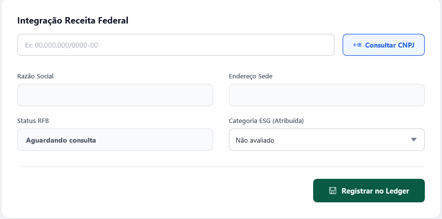

# 📦🍃 Iveco Green Ledger – Manual do Usuário

    

Essa documentação se aplica ao manual operacional de instruções para o uso da aplicação WPF em estações de trabalho e portarias da IVECO, cobrindo navegação, cadastros, integrações de API's e visualização de dados de governança ambiental em nuvem.

---

## **1. Apresentação e Objetivo do Sistema**
O **Iveco Green Ledger** é uma solução desenvolvida para gerenciar a triagem logística de pátio, a rastreabilidade de suprimentos e o cálculo automatizado da pegada de carbono, com foco no escopo 3 do GHG Protocol. O objetivo do sistema é unir a operação física da fábrica aos compromissos de sustentabilidade da IVECO, fornecendo um ambiente centralizado onde:

   * Fornecedores são qualificados e avaliados por suas práticas ambientais.
   * A entrada de componentes e matérias-primas é monitorada.
   * A montagem e composição de veículos são rastreadas peça a peça.
   * As emissões de gases de efeito estufa são calculadas e consolidadas em tempo real.

---

## **2. Requisitos de Acesso e Conectividade**

- **Ambiente:** Computador com sistema operacional Windows 10(64-bit) ou superior e .NET 8 instalado.
- **Conectividade:** A conexão ativa e obrigatória com a internet.
- **Credenciais de Acesso:** E-mail previamente autorizado pela administração do sistema.

---

## **3. Autenticação e Primeiro Acesso**

O acesso ao sistema é restrito para garantir a segurança dos dados industriais e de logística.

- **1º Etapa - Realizando o login:**

---

## **4. Primeiro Acesso e Tela Inicial**

O sistema exige autenticação rigorosa para garantir a segurança dos dados logísticos e industriais.

**4.1. Realizando o Login**

- Abra o aplicativo **Iveco Green Ledger** em sua estação de trabalho.
- Na tela inicial, insira seu **E-mail** e **Senha** nos campos de autenticação.

    <!-- INSIRA AQUI A IMAGEM DA TELA DE LOGIN -->
    

**4.2. Verificação de E-mail de Usuário**

* Clique em **Entrar**. O sistema consultará as credenciais selecionadas pelo usuario e
 fara a liberaçao do sistema depois que tudo for autenticado .
  
---

## **5. Módulo de Fornecedores e Supply Chain**

Este módulo é utilizado na para homologação e qualificação dos Fornecedores.

**5.1. Cadastro de Fornecedor via API**

1. Acesse o menu lateral e clique em **Fornecedores** > **Novo Cadastro**.
2. No campo correspondente, digite os 14 dígitos do **CNPJ** e clique na lupa de busca.
3. O sistema fará uma requisição à **Brasil API** e preencherá instantaneamente a Razão Social, Nome  e dados de constituição.
4. Para o endereço, comece a digitar e o sistema vai sugerir e validar o local da fábrica. Salve o registro.

    

---

## **6. Rastreabilidade (**

Utilizado nas linhas de montagem para controle de ativos.

**6.1. Entrada de Matéria-Prima (Lotes)**
1. No menu principal, acesse **Rastreabilidade** > **Busca no Blockchain**.
2. Clique em **rastrear Origem**. Insira o código VIN do Veiculo.
3. Clique em registrar, ele será salvo no sistema.

    

**6.2. Registro de Peças e Componentes**

1. Vá até o módulo **Chassi do Veículo VIN** selecione o VIN cadastrado, 
2. vá até o módulo **Fornecedor** selecione o Fornecedor cadastrado.
3. Clique em **Nome e Registro de peça** cadastre as informaçoes.
4. Faça a mesma coisa em **Peso da peça (kg)**
5. Por fim Clique em Registrar peça, o sistema vai fazer a autenticaçao e Registrar no Sistema

---

## **7. Módulo de Sustentabilidade e ESG**

Painéis de controle abastecidos em tempo real pelas informações geradas na triagem e produção.

**7.1. Lançamento e Acompanhamento de Escopos**
1. Acesse o menu **Sustentabilidade**.
2. Em **Escopos de Emissão**, os valores do *Escopo 3* serão automaticamente populados pelas notas e transportes registrados dos Fornecedores. O operador pode adicionar manualmente dados de operações internas.

**7.2. Gráficos Analíticos**
1. Em **Dashboard ESG**, visualize os *Gráficos de Emissões*. O sistema processa os dados salvos no Firebase para mostrar a evolução da pegada de carbono mensal.
2. Na aba **Análises ESG**, é possível visualizar métricas sociais e de governança para fins de compliance.

    

---

## **8. Consultas de Mercado e Central de Suporte**

**8.1. Consulta no Mercado Livre**
1. Acesse **Ferramentas** > **Mercado Livre**.
2. Insira o termo da busca (ex: componente mecânico ou acessório). O sistema comunicará com a API do Mercado Livre para retornar cotações e tendências de preço, auxiliando balanços rápidos do setor de compras.

    <!-- INSIRA AQUI A IMAGEM DA TELA DE CONSULTA DE MERCADO -->
    

**8.2. Abrindo um Chamado de Suporte**
1. Para relatar falhas ou solicitar manutenção, vá em **Central de Suporte**.
2. Preencha o assunto, descreva o problema no campo de texto e clique em **Enviar Chamado**. A requisição irá direto para o controlador da equipe de TI.

---

## **9. Solução de Problemas e Perguntas Frequentes (FAQ)**

Abaixo, listamos 8 situações comuns na operação da plataforma e as instruções técnicas para resolvê-las.

**1. O CNPJ não está sendo preenchido automaticamente ao cadastrar um fornecedor.**
*   *Causa:* Falha na comunicação com a Brasil API ou formato inválido.
*   *Solução:* Certifique-se de digitar os 14 números do CNPJ sem pontos ou traços. Verifique se o computador possui acesso à rede externa e se a Brasil API não está temporariamente indisponível.

**2. A validação de Chassi (VIN) falhou ou retornou "Veículo Não Encontrado".**
*   *Causa:* O número VIN (Vehicle Identification Number) digitado está fora dos padrões internacionais ou a API da NHTSA recusou o código.
*   *Solução:* Verifique se o código possui exatamente 17 caracteres. Lembre-se que letras como 'I', 'O' e 'Q' não são usadas em chassis para evitar confusão com números.

**3. O endereço do Fornecedor não é autocompletado no formulário.**
*   *Causa:* Falha no serviço do Google Places Response.
*   *Solução:* Digite a rua acompanhada da cidade (ex: "Av. Industrial, Nova Lima"). Caso o erro persista, o limite de requisições à API do Google pode ter sido atingido pelo backend; nesse caso, preencha manualmente e acione o suporte.

**4. Não recebi o e-mail de validação de conta ou redefinição de senha.**
*   *Causa:* Bloqueio de firewall corporativo ou atraso no *Email Validation Service*.
*   *Solução:* Aguarde 5 minutos e verifique as pastas de "Lixo Eletrônico" ou "Spam". Se usar e-mail da Iveco, peça ao TI para liberar envios provenientes do domínio do Green Ledger.

**5. Os dados cadastrados não estão aparecendo para os outros computadores do pátio.**
*   *Causa:* Assincronia entre o banco SQLite (cache local) e o Firebase (nuvem).
*   *Solução:* O aplicativo pode ter entrado em modo offline devido a quedas na rede, salvando apenas no SQLite. Verifique sua conexão. Assim que a rede for restaurada, o sistema subirá automaticamente a fila de registros para o Firebase e a Web API atualizará todos os painéis.

**6. A pesquisa no Mercado Livre retorna tela vazia sem resultados.**
*   *Causa:* Termos muito genéricos ou itens não listados comercialmente na plataforma.
*   *Solução:* Refine a busca utilizando o nome técnico específico do componente ou o código da peça. Se a tela estiver demorando muito para carregar, a Web API pode estar lidando com lentidão nos servidores externos.

**7. Não consigo vincular um Lote de Matéria-Prima a um Veículo (VeiculoComponente).**
*   *Causa:* O lote não existe ou a quantidade do lote já foi totalmente alocada a outros veículos.
*   *Solução:* Acesse o menu **Lotes de Matéria-Prima** e confira se o lote em questão foi devidamente "Registrado" ou se o saldo de peças dele já zerou na linha de produção.

**8. O Dashboard de Gráficos de Emissões está em branco em um determinado mês.**
*   *Causa:* Ausência de dados processados no `EscopoEmissaoDto` ou transações logísticas insuficientes.
*   *Solução:* O gráfico apenas plota informações de lotes ou fornecedores devidamente marcados como "Fornecedor Verde" ou que tiveram suas rotas concluídas e salvas no banco. Certifique-se de que a triagem do mês foi finalizada no sistema.

---

*Projeto desenvolvido para fins educacionais no Curso Técnico em Desenvolvimento de Sistemas – SENAI / Escola de Programação e Robótica.*  
*Última atualização: 05 de agosto de 2026.*
