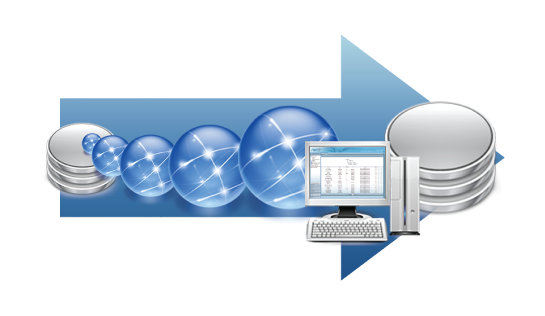
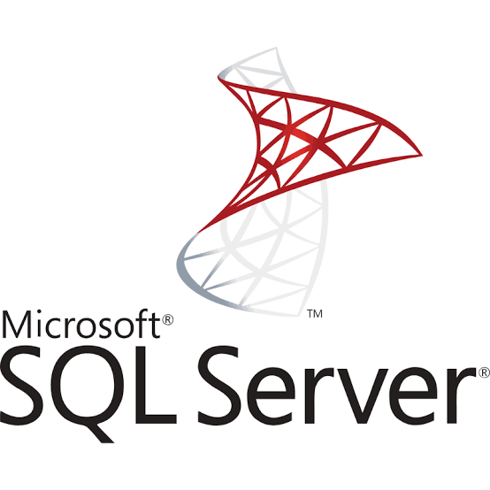
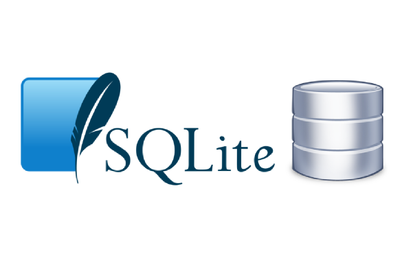

# 📦🍃 Iveco Green Ledger – Plano de Migração

 

    

## **1. Dados do Sistema**

Esta seção estabelece as informações fundamentais de identificação do software, contextualizando o escopo da aplicação e o ambiente de destino no processo de migração de dados da Iveco:

| Parâmetro | Detalhe / Valor |
| :--- | :--- |
| **Nome do Sistema** | Iveco Green Ledger |
| **Versão** | Release Operacional Base (.NET 8) |
| **Domínio de Aplicação** | Triagem logística de pátio, rastreabilidade de suprimentos e cálculo automatizado de pegada de carbono Escopo 3 (GHG Protocol) |
| **Cliente Final** | IVECO (Portaria Logística e Gestão ESG) |
| **Ambiente Alvo da Migração** | Servidor SQL Server e operações da fábrica Iveco |
---

## **2. Banco Utilizado**
O sistema Iveco Green Ledger adota uma arquitetura de banco de dados relacional robusta e estruturada, centrada no SQL Server para a gestão corporativa e combinada com armazenamento em borda. Essa abordagem foi projetada para responder diretamente às demandas críticas de ambientes industriais e pátios logísticos, garantindo transações ACID, alta disponibilidade, integridade referencial e resiliência a falhas de conectividade.

- **Microsoft SQL Server (Banco Relacional):**

- Possui infraestrutura relacional corporativa de alto desempenho, hospedada em servidor central ou nuvem;
- Tendo como função principal a atuação como repositório central, relacional e definitivo;
- A aplicação ocorre por transações ACID validadas via Entity Framework Core (.NET 8) na Web API, garantindo integridade referencial rigorosa e alimentando relatórios e dashboards em tempo real.

---

- **SQLite (Banco Local / Relacional):**

- Possui uma infraestrututra de banco de dados relacional leve e embutido;
- Tendo como função principal a persistência em borda integrada diretamente a aplicação WPF;
- Sendo assim, atuando como cache para consultas frequentes (CNPJs e VINs/chassis) e garantindo o funcionamento do sistema.

---

## **3. Estrutura Atual do Projeto**
Estruturamos em uma arquitetura em camadas, dividindo com clareza as responsabilidades entre a interface de usuário, a inteligência de negócio e a persistência de dados. Essa separação garante modularidde, facilidade de manutenção e alto desempenho.

- **Componentes do Sistema:**

| Componente | Função | Responsabilidades | Integração / Comunicação |
| :--- | :--- | :--- | :--- |
| **Aplicação Desktop: (WPF / .NET 8)** | Interface do operador para uso nas estações de trabalho do pátio logístico e portaria | Realizar a triagem de insumos, leitura de dados, consulta de chassis/VINs e envio de solicitações para a API | Conecta-se ao SQLite interno exclusivamente para rotinas de cache e leitura rápida de dados frequentes, garantindo agilidade na navegação |
| **Backend / Web API: (ASP.NET Core / .NET 8)** | Camada central de regras de negócio e serviços | Validação de cadastros, autenticação de usuários, execução dos cálculos automatizados de pegada de carbono e homologação de transações | Expõe endpoints RESTful seguros para a aplicação Desktop e orquestra a gravação dos dados na nuvem |
| **Armazenamento centralizado (SQL Server)** | Banco de dados central e unificada | Armazenamento definitivo com chave primária/estrangeira de lotes, veículos, fornecedores e métricas ambientais | Repositório central integrado e atualizado diretamente pela Web API |

Sendo assim, a estrutura do projeto é distribuída da seguinte forma:
- **Camada de Apresentação:** Onde reúne as telas(Views), componentes visuais em XAML e todos os fluxos de interação direta com o operador no aplicativo WPF.
- **Camada de Regras de Negócio e Serviços (API):** Onde agrupa os controladores da API, executa as validações de CNPJ e VIN, aplica as regras de rastreabilidade de suprimentos e processa os algoritmos e processa os algoritmos automatizados para o cálculo das emissões de carbono.
- **Camada de Persistência e Dados:** Onde gerencia a comunicação relacional direta com o SQL Server utilizando Entity Framework Core / Dapper para a consolidação de dados corporativos, além de manipular o banco SQLite local exclusivamente para o gerenciamento do cache de navegação nas estações de trabalho
---

## **4. Alterações Previstas**

O objetivo central desta documentação é orientar e estrturar o processo de migração dps dados legados da IVECO para o nosso projeto e garantindo a integridade do histórico, continuidade operacional do pátio logístico e a segurança de todo o acervo de informações.

**1-) Mapeamento e Modelagem Relacional:** 
- Mapeamento das tabelas legadas da Iveco para a estrutura relacional do SQL Server.
- Normalização de dados e ajuste dos tipos de dados (ex: VARCHAR, DATETIME, DECIMAL) para compatibilidade com os fatores de emissão do GHG Protocol.

**2-) Scripts de Carga e Migração:** 
- Criação e execução de scripts para ler o ambiente antigo e inserir os registros diretamente nas tabelas de destino no SQL Server, mantendo a integridade referencial.
  
**3-) Estratégia de Migração sem Interrupção:** 
- A migração é executada via estratégias de carga incremental ou lote paralelo, permitindo que os dados legados sejam transferidos sem paralisação total das rotinas de portaria e triagem do pátio.

**4-) Implantação, Sincronismo e Transição de Uso:** 
- Apontamento das connection strings do Entity Framework Core na Web API para o SQL Server e sincronização da carga inicial para o cache SQLite dos desktops WPF no pátio da IVECO.

---

## **5. Estratégia de Backup**

Nossa estratégia de backup é fundamentada nos seguintes pilares:

**Plano de Contingência** Antes de iniciar qualquer extração ou execução de scripts ETL, é gerado um backup estático completo da base legada e da base de destino no SQL Server. Esse backup permanece isolado e serve exclusivamente como garantia de rollback, permitindo restaurar o ambiente ao estado original de forma imediata caso ocorra qualquer inconsistência ou falha crítica durante o processo.

Rotinas Automáticas no SQL Server Agent Assim que a migração é concluída, são ativados os planos de manutenção automatizados via SQL Server Agent, com a seguinte periodicidade:

- **Backup Completo:** Executado semanalmente nos horários de menor tráfego operacional.
- **Backup Diferencial:** Executado diariamente para capturar alterações relativas ao último backup full.
- **Backup do Log de Transações (Transaction Log):** Executado periodicamente em intervalos curtos, permitindo a recuperação Poin-In-Time (restauração no minuto exato anterior a uma eventual falha).

---

## **6. Estratégia de Migração**

Nossa estratégia de migração é fundamentada nos seguintes pilares:

**Preparação dos Dados** Leitura completa na base legada da Iveco para seleção e higienização dos cadastros de fornecedores, históricos de lotes, insumos e chassis (VINs). Converte-se dados inconsistentes para os tipos exatos do SQL Server e valida-se a integridade das chaves primárias e estrangeiras antes do carregamento.

**Carga Incremental e Sistema Operante** A transferência dos dados é realizada em lotes estruturados utilizando transações SQL. Caso um lote apresente erro, apenas aquele bloco é desfeito, mantendo a integridade sem paralisar as atividades de portaria.

**Conferência e Validação de Segurança** Executar validações quantitativas e qualitativas comparando a origem e o destino no SQL Server e garantindo 100% de precisão nos dados migrados.

**Transição Transparente** Finalizada a carga principal e validada a estrutura relacional no SQL Server, as aplicações WPF nos computadores da fábrica recebem a atualização das configurações via API. O cache SQLite local é alimentado com a nova base relacional, finalizando a transição de forma fluida para os operadores.

---

## **7. Testes e Validação de Backup**

Esta seção descreve a proposta teórica para a validação dos backups do SQL Server, servindo como diretriz estruturada para orientar a etapa de testes práticos do sistema Iveco Green Ledger. O objetivo principal é estabelecer o planejamento das rotinas de teste das cópias de segurança, assegurando a capacidade de restauração integral da base corporativa sem causar imprevistos ou perdas de dados.

Como planejamento inicial, está prevista a realização de testes de restauração em um ambiente isolado, permitindo validar rigorosamente a integridade das tabelas de fornecedores, histórico de lotes, registros de chassis (VINs) e fatores de emissão de carbono. Paralelamente, o plano abrange a medição do tempo necessário para restabelecer a operação total do SQL Server e sincronizar o cache SQLite dos terminais WPF, garantindo uma recuperação rápida que não comprometa a continuidade das rotinas de portaria e triagem do pátio logístico da Iveco. Por se tratar de uma especificação prévia, estas diretrizes poderão ser refinadas conforme o projeto evoluir.

---

*Projeto desenvolvido para fins educacionais no Curso Técnico em Desenvolvimento de Sistemas – SENAI / Escola de Programação e Robótica.*  
*Última atualização: 05 de agosto de 2026.*
