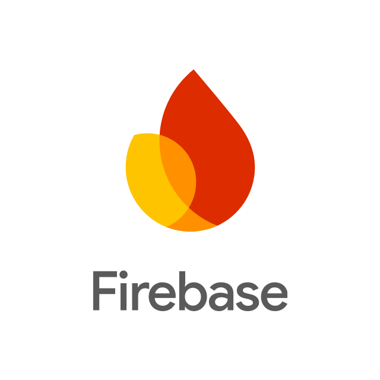

# 📦🍃 Iveco Green Ledger – Plano de Migração

 

    

## **1. Dados do Sistema**

Esta seção estabelece as informações fundamentais de identificação do software, contextualizando o escopo da aplicação e o ambiente de destino no processo de migração de dados da Iveco:

| Parâmetro | Detalhe / Valor | 
| :--- | :--- | 
| **Nome do Sistema** | Iveco Green Ledger |   
| **Versão** | Release Operacional Base (.NET 8) | 
| **Domínio de Aplicação** | Triagem logística de pátio, rastreabilidade de suprimentos e cálculo automatizado de pegada de carbono Escopo 3 (GHG Protocol) |
| **Cliente Final** | IVECO (Portaria Logística e Gestão ESG) | 
| **Ambiente Alvo da Migração** | Operações da fábrica e base de dados de fornecedores/clientes da Iveco | 

---

## **2. Banco Utilizado**
O sistema Iveco Green Ledger adota uma arquitetura de banco de dados híbrido, combinando persistência em nuvem (NoSQL) com armazenamento em borda. Essa abordagem foi projetada para atuar diretamente nas demandas críticas de ambientes industriais e pátios logísticos, garantindo alta disponibilidade, sincronização em tempo real, consistência de dados e resiliência a falhas de conectividade.

- **Firebase Firestore (Banco em Nuvem / NoSQL:**

- Possui uma infraestutura de banco de dados não relacional baseado em documentos e hospedado no Google Cloud;
- Tendo como função principal a atuação de repositório central e definitivo do sistema;
- A aplicação acontece pelos processos de operações validadas pela Web API e sincronizando atualizações em tempo real e alimentando os dashboards analíticos.

---

- **SQLite (Banco Local / Relacional:**

- Possui uma infraestrututra de banco de dados relacional leve e embutido;
- Tendo como função principal a persistência em borda integrada diretamente a aplicação WPF;
- Sendo assim, atuando como cache para consultas frequentes (CNPJs e VINs/chassis) e garantindo o funcionamento do sistema.

---

## **3. Estrutura Atual do Projeto**
Estruturamos em uma arquitetura em camadas, dividindo com clareza as responsabilidades entre a interface de usuário, a inteligência de negócio e a persistência de dados. Essa separação garante modularidde, facilidade de manutenção e alto desempenho.

- **Componentes do Sistema:**

| Componente | Função | Responsabilidades | Integração / Comunicação | 
| :--- | :--- |  :--- |  :--- | 
| **Aplicação Desktop: (WPF / .NET8)** | Interface do operador para uso nas estações de trabalho do pátio logístico e portaria | Realizar a triagem de insumos, leitura de dados, consulta de chassis/VINs e envio de solicitações para a API | Conecta-se ao SQLite interno exclusivamente para rotinas de cache e leitura rápida de dados frequentes, garantindo agilidade na navegação |   
| **Backend / Web API: (ASP.NET Core / .NET 8)** | Camada central de regras de negócio e serviços | Validação de cadastros, autenticação de usuários, execução dos cálculos automatizados de pegada de carbono e homologação de transações | Expõe endpoints RESTful seguros para a aplicação Desktop e orquestra a gravação dos dados na nuvem |   
| **Armazenamento em Nuvem** | Banco de dados central e unificada | Armazenamento definitivo de lotes, veículos, fornecedores e métricas ambientais, discutindo atualizações em tempo real para dashboards e relatórios analíticos | Repositório central integrado e atualizado diretamente pela Web API |

Sendo assim, a estrutura do projeto é distribuída da seguinte forma:
- **Camada de Apresentação:** Onde reúne as telas(Views), componentes visuais em XAML e todos os fluxos de interação direta com o operador no aplicativo WPF.
- **Camada de Regras de Negócio e Serviços (API):** Onde agrupa os controladores da API, executa as validações de CNPJ e VIN, aplica as regras de rastreabilidade de suprimentos e processa os algoritmos e processa os algoritmos automatizados para o cálculo das emissões de carbono.
- **Camada de Persistência e Dados:** Onde gerencia a comunicação direta com os SDKs do Firebase para a consolidação e sincronização das operações na nuvem, além de manipular o banco SQLite local exclusivamente para o gerenciamento do cache de navegação.

---

## **4. Alterações Previstas**

O objetivo central desta documentação é orientar e estrturar o processo de migração dps dados legados da IVECO para o nosso projeto e garantindo a integridade do histórico, continuidade operacional do pátio logístico e a segurança de todo o acervo de informações.

**1-) Mapeamento e Preparação:** 
- A extração de dados para o mapeamento das tabelas e arquivos do sistema legado da Iveco para extrair os cadastros de fornecedores, histórico de lotes de matéria-prima, registros de chassis/VINs e fatores de emissão de carbono.
- Tratamento prévio dos dados para remover duplicidades e adequar os identificadores ao formato TEXT, garantindo assim a compatibilidade no momento de carga no Firebase e na leitura em cache pelo SQLite.

**2-) Execução da Migração sem Interrupção:** 
- A migração deve ser executada de forma progressiva ou em lotes paralelos, permitindo que a base de dados do cliente seja transferida para a uvem sem a necessidade de paralisação total das rotinas de portaria e triagem;

**3-) Estratégia de Backup e Integridade Pré e Pós Migração:** 
- Realizar o backup integral da base legada antes de disparar qualquer rotina de leitura e conversão de dados.

**4-) Implantação e Transição de Uso no Cliente:** 
- Realizar um instalador leve para a aplicação WPF nas estações de trabalho do pátio da IVECO.
- E obter uma transição transparente onde a carga inicial e a validação do cache local forem concluídas, o aplicativo Desktop passar a operar integrado á nova API e á nuvem, finalizando o ciclo de migração de forma fluida para os operadores.

---

## **5. Estratégia de Backup**

Nossa estratégia de backup é fundamentada nos seguintes pilares:

**Plano de Contingência** Antes de iniciar qualquer extração de dados, é gerado um snapshot completo e estático da base legada da Iveco. Esse arquivo permanece isolado e serve exclusivamente como garantia de rollback, permitindo reverter o processo e restaurar o banco de dados ao seu estado original de forma imediata caso seja detectada qualquer inconsistência ou falha durante o processo de migração.

**Automação na Nuvem** Antes de iniciar qualquer extração de dados, é gerado um snapshot completo e estático da base legada da Iveco. Esse arquivo permanece isolado e serve exclusivamente como garantia de rollback, permitindo reverter o processo e restaurar o banco de dados ao seu estado original de forma imediata caso seja detectada qualquer inconsistência ou falha durante o processo de migração.

**Plano de Contingência** Assim que os primeiros lotes são consolidados no banco de dados central, são executadas rotinas automatizadas de backup periódico de todas as coleções do sistema. Essa rotina resguarda o histórico de veículos, fornecedores e métricas ambientais do GHG Protocol para fins de auditoria e segurança. Adicionalmente, as ferramentas de migração possuem verificação por ponteiros: se a conexão oscilar durante a carga, o envio é retomado exatamente do ponto de interrupção, impedindo a perda ou a duplicação de dados.

**Sem Necessidade de Backup nos Computadores Locais** Como as máquinas do pátio e da portaria guardam apenas uma cópia temporária de dados para deixar as consultas mais rápidas, elas não precisam de backup individual. Se um computador precisar ser trocado ou formatado, basta abrir o sistema na nova máquina: ele se reconecta ao servidor central e recarrega os dados necessários de forma automática, dispensando qualquer manutenção manual.

---

## **6. Estratégia de Migração**

Nossa estratégia de migração é fundamentada nos seguintes pilares:

**Preparação e Organização** Antes de transferir os dados, é realizada uma leitura completa na base legada da Iveco. Esse processo seleciona os cadastros essenciais como fornecedores, histórico de lotes, códigos de matérias-primas e registros de chassis (VINs), corrigindo divergências e padronizando as informações para que cheguem organizadas ao novo banco central.

**Sistema Rodando Normalmente** A migração é executada em etapas ou lotes contínuoo, sendo assim, permitindo que a transferência dos dados ocorra enquanto o sistema está em uso.

**Conferência e Validação de Segurança** Após o envio de cada lote de dados, rotinas de verificação comparam a quantidade e a precisão dos registros entre a base antiga e o novo banco central. Garantindo 100% de integridade das informações e rastreabilidade dos dados migrados.

**Transição Simples nos Computadores do Cliente** A atualização nas estações de trabalho do pátio é feita por meio de um instalador mo WPF, que já está sendo preparado. Assim que a migração inicial é concluída e o cache do SQLite é recarregado pela API, os operadores passam a utilizar o novo sistema imediatamente, sem a necessidade de configurações complexas nas máquinas locais.

---

## **7. Testes e Validação de Backup**

Esta seção descreve a proposta teórica para a validação dos backups, servindo como diretriz para quando a fase de execução prática for iniciada. O objetivo é planejar como as cópias de segurança serão testadas para garantir que o sistema possa ser restaurado sem imprevistos.

Como planejamento inicial, está prevista a realização de testes de restauração em um ambiente separado, permitindo conferir se as informações de fornecedores, veículos e registros gerais permanecem completas e sem falhas. Também faz parte do plano medir o tempo necessário para colocar o sistema de volta no ar, garantindo que uma eventual recuperação seja rápida e não atrapalhe o trabalho da portaria e do pátio da Iveco. Por se tratar de uma especificação prévia, estes passos poderão ser adaptados conforme o desenvolvimento do projeto avançar.

---

*Projeto desenvolvido para fins educacionais no Curso Técnico em Desenvolvimento de Sistemas – SENAI / Escola de Programação e Robótica.*  
*Última atualização: 04 de agosto de 2026.*
