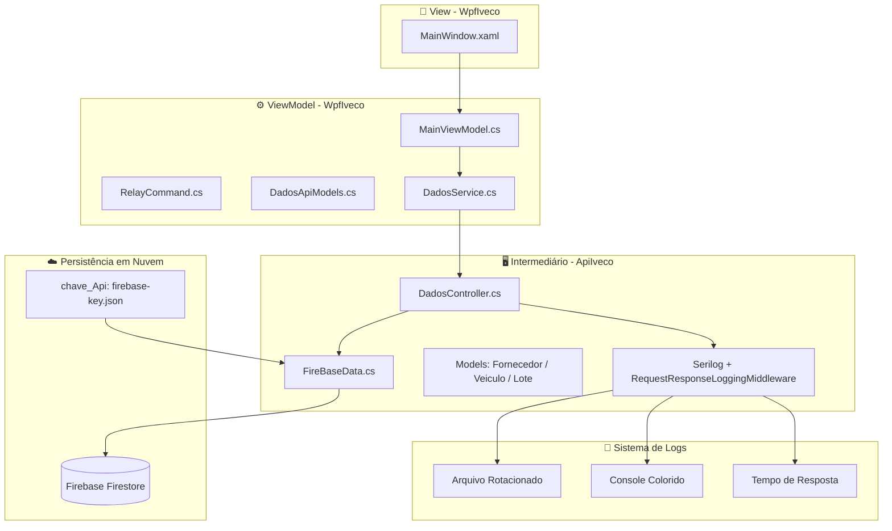
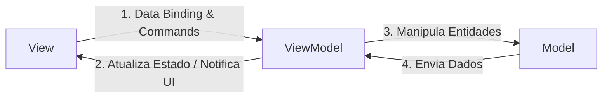

# 📦🍃 Sistema de Rastreamento Inteligente - Iveco Green Ledger

### Trabalho de Conclusão de Curso - Desenvolvimento de Sistemas

<div align="center">

</div>

### Escola De Programação e Robótica - SENAI 

#### Orientado por: Fred Aguiar

👥 **Equipe de Desenvolvimento**

<p align="center"> <strong>Colaboradores:</strong><br>
<a href="https://github.com/NicolasOlim">🧑‍💻 Nicolas de Oliveira Lima</a> | 
<a href="https://github.com/aliceandradee">🧑‍💻 Alice Andrade</a> | 
<a href="https://github.com/erick190813">🧑‍💻 Erick Silva</a> | 
<a href="https://github.com/vnxtry">🧑‍💻 Vinicius Trindade</a> | 
<a href="https://github.com/vncsqxy">🧑‍💻 Vinícius Oliveira</a>
</p>

---

# 🎯 Proposta de Valor: Sistema de Rastreamento Inteligente (Projeto Iveco)

**Contexto:** Solução tecnológica voltada para a rastreabilidade logística e a transparência ambiental na cadeia de suprimentos da indústria automotiva pesada.

---

## 🎯 Principais Pilares de Valor

### 📦 1. Gerenciamento e Rastreabilidade Logística
* **Monitoramento em Tempo Real:** Capacidade de catalogar insumos e rastrear a produção instantaneamente.
* **Controle de Suprimentos:** Gestão integrada que atende à complexidade logística da manufatura de veículos industriais.

### 🌱 2. Sustentabilidade e Conformidade ESG
* **Cálculo da Pegada de Carbono:** Automação no cálculo da emissão de gases de efeito estufa para a frota.
* **Alinhamento a Diretrizes:** Facilita o atendimento aos rigorosos requisitos de conformidade e auditoria estabelecidos pelas políticas Ambientais, Sociais e de Governança Corporativa (ESG).

### ⚙️ 3. Infraestrutura de Alta Performance e Resiliência
* **Arquitetura Distribuída:** Solução escalável, estruturada em nuvem (NoSQL/Firestore) e preparada para suportar a demanda de uma produção em escala industrial.
* **Processamento Concorrente:** Absorve alta demanda de telemetria e sensores IoT sem interrupções (Thread Pool e fluxo assíncrono), garantindo integridade e resposta ágil às linhas de produção.

### 📊 4. Ferramenta Estratégica de Monitoramento
* **Inteligência de Dados:** Atua como o núcleo de governança e painel de controle administrativo das operações logísticas (Dashboards ricos e interativos).
* **Comprovação Ecológica:** Estruturada para atuar como prova estratégica de responsabilidade ecológica e eficiência da operação.

---

## 🛠️ Tecnologias e Stack

<p align="center">
  
  
  
  
  
  
  
  
  
  
  
  
  
  
  
  
</p>

---

## 📢 Pitch de Negócios & Defesa Estratégica

Somos o grupo responsável por desenvolver uma solução para a descarbonização na Iveco. Criamos um software capaz de monitorar o consumo energético na linha de produção, gerando dados estratégicos para otimização e conformidade ambiental.

---

### 🚨 1. O Problema e a Proposta de Valor

A descarbonização e a eficiência energética tornaram-se pilares críticos na manufatura da indústria automotiva pesada. O desafio central consiste em monitorar, quantificar e mitigar o consumo de recursos e as emissões de carbono em operações de larga escala.

Nossa solução propõe uma abordagem estruturada (baseada no Modelo Canvas), cujos principais valores entregues são:

* **Sustentabilidade Mensurável:** Transparência no consumo de recursos e emissões por ativo.
* **Economia de Energia:** Identificação cirúrgica de gargalos e vazamentos energéticos.
* **Ganho de Eficiência:** Otimização dos ciclos de montagem com base em dados reais de consumo.

---

## 📐 Documentação do Ecossistema: Cadeia de Suprimentos, Veículos e Persistência em Nuvem

Bem-vindo à documentação do ecossistema de software desenvolvido para o gerenciamento, rastreabilidade e monitoramento ambiental da cadeia de suprimentos de veículos Iveco. Este ecossistema é composto por três pilares principais:

1. **`ApiIveco` (Back-End)**: API Web construída em ASP.NET Core que centraliza as regras de negócio, expõe endpoints documentados via **Swagger** (com tags organizadas) e faz a comunicação segura com a nuvem utilizando Firebase/Firestore.

2. **`WpfIveco` (Front-End Desktop)**: Aplicação visual desenvolvida para o painel de controle (dashboard) que consome os microsserviços da API, estruturada estritamente sob o padrão **MVVM (Model-View-ViewModel)** com interface em tema **Light Mode** moderno e responsivo.

3. **`Firebase Firestore` (Banco de Dados)**: Banco de dados NoSQL baseado em nuvem, garantindo a persistência assíncrona, escalabilidade e atualizações em tempo real.

**Arquitetura Visual:**



---

## 📊 Diagramas e Modelagem

Para facilitar o entendimento da arquitetura e da evolução do ecossistema **Iveco Green Ledger**, consulte os diagramas abaixo que mapeiam o estágio relacional e as estruturas de banco de dados.

### 📐 1. Modelagem Relacional (SQLite)

Estes diagramas representam a primeira fase de modelagem do projeto, estruturada sobre um banco de dados relacional clássico (legado).

#### Modelo Conceitual (Diagrama Entidade-Relacionamento - DER)
Representação de alto nível que identifica as entidades de negócio da Iveco, seus atributos identificadores e as respectivas cardinalidades operacionais.

<div align="center">

</div>

#### Modelo Lógico (Diagrama Entidade-Relacionamento)
Estrutura de tabelas, chaves primárias (PK) e chaves estrangeiras (FK).

<div align="center">

</div>

---

<a id="dicionario-de-dados"></a>
## 🗄️ Dicionário de Dados

Abaixo está o detalhamento técnico de cada tabela e seus respectivos campos.

### 1. Tabela `Fornecedor`
Armazena as informações das empresas fornecedoras de matérias-primas.

| Coluna | Tipo | Restrições | Descrição |
| :--- | :--- | :--- | :--- |
| `Id` | `INTEGER` | `PRIMARY KEY, AUTOINCREMENT` | Identificador único do fornecedor. |
| `Nome` | `VARCHAR(255)` | `NOT NULL` | Razão social ou nome fantasia do fornecedor. |
| `Cnpj` | `VARCHAR(18)` | `NOT NULL, UNIQUE` | Cadastro Nacional da Pessoa Jurídica (ex: 00.000.000/0000-00). |
| `Localizacao` | `VARCHAR(255)` | `NULL` | Endereço físico ou região do fornecedor. |

### 2. Tabela `LoteMateriaPrima`
Registra os lotes de materiais entregues pelos fornecedores e sua respectiva pegada de carbono.

| Coluna | Tipo | Restrições | Descrição |
| :--- | :--- | :--- | :--- |
| `Id` | `INTEGER` | `PRIMARY KEY, AUTOINCREMENT` | Identificador único do lote. |
| `FornecedorId` | `INTEGER` | `NOT NULL, FK` | Referência ao `Id` do Fornecedor correspondente. |
| `TipoMaterial` | `VARCHAR(50)` | `NOT NULL` | Categoria ou nome da matéria-prima (ex: Aço, Plástico, Borracha). |
| `DataProducao` | `DATETIME` | `NOT NULL` | Data de produção ou recebimento do lote. |
| `QuantidadeKg` | `DECIMAL(10, 2)` | `NOT NULL` | Peso total do lote em quilogramas (kg). |
| `PegadaCarbonoPorKg`| `DECIMAL(10, 4)` | `NOT NULL` | Índice de emissão de carbono por quilo do material. |

### 3. Tabela `Veiculo`
Cadastro de veículos finalizados ou em montagem.

| Coluna | Tipo | Restrições | Descrição |
| :--- | :--- | :--- | :--- |
| `Vin` | `VARCHAR(17)` | `PRIMARY KEY` | Chassi ou *Vehicle Identification Number* (Padrão internacional de 17 caracteres). |
| `Modelo` | `VARCHAR(100)` | `NOT NULL` | Modelo comercial do veículo. |
| `DataMontagem` | `DATETIME` | `NOT NULL` | Data exata da montagem do veículo. |

### 4. Tabela `VeiculoComponente`
Tabela associativa que vincula os veículos aos lotes de matéria-prima, garantindo rastreabilidade peça por peça.

| Coluna | Tipo | Restrições | Descrição |
| :--- | :--- | :--- | :--- |
| `Id` | `INTEGER` | `PRIMARY KEY, AUTOINCREMENT` | Identificador único do registro de montagem da peça. |
| `VeiculoVin` | `VARCHAR(17)` | `NOT NULL, FK` | Referência ao chassi (`Vin`) do veículo. Possui `ON DELETE CASCADE`. |
| `LoteMateriaPrimaId`| `INTEGER` | `NOT NULL, FK` | Referência ao `Id` do lote que originou a peça. |
| `NomePeca` | `VARCHAR(100)` | `NOT NULL` | Nome específico do componente (ex: Eixo Dianteiro, Bloco do Motor). |

---

<a id="relacionamentos"></a>
## 🔗 Relacionamentos

* **`Fornecedor` 1 ↔ N `LoteMateriaPrima`**: Um fornecedor pode entregar múltiplos lotes de matéria-prima, mas um lote específico vem de apenas um fornecedor.
* **`Veiculo` 1 ↔ N `VeiculoComponente`**: Um veículo possui vários componentes rastreáveis instalados. Se o registro do veículo for excluído, todos os seus componentes associados serão removidos em cascata.
* **`LoteMateriaPrima` 1 ↔ N `VeiculoComponente`**: Um lote de matéria-prima gera diversas peças (componentes), que podem ser instaladas em vários veículos.

---

<a id="script-sql"></a>
## 💻 Script SQL (SQLite)

Para criar a estrutura em seu banco de dados SQLite, execute o script abaixo:

```sql
PRAGMA foreign_keys = ON;

-- 1. Tabela Fornecedor
CREATE TABLE Fornecedor (
    Id INTEGER PRIMARY KEY AUTOINCREMENT,
    Nome VARCHAR(255) NOT NULL,
    Cnpj VARCHAR(18) NOT NULL UNIQUE,
    Localizacao VARCHAR(255)
);

-- 2. Tabela LoteMateriaPrima
CREATE TABLE LoteMateriaPrima (
    Id INTEGER PRIMARY KEY AUTOINCREMENT,
    FornecedorId INTEGER NOT NULL,
    TipoMaterial VARCHAR(50) NOT NULL,
    DataProducao DATETIME NOT NULL,
    QuantidadeKg DECIMAL(10, 2) NOT NULL,
    PegadaCarbonoPorKg DECIMAL(10, 4) NOT NULL,
    CONSTRAINT FK_Lote_Fornecedor FOREIGN KEY (FornecedorId) 
        REFERENCES Fornecedor(Id)
);

-- 3. Tabela Veiculo
CREATE TABLE Veiculo (
    Vin VARCHAR(17) PRIMARY KEY,
    Modelo VARCHAR(100) NOT NULL,
    DataMontagem DATETIME NOT NULL
);

-- 4. Tabela VeiculoComponente (Tabela Associativa / Peças do Caminhão)
CREATE TABLE VeiculoComponente (
    Id INTEGER PRIMARY KEY AUTOINCREMENT,
    VeiculoVin VARCHAR(17) NOT NULL,
    LoteMateriaPrimaId INTEGER NOT NULL,
    NomePeca VARCHAR(100) NOT NULL,
    CONSTRAINT FK_Componente_Veiculo FOREIGN KEY (VeiculoVin) 
        REFERENCES Veiculo(Vin) ON DELETE CASCADE,
    CONSTRAINT FK_Componente_Lote FOREIGN KEY (LoteMateriaPrimaId) 
        REFERENCES LoteMateriaPrima(Id)
);
```

---

## 📚 Conhecendo cada camada do projeto:

---

## 🌐 API's Públicas utilizadas no projeto

### **BrasilAPI**
É uma comunidade de desenvolvedores no Brasil que nasceu com um propósito claro de simplificar o acesso a dados públicos nacionais, centralizando diversas consultas.

#### 🛠️ Pilares Arquiteturais e Diferenciais Técnicos

O sucesso e a confiabilidade da Brasil API na integração de sistemas industriais — como o ecossistema *Iveco Green Ledger* — fundamentam-se em três pilares principais:

1. **Abstração de Protocolos e Autenticação:** Diferente de outras soluções comerciais, a plataforma dispensa o uso de chaves privadas (*API Keys*) ou tokens de portador (*Bearer Tokens*), oferecendo acesso livre aos dados públicos nacionais.

2. **Camada Inteligente de Cache (Alta Disponibilidade):** Portais de órgãos públicos sofrem frequentemente com picos de tráfego ou janelas de manutenção. A Brasil API mitiga esse gargalo implementando uma camada robusta de cache, garantindo disponibilidade contínua.

3. **Gratuidade e Escalabilidade Horizontal:** Por ser mantida de forma colaborativa pela comunidade de engenharia de software brasileira, a API é dimensionada para suportar milhões de requisições mensais sem comprometer a latência.

---

### **NHTSA Response**
Funciona via requisições HTTP normais e retorna respostas estruturadas em formatos como JSON, XML ou CSV.

#### 🛠️ Pilares Arquiteturais e Diferenciais Técnicos

O sucesso e a confiabilidade da NHTSA API na integração de sistemas industriais — como o ecossistema *Iveco Green Ledger* — fundamentam-se em três pilares principais:

1. **Decodificação Normativa Global (Padrão ISO 3779):** A API baseia-se na estrutura internacional do VIN (*Vehicle Identification Number*), que divide os 17 caracteres do chassi em três segmentos: país/fabricante, atributos do veículo e dígito verificador.

2. **Camada Inteligente de Cache (Alta Disponibilidade):** Por lidar com frotas e homologações globais, os servidores da NHTSA são estruturados para responder com baixíssima latência. O ecossistema Iveco aproveita esse benefício para validações de VIN em tempo real.

3. **Gratuidade e Escalabilidade Governamental:** Por ser mantida por um órgão federal de segurança viária norte-americano, a infraestrutura da API é dimensionada para suportar milhões de requisições sem custo adicional.

---

### **API Mercado Livre**
Funciona via requisições HTTP normais e retorna respostas estruturadas em formatos como JSON, XML ou CSV.

#### 🛠️ Pilares Arquiteturais e Diferenciais Técnicos

O sucesso e a confiabilidade da API do Mercado Livre na integração de sistemas industriais — como o ecossistema *Iveco Green Ledger* — fundamentam-se em três pilares principais:

1. **Abstração de Catálogos e Indexação Universal (EAN/GTIN):** A API baseia-se na estrutura global de identificação de mercadorias, mapeando os componentes através de códigos universais (European Article Number / Global Trade Item Number).

2. **Infraestrutura Cloud-Native e Baixa Latência (Alta Disponibilidade):** Por sustentar operações críticas de e-commerce transacional em todo o continente, os servidores do Mercado Livre utilizam Content Delivery Networks (CDN) globais.

3. **Escalabilidade Industrial e Amplo Rate Limiting:** Sendo estruturada para suportar picos massivos de tráfego, a infraestrutura da API oferece margens amplas de requisições diárias. O sistema Iveco beneficia-se dessa robustez para operações de catálogo em larga escala.

---

## 🗂️ Camada de Serviços Intermediários - API (ApiIveco)

<div align="center">

</div>

A **ApiIveco** atua como o núcleo inteligente e centralizador de dados de todo o ecossistema. Desenvolvida sob o ecossistema **.NET 8** com **ASP.NET Core Web API**, ela adota o estilo arquitetural **RESTful** para máxima interoperabilidade.

### ✨ Características Principais:

- **Documentação Automática via Swagger**: Todos os endpoints são documentados com tags organizadas para melhor navegação e compreensão.
- **Validação de Dados Robusta**: Implementa regras de negócio complexas com tratamento de erros granular.
- **Autenticação e Autorização**: Integração segura com Firebase para controle de acesso.
- **Operações Assíncronas**: Toda a pipeline de requisição utiliza `async/await` para máxima performance.
- **CORS Configurado**: Permite comunicação segura entre o front-end WPF e a API.

---

### 📝 Sistema de Logging Avançado (Serilog)

A **ApiIveco** implementa um sistema de logging robusto utilizando **Serilog** com múltiplos sinks:

**Componentes:**

1. **Serilog com Arquivo Rotacionado**: Logs persistem em arquivo com rotação automática por data/tamanho
2. **Console Colorido**: Saída visual com cores para diferentes níveis de severidade
3. **RequestResponseLoggingMiddleware**: Middleware customizado que:
   - Registra cada requisição HTTP com emojis visuais (✅, ❌, ⚠️)
   - Mede e exibe tempo de resposta em milissegundos
   - Captura request body e response body para análise
   - Fornece rastreamento completo do fluxo de dados

**Configuração em `appsettings.json`:**

```json
{
  "Serilog": {
    "MinimumLevel": "Information",
    "WriteTo": [
      {
        "Name": "Console",
        "Args": {
          "theme": "Ansi"
        }
      },
      {
        "Name": "File",
        "Args": {
          "path": "Logs/api-.txt",
          "rollingInterval": "Day",
          "outputTemplate": "{Timestamp:yyyy-MM-dd HH:mm:ss.fff zzz} [{Level:u3}] {Message:lj}{NewLine}{Exception}"
        }
      }
    ]
  }
}
```

---

## 🗂️ Camada da Interface Gráfica - WPF (WpfIveco)

<div align="center">

</div>

A camada **WpfIveco** foi desenvolvida utilizando a tecnologia **Windows Presentation Foundation (WPF)** e estruturada rigorosamente sob o padrão de projeto arquitetural **MVVM (Model-View-ViewModel)**.

Essa arquitetura elimina a dependência de códigos complexos e acoplados diretamente no arquivo de eventos da tela (*code-behind*), delegando a renderização e o controle de dados aos mecanismos declarativos do XAML e ao binding do WPF.

---

### 🎨 Design System Modernizado (Light Mode)

A aplicação adota uma estética **Light Mode** moderna e profissional:

- **Tema Claro e Responsivo**: Interface minimalista com contraste adequado
- **Moldura Customizada**: Sem a moldura padrão do Windows (`WindowStyle=None`) para maior controle visual
- **Paleta de Cores Corporativa**: Alinhada com identidade visual da Iveco
- **Responsividade**: Adapta-se a diferentes resoluções de tela

---

### 🚀 Detalhamento Técnico e Implementações Avançadas

* **Padrão MVVM Puro e Data Binding:** A interface utiliza intensamente o motor de binding do WPF para conectar propriedades da `ViewModel` (como indicadores de `TotalVeiculos`, `MediaCarbono` e `StatusOperacional`) às propriedades de controles visuais, eliminando a necessidade de code-behind.

* **Renderização Dinâmica de Coleções (ItemsControl):** Na aba de rastreabilidade, a exibição de dados estáticos foi substituída por um componente inteligente `ItemsControl`. Ele consome coleções observáveis (`ObservableCollection<T>`) e renderiza os itens dinamicamente conforme novos dados chegam da API.

* **State Management e Navegação Declarativa:** O roteamento entre os módulos do sistema (Dashboard, Gestão de Fornecedores, Análises ESG e Configurações) descarta o uso tradicional de múltiplas janelas, adotando um modelo de abas (`TabControl`) com conteúdo dinâmico.

* **Arquitetura Orientada a Comandos (Command Pattern):** Interações do utilizador (cliques, submissões de formulário) não acionam eventos de clique convencionais (`Click=""`). Tudo é controlado via implementação de `ICommand`:
  * `ConsultarCnpjCommand`: Para integração via API com a Receita Federal.
  * `PesquisarVinCommand`: Para busca de ativos (Gêmeos Digitais) na rede.
  * `SalvarFornecedorCommand`: Para registro de novos nós permissionados.
  * `AdicionarPecaManualCommand`: Para adição manual de peças ao inventário.

* **Formatação e Validação de Dados (Data Masking):** Os campos de entrada implementam máscaras inteligentes:
  * CNPJ: Formato `##.###.###/####-##`
  * VIN: Validação de 17 caracteres + verificação de checksum
  * Datas: Formato `dd/MM/yyyy` com validação de intervalo
  * Valores Numéricos: Separador decimal com máximo de 4 casas

* **Ferramentas de Teste Integradas na UI:** A interface foi projetada para suportar monitorização de testes de carga, incluindo um painel de configurações (`Ajustes`) que permite acionar um simulador interno para validar desempenho sob stress.

---

### 🗂️ Camada da View Model - WPF (WpfIveco)

Como mencionado anteriormente, foi utilizado o padrão de projeto arquitetural **MVVM**. A escolha dessa abordagem baseia-se na metodologia de ensino adotada em sala de aula, na qual trabalhamos em projetos com separação clara de responsabilidades.

O funcionamento do fluxo de dados e controle dentro da aplicação baseia-se em um ciclo fechado e reativo dividido em quatro etapas principais de interação:



---

#### **Ciclo de Interação Detalhado:**

**1. Disparo da UI: View → ViewModel (Data Binding & Commands)**

O ciclo operacional inicia-se na camada da View, desenvolvida em XAML (`MainWindow.xaml`), onde acontece a lógica visual da interface. Quando o utilizador realiza uma ação, como por exemplo clicar em um botão ou digitar em um TextBox:

- **Data Binding:** Vinculação direta das propriedades dos componentes visuais (como o texto digitado em um TextBox) a propriedades em memória da ViewModel, de forma bidirecional.
- **Commands:** Encapsulamento da intenção do utilizador através da interface `ICommand` (implementada pela classe utilitária `RelayCommand`), que mapeia delegates assíncronos.

**2. Sincronização Reativa: ViewModel → View (Atualiza Estado / Notifica UI)**

Após processar as requisições e/ou receber novas informações da API intermediária, a ViewModel (`MainViewModel.cs`) atualiza seu estado interno em memória. Para que a interface reflita essas mudanças, implementa-se a interface `INotifyPropertyChanged`:

- **OnPropertyChanged:** Toda vez que o valor de uma propriedade é alterado dentro do bloco `set`, o método `OnPropertyChanged` é disparado, notificando o motor de binding do WPF.
- **UI Refresh Automático:** O motor de renderização do WPF reage automaticamente às mudanças e atualiza os componentes visuais sem necessidade de code-behind.

**3. Manipulação de Entidades: ViewModel → Model**

A ViewModel realiza operações CRUD (Create, Read, Update, Delete) no Model, que representa as entidades de negócio:

- Cria novas instâncias de `Fornecedor`, `Veiculo`, `LoteMateriaPrima`, etc.
- Valida os dados segundo as regras de negócio.
- Prepara as entidades para persistência.

**4. Retorno de Dados: Model → ViewModel**

O Model retorna os dados processados (sucesso ou erro) para a ViewModel, que atualiza seu estado e notifica a View.

---

### 📄 Modelo de Exportação e Relatórios em PDF

Essa parte do projeto é responsável por capturar os dados criados, estruturados e observados em tempo real na linha de produção da Iveco. Em vez de simplesmente acumular um histórico de registros, o sistema gera relatórios visuais e estruturados em formato PDF para conformidade e auditoria ESG.

<div align="center">

</div>

Para atender aos rigorosos requisitos de governança ambiental e conformidade com os padrões ESG, esse motor de geração documental foi projetado com foco em **alta performance** e **segurança**. Todos os relatórios são gerados de forma assíncrona e podem ser exportados com:

- **Sumário Executivo:** Métricas-chave de sustentabilidade e desempenho
- **Detalhamento Técnico:** Tabelas de fornecedores, lotes, veículos e pegada de carbono
- **Gráficos Interativos:** Visualizações de dados com LiveCharts2 e SkiaSharp
- **Certificação Digital:** Hash de integridade para auditoria

---

## 🚀 Como Executar o Projeto

### **Pré-requisitos:**
- .NET 8 SDK instalado
- Visual Studio 2022 ou superior
- Conta Firebase com credenciais configuradas
- Git para clonar o repositório

### **Passos:**

1. **Clone o repositório:**
```bash
git clone https://github.com/NicolasOlim/Ivec_Green_Ledger.git
cd Ivec_Green_Ledger
```

2. **Configure as credenciais Firebase:**
   - Coloque o arquivo `firebase-key.json` na raiz do projeto `ApiIveco`
   - Atualize a string de conexão em `appsettings.json`

3. **Restaure as dependências:**
```bash
dotnet restore
```

4. **Execute a API:**
```bash
cd ApiIveco
dotnet run
```
   - A API estará disponível em `https://localhost:7000`
   - Swagger estará em `https://localhost:7000/swagger/index.html`

5. **Execute o WPF:**
```bash
cd WpfIveco
dotnet run
```

---

## 📖 Documentação Adicional

- **[Repositório Anterior](https://github.com/NicolasOlim/Iveco-Green-Ledger-Old)**: Referência histórica do projeto

---

## 🤝 Contribuições

Este projeto foi desenvolvido como Trabalho de Conclusão de Curso pela equipe SENAI. Contribuições e sugestões são bem-vindas!

---

## 📄 Licença

Projeto desenvolvido para fins educacionais no âmbito do SENAI.

---

**Última atualização:** 16 de junho de 2026

