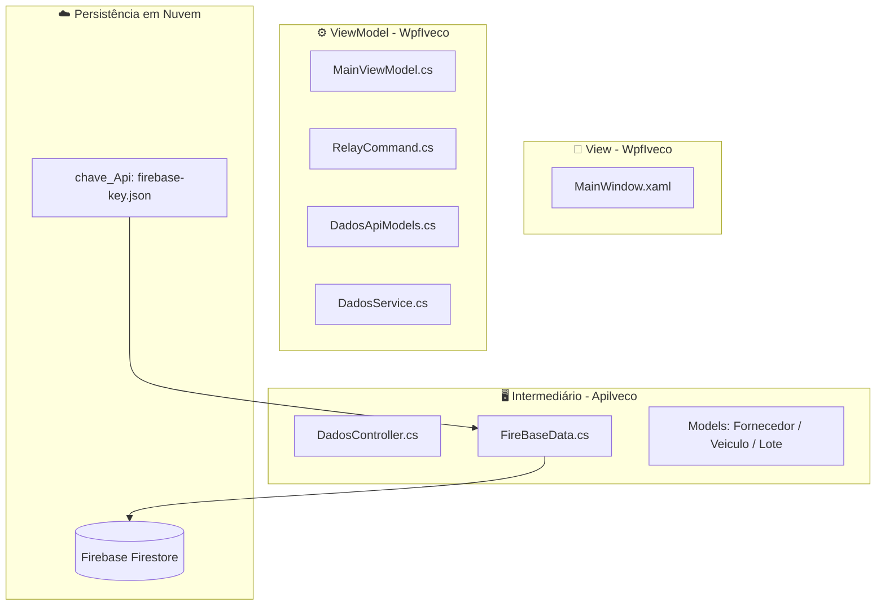
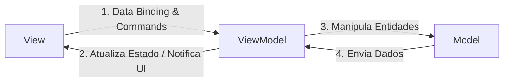

# 📦🍃 Sistema de Rastreamento Inteligente

### Trabalho de Conclusão de Curso - Desenvolvimento de Sistemas

<div align="center">

</div>

### Escola De Programação e Robótica - SENAI 


#### Orientado por: Fred Aguiar

  👥 Equipe de Desenvolvimento

<p align="center"> <strong>Colaboradores:</strong><br> <a href="https://github.com/aliceandradee">🧑‍💻 Alice Andrade</a> | <a href="https://github.com/erick190813">🧑‍💻 Erick Silva</a> | <a href="https://github.com/NicolasOlim">🧑‍💻 Nicolas Oliveira</a> | <a href="https://github.com/vnxtry">🧑‍💻 Vinicius Augusto</a> </p>

# Proposta de Valor: Sistema de Rastreamento Inteligente (Projeto Iveco)

**Contexto:** Solução tecnológica voltada para a rastreabilidade logística e a transparência ambiental na cadeia de suprimentos da indústria automotiva pesada.

---

## 🎯 Principais Pilares de Valor

### 📦 1. Gerenciamento e Rastreabilidade Logística
* **Monitoramento em Tempo Real:** Capacidade de catalogar insumos e rastrear a produção instantaneamente.
* **Controle de Suprimentos:** Gestão integrada que atende à complexidade logística da manufatura de veículos industriais.

### 🌱 2. Sustentabilidade e Conformidade ESG
* **Cálculo da Pegada de Carbono:** Automação no cálculo da emissão de gases de efeito estufa para a frota.
* **Alinhamento a Diretrizes:** Facilita o atendimento aos rigorosos requisitos de conformidade e auditoria estabelecidos pelas políticas Ambientais, Sociais e de Governança Corporativa (ESG).

### ⚙️ 3. Infraestrutura de Alta Performance e Resiliência
* **Arquitetura Distribuída:** Solução escalável, migrada para um ecossistema em nuvem (NoSQL) e estruturada para suportar a demanda de uma produção em escala industrial.
* **Processamento Concorrente:** Absorve alta demanda de telemetria e sensores IoT sem interrupções (Thread Pool e fluxo assíncrono), garantindo integridade e resposta ágil às linhas de produção.

### 📊 4. Ferramenta Estratégica de Monitoramento
* **Inteligência de Dados:** Atua como o núcleo de governança e painel de controle administrativo das operações logísticas (Dashboards ricos e interativos).
* **Comprovação Ecológica:** Estruturada para atuar como prova estratégica de responsabilidade ecológica e eficiência da operação.


## 🛠️ Tecnologias e Stack

<p align="center">
  
  
  
  
  
  
  
  
  
  
  
  
  
  
  
</p>


---


## 📢 Pitch de Negócios & Defesa Estratégica

Nós somos o grupo responsável por desenvolver uma solução para a descarbonização na Iveco. Criamos um software capaz de monitorar o consumo energético na linha de produção, gerando dados em tempo real e ajudando a reduzir desperdícios. Destacando a economia de energia, a sustentabilidade e o ganho de eficiência como valores principais. Sendo criado um protótipo de sistema que integra sensores IoT capazes de medir tensão e corrente em cada máquina. Esses dados são enviados para um banco de dados central e exibidos em um painel interativo/interface. O sistema consegue identificar falhas, alertar desperdícios e mapear os lotes de produção, mostrando exatamente o gasto de energia de cada caminhão. Também vamos integrar um sistema de machine learning para aplicar a manutenção preditiva, que utiliza dados e monitoramento contínuo para prever falhas antes que ocorram. Conseguindo reduzir os custos operacionais com desperdício de energia, prevenir falhas que geram altos custos de manutenção e aumentar a sua competitividade no mercado. Além de confiável, o sistema é flexível e pode ser expandido para diferentes tipos de produção.

---

### 🚨 1. O Problema e a Proposta de Valor
A descarbonização e a eficiência energética tornaram-se pilares críticos na manufatura da indústria automotiva pesada. O desafio central consiste em monitorar, quantificar e mitigar o consumo energético diretamente na linha de produção em tempo real, eliminando desperdícios operacionais.

A nossa solução propõe uma abordagem estruturada (baseada no Modelo Canvas), cujos principais valores entregues são:
* **Sustentabilidade Mensurável:** Transparência no consumo de recursos e emissões por ativo.
* **Economia de Energia:** Identificação cirúrgica de gargalos e vazamentos energéticos.
* **Ganho de Eficiência:** Otimização dos ciclos de montagem com base em dados reais de consumo.

---

## Documentação do Ecossistema: Cadeia de Suprimentos, Veículos e Persistência em Nuvem

Bem-vindo à documentação do ecossistema de software desenvolvido para o gerenciamento, rastreabilidade e monitoramento ambiental da cadeia de suprimentos de veículos Iveco. Este ecossistema é distribuído, composto por uma **API REST Core**, uma interface visual **WPF (Desktop)** baseada no padrão **MVVM**, um **Simulador** e armazenamento distribuído via **Firebase Firestore**. O nosso projeto é uma evolução do protótipo entregue no SAGA SENAI, onde foi remodelado para operarmos com a arquitetura e codificação do código com base os conhecimentos adquiridos no curso técnico de Desenvolvimento De Sistemas e como nosso projeto de conclusão de curso, sendo assim dividimos a nossa solução em três projetos, sendo eles:
1. **`ApiIveco` (Back-End)**: API Web construída em ASP.NET Core que centraliza as regras de negócio, expõe endpoints documentados via **Swagger** e faz a comunicação segura com a nuvem utilizando o SDK oficial do Google Cloud.
2. **`WpfIveco` (Front-End Desktop)**: Aplicação visual rica desenvolvida para o painel de controlo (dashboard) que consome os microsserviços da API, estruturada estritamente sob o padrão **MVVM (Model-View-ViewModel)** e com gráficos interativos via **LiveCharts2 (SkiaSharp)**.
3. **`SimuladorIveco` (Utilitário)**: Aplicação em modo Console responsável por simular e injetar dados contínuos de telemetria e produção para testes de carga e desempenho do ecossistema.
4. **`Firebase Firestore` (Banco de Dados)**: Banco de dados NoSQL baseado em nuvem, garantindo a persistência assíncrona, escalabilidade e atualizações em tempo real.

Contendo assim a seguinte arquitetura e estrutura de pastas:


---

## 📊 Diagramas e Modelagem

Para facilitar o entendimento da arquitetura e da evolução do ecossistema **Iveco Green Ledger**, consulte os diagramas abaixo que mapeiam tanto o estágio inicial relacional (legado do protótipo) quanto a nova estrutura otimizada para nuvem.

### 📐 1. Modelagem Relacional Original (SQLite)

Estes diagramas representam a primeira fase de modelagem do projeto, estruturada sobre um banco de dados relacional clássico.

#### Modelo Conceitual (Diagrama Entidade-Relacionamento - DER)
Representação de alto nível que identifica as entidades de negócio da Iveco, seus atributos identificadores e as respectivas cardinalidades operacionais.

<div align="center">

</div>

#### Modelo Lógico (Diagrama Entidade-Relacionamento - DER)
Estrutura de tabelas, chaves primárias (PK) e chaves estrangeiras (FK).

<div align="center">

</div>

---

<a id="dicionario-de-dados"></a>
## 🗄️ Dicionário de Dados

Abaixo está o detalhamento técnico de cada tabela e seus respectivos campos.

### 1. Tabela `Fornecedor`
Armazena as informações das empresas fornecedoras de matérias-primas.

| Coluna | Tipo | Restrições | Descrição |
| :--- | :--- | :--- | :--- |
| `Id` | `INTEGER` | `PRIMARY KEY, AUTOINCREMENT` | Identificador único do fornecedor. |
| `Nome` | `VARCHAR(255)` | `NOT NULL` | Razão social ou nome fantasia do fornecedor. |
| `Cnpj` | `VARCHAR(18)` | `NOT NULL, UNIQUE` | Cadastro Nacional da Pessoa Jurídica (ex: 00.000.000/0000-00). |
| `Localizacao` | `VARCHAR(255)` | `NULL` | Endereço físico ou região do fornecedor. |

### 2. Tabela `LoteMateriaPrima`
Registra os lotes de materiais entregues pelos fornecedores e sua respectiva pegada de carbono.

| Coluna | Tipo | Restrições | Descrição |
| :--- | :--- | :--- | :--- |
| `Id` | `INTEGER` | `PRIMARY KEY, AUTOINCREMENT` | Identificador único do lote. |
| `FornecedorId` | `INTEGER` | `NOT NULL, FK` | Referência ao `Id` do Fornecedor correspondente. |
| `TipoMaterial` | `VARCHAR(50)` | `NOT NULL` | Categoria ou nome da matéria-prima (ex: Aço, Plástico, Borracha). |
| `DataProducao` | `DATETIME` | `NOT NULL` | Data de produção ou recebimento do lote. |
| `QuantidadeKg` | `DECIMAL(10, 2)` | `NOT NULL` | Peso total do lote em quilogramas (kg). |
| `PegadaCarbonoPorKg`| `DECIMAL(10, 4)` | `NOT NULL` | Índice de emissão de carbono por quilo do material. |

### 3. Tabela `Veiculo`
Cadastro de veículos finalizados ou em montagem.

| Coluna | Tipo | Restrições | Descrição |
| :--- | :--- | :--- | :--- |
| `Vin` | `VARCHAR(17)` | `PRIMARY KEY` | Chassi ou *Vehicle Identification Number* (Padrão internacional de 17 caracteres). |
| `Modelo` | `VARCHAR(100)` | `NOT NULL` | Modelo comercial do veículo. |
| `DataMontagem` | `DATETIME` | `NOT NULL` | Data exata da montagem do veículo. |

### 4. Tabela `VeiculoComponente`
Tabela associativa que vincula os veículos aos lotes de matéria-prima, garantindo rastreabilidade peça por peça.

| Coluna | Tipo | Restrições | Descrição |
| :--- | :--- | :--- | :--- |
| `Id` | `INTEGER` | `PRIMARY KEY, AUTOINCREMENT` | Identificador único do registro de montagem da peça. |
| `VeiculoVin` | `VARCHAR(17)` | `NOT NULL, FK` | Referência ao chassi (`Vin`) do veículo. Possui `ON DELETE CASCADE`. |
| `LoteMateriaPrimaId`| `INTEGER` | `NOT NULL, FK` | Referência ao `Id` do lote que originou a peça. |
| `NomePeca` | `VARCHAR(100)` | `NOT NULL` | Nome específico do componente (ex: Eixo Dianteiro, Bloco do Motor). |

---

<a id="relacionamentos"></a>
## 🔗 Relacionamentos

* **`Fornecedor` 1 ↔ N `LoteMateriaPrima`**: Um fornecedor pode entregar múltiplos lotes de matéria-prima, mas um lote específico vem de apenas um fornecedor.
* **`Veiculo` 1 ↔ N `VeiculoComponente`**: Um veículo possui vários componentes rastreáveis instalados. Se o registro do veículo for excluído, todos os seus componentes associados serão removidos em cascata (`ON DELETE CASCADE`).
* **`LoteMateriaPrima` 1 ↔ N `VeiculoComponente`**: Um lote de matéria-prima gera diversas peças (componentes), que podem ser instaladas em vários veículos.

---

<a id="script-sql"></a>
## 💻 Script SQL (SQLite)

Para criar a estrutura em seu banco de dados SQLite, execute o script abaixo:

```sql
PRAGMA foreign_keys = ON;

-- 1. Tabela Fornecedor
CREATE TABLE Fornecedor (
    Id INTEGER PRIMARY KEY AUTOINCREMENT,
    Nome VARCHAR(255) NOT NULL,
    Cnpj VARCHAR(18) NOT NULL UNIQUE,
    Localizacao VARCHAR(255)
);

-- 2. Tabela LoteMateriaPrima
CREATE TABLE LoteMateriaPrima (
    Id INTEGER PRIMARY KEY AUTOINCREMENT,
    FornecedorId INTEGER NOT NULL,
    TipoMaterial VARCHAR(50) NOT NULL,
    DataProducao DATETIME NOT NULL,
    QuantidadeKg DECIMAL(10, 2) NOT NULL,
    PegadaCarbonoPorKg DECIMAL(10, 4) NOT NULL,
    CONSTRAINT FK_Lote_Fornecedor FOREIGN KEY (FornecedorId) 
        REFERENCES Fornecedor(Id)
);

-- 3. Tabela Veiculo
CREATE TABLE Veiculo (
    Vin VARCHAR(17) PRIMARY KEY,
    Modelo VARCHAR(100) NOT NULL,
    DataMontagem DATETIME NOT NULL
);

-- 4. Tabela VeiculoComponente (Tabela Associativa / Peças do Caminhão)
CREATE TABLE VeiculoComponente (
    Id INTEGER PRIMARY KEY AUTOINCREMENT,
    VeiculoVin VARCHAR(17) NOT NULL,
    LoteMateriaPrimaId INTEGER NOT NULL,
    NomePeca VARCHAR(100) NOT NULL,
    CONSTRAINT FK_Componente_Veiculo FOREIGN KEY (VeiculoVin) 
        REFERENCES Veiculo(Vin) ON DELETE CASCADE,
    CONSTRAINT FK_Componente_Lote FOREIGN KEY (LoteMateriaPrimaId) 
        REFERENCES LoteMateriaPrima(Id)
);
 ```
---

## Conhecendo cada camada do projeto:

## API' s Públicas utilizadas no projeto

####  **BrasilAPI:** É uma comunidade de desenvolvedores no Brasil e que nasceu com um propósito claro de simplificar o acesso a dados públicos nacionais, centralizando diversas consultas que antes eram espalhadas por sites governamentais instáveis, lentos ou de difícil integração. 

#### 🛠️ Pilares Arquiteturais e Diferenciais Técnicos

O sucesso e a confiabilidade da Brasil API na integração de sistemas industriais — como o ecossistema *Iveco Green Ledger* — fundamentam-se em três pilares principais:

1. **Abstração de Protocolos e Autenticação:** Diferente de outras soluções comerciais, a plataforma dispensa o uso de chaves privadas (*API Keys*) ou tokens de portador (*Bearer Tokens*) para a maioria de seus endpoints básicos, eliminando o acoplamento de credenciais no código-fonte e agilizando as chamadas assíncronas no Back-End.
2. **Camada Inteligente de Cache (Alta Disponibilidade):** Portais de órgãos públicos sofrem frequentemente com picos de tráfego ou janelas de manutenção. A Brasil API mitiga esse gargalo implementando estratégias severas de *caching* em servidores de borda (*Edge Computing*, através da infraestrutura da Vercel). Isso garante que, mesmo se o microsserviço de origem estiver temporariamente fora do ar, a API consiga responder à requisição utilizando uma imagem de dados recentemente validada.
3. **Gratuidade e Escalabilidade Horizontal:** Por ser mantida de forma colaborativa pela comunidade de engenharia de software brasileira, a API é dimensionada para suportar milhões de requisições diárias sem custos operacionais para os desenvolvedores parceiros, tornando-se uma ferramenta viável para testes de estresse e homologação de projetos escolares e industriais.

---

#### **NHTSA Response:** Elas funcionam via requisições HTTP normais e retornam respostas estruturadas em formatos como JSON, XML ou CSV.

#### 🛠️ Pilares Arquiteturais e Diferenciais Técnicos

O sucesso e a confiabilidade da NHTSA API na integração de sistemas industriais — como o ecossistema *Iveco Green Ledger* — fundamentam-se em três pilares principais:

1. **Decodificação Normativa Global (Padrão ISO 3779):** A API baseia-se na estrutura internacional do VIN (*Vehicle Identification Number*), que divide os 17 caracteres do chassi em três seções: o WMI (Identificador do Fabricante Mundial), o VDS (Seção de Descrição do Veículo) e o VIS (Seção de Indicador do Veículo). A plataforma dispensa o uso de chaves privadas (*API Keys*) para consultas públicas, permitindo que o Back-End faça chamadas assíncronas diretas para isolar e extrair os metadados de engenharia em tempo real.
2. **Camada Inteligente de Cache (Alta Disponibilidade):** Por lidar com frotas e homologações globais, os servidores da NHTSA são estruturados para responder com baixíssima latência. O ecossistema mitiga gargalos de requisições repetitivas na linha de montagem ou no simulador implementando indexação massiva em servidores de borda (*Edge Computing*). Isso garante que consultas sobre chassis semelhantes (mesmo lote ou modelo Iveco) obtenham respostas quase instantâneas, blindando a aplicação contra quedas de conexão transatlântica.
3. **Gratuidade e Escalabilidade Governamental:** Por ser mantida por um órgão federal de segurança viária norte-americano, a infraestrutura da API é dimensionada para suportar milhões de requisições de auditoria industrial diariamente sem custos operacionais ou limites severos de *rate limiting* para os desenvolvedores parceiros. Isso a torna uma ferramenta extremamente viável para testes de estresse, simulações de IoT em larga escala e homologação acadêmica.

   ---

#### **API Mercado Livre:** Elas funcionam via requisições HTTP normais e retornam respostas estruturadas em formatos como JSON, XML ou CSV.

#### 🛠️ Pilares Arquiteturais e Diferenciais Técnicos

O sucesso e a confiabilidade da API do Mercado Livre na integração de sistemas industriais — como o ecossistema *Iveco Green Ledger* — fundamentam-se em três pilares principais:

1. **Abstração de Catálogos e Indexação Universal (EAN/GTIN):** A API baseia-se na estrutura global de identificação de mercadorias, mapeando os componentes através de códigos universais de produto ou números originais de fábrica. Para consultas de leitura pública de catálogo e categorias, a plataforma dispensa fluxos complexos de autenticação em chamadas iniciais, permitindo que o Back-End faça requisições assíncronas diretas para coletar metadados comerciais e agilizar o fluxo de dados.
2. **Infraestrutura Cloud-Native e Baixa Latência (Alta Disponibilidade):** Por sustentar operações críticas de e-commerce transacional em todo o continente, os servidores do Mercado Livre utilizam arquiteturas distribuídas e escaláveis na nuvem. O ecossistema mitiga gargalos de requisições repetitivas na linha de suprimentos implementando espelhamento massivo de banco de dados e servidores de borda (*Edge Computing*). Isso garante que consultas por componentes estruturais (como "Eixo Dianteiro" ou "Bloco do Motor") obtenham respostas em milissegundos, blindando a aplicação contra quedas e latências de rede.
3. **Escalabilidade Industrial e Amplo Rate Limiting:** Sendo estruturada para suportar picos massivos de tráfego, a infraestrutura da API oferece margens amplas de requisições diárias. O sistema conta com políticas claras de limites operacionais (*rate-limiting*) que protegem o servidor, permitindo que o `SimuladorIveco` ou o dashboard WPF realizem varreduras e coletas analíticas em larga escala sem interrupções de serviço, tornando-a ideal para simulações fabris e homologação de projetos acadêmicos.


### 🗂️ Camada de serviços intermediários - API (ApiIveco)

<div align="center">

</div>

A ApiIveco atua como o núcleo inteligente e centralizador de dados de todo o ecossistema. Desenvolvida sob o ecossistema .NET 8 com o ecossistema ASP.NET Core Web API, ela adota o estilo arquitetural REST (Representational State Transfer), utilizando o protocolo HTTP/HTTPS e payloads em formato JSON para a comunicação entre sistemas. A principal justificativa para a implementação desta camada intermediária é o desacoplamento e a segurança da informação: em vez de expor as regras de negócio e as credenciais confidenciais de nuvem diretamente nas pontas (clientes), a API encapsula o acesso ao banco de dados e expõe apenas portas controladas (endpoints). Adicionalmente, a API desempenha um papel fundamental na governança dos dados ao integrar o SDK oficial do Google Cloud para a comunicação com o Firebase Firestore. As requisições recebidas passam por processos de validação de dados nas entidades antes de dispararem os métodos assíncronos de persistência em nuvem. Para garantir a transparência no desenvolvimento e facilitar a integração contínua entre os colaboradores, a aplicação conta com a documentação automatizada via Swagger (OpenAPI), fornecendo uma interface interativa onde todos os endpoints de consulta, inserção e agregação podem ser validados e testados em tempo real.

---

### 🗂️ Camada da Interface Gráfica - WPF (WpfIveco)

<div align="center">

</div>

A camada **WpfIveco** foi desenvolvida utilizando a tecnologia Windows Presentation Foundation (WPF) e estruturada rigorosamente sob o padrão de projeto arquitetural **MVVM (Model-View-ViewModel)**. O objetivo primordial dessa abordagem é a completa separação de responsabilidades entre a interface gráfica com o usuário (View escrita em XAML) e a lógica de apresentação e regras de negócio (ViewModel escrita em C#). 

Essa arquitetura elimina a dependência de códigos complexos e acoplados diretamente no arquivo de eventos da tela (*code-behind*), delegando a renderização e o controle de dados aos mecanismos nativos de **Data Binding** bidirecional e à implementação da interface `INotifyPropertyChanged`. Dessa forma, a interface reage e se atualiza automaticamente a cada alteração de estado no domínio da aplicação.

#### 🚀 Detalhamento Técnico e Implementações Avançadas

* **Padrão MVVM Puro e Data Binding:** A interface utiliza intensamente o motor de binding do WPF para conectar propriedades da `ViewModel` (como indicadores de `TotalVeiculos`, `MediaCarbono` e inputs de `CnpjBusca`) diretamente aos componentes visuais. Isso garante que a UI seja apenas um reflexo do estado atual dos dados.
* **Renderização Dinâmica de Coleções (ItemsControl):** Na aba de rastreabilidade, a exibição de dados estáticos foi substituída por um componente inteligente `ItemsControl`. Ele consome a coleção observável `ListaVeiculos`, mapeando automaticamente propriedades do banco de dados (como `{Binding Modelo}`, `{Binding Vin}` e `{Binding DataMontagem}`) para dentro de um `DataTemplate` customizado, gerando cards de forma dinâmica conforme o banco é atualizado.
* **State Management e Navegação Declarativa:** O roteamento entre os módulos do sistema (Dashboard, Gestão de Fornecedores, Análises ESG e Configurações) descarta o uso tradicional de múltiplas janelas (Windows) ou frames de navegação complexos. Em vez disso, utiliza um sistema inteligente de `DataTriggers` que escuta a propriedade `AbaAtiva` e altera a visibilidade (`Visibility`) das `Grids` conteinerizadas. A transição é despachada via `ICommand` (`MudarAbaCommand`).
* **Arquitetura Orientada a Comandos (Command Pattern):** Interações do utilizador (cliques, submissões de formulário) não acionam eventos de clique convencionais (`Click=""`). Tudo é controlado via comandos injetáveis, como:
  * `ConsultarCnpjCommand`: Para integração via API com a Receita Federal.
  * `PesquisarVinCommand`: Para busca de ativos (Gêmeos Digitais) na rede.
  * `SalvarFornecedorCommand`: Para registo de novos nós permissionados.
* **Design System Customizado e UI/UX Premium:** A aplicação adota uma estética *Dark Mode* moderna e imersiva. Para alcançar esse resultado, a moldura padrão do Windows foi removida (`WindowStyle="None"`, `AllowsTransparency="True"`) e os controlos de janela foram recriados do zero. O projeto conta com um dicionário de recursos rico, definindo `Styles` globais (como `PremiumCardStyle` e `PremiumTextBoxStyle`) que padronizam cores institucionais, sombras em tempo real (`DropShadowEffect`), bordas fluidas (`CornerRadius`) e iconografia vetorial via *Segoe MDL2 Assets*.
* **Ferramentas de Teste Integradas na UI:** A interface foi projetada para suportar monitorização de testes de carga, incluindo um painel de configurações (`Ajustes`) que permite acionar um "Simulador de Chão de Fábrica (Mock IoT)" via `LigarDesligarSimuladorCommand`, gerando telemetria em tempo real para os bancos de dados em nuvem.
---
### 🗂️ Camada da View Model - WPF (WpfIveco)

Como dito anteriormente foi utilizado o padrão de projeto arquitetural MVVM. A escolha dessa abordagem baseia-se na metodologia de ensino adotada em sala de aula,na qual trabalhamos em nossos projetos práticos e definido pelo pelo educador Fred Aguiar como o modelo ideal para a estruturação do projeto técnico. Dessa forma, aplicamos na prática os conceitos de arquitetura aprendidos durante o curso técnico em Desenvolvimento de Sistemas.

O funcionamento do fluxo de dados e controle dentro da aplicação baseia-se em um ciclo fechado e reativo dividido em quatro etapas principais de interação, descritas a seguir:

---



---

### 📄 Modelo de Exportação e Relatórios em PDF

Essa parte do projeto é responsável por capturar os dados criados, estruturados e observados em tempo real na linha de produção da Iveco. Em vez de simplesmente acumular um histórico de registros, o sistema refina essas informações, correlacionando o consumo elétrico monitorado pelas estações de trabalho ao chassi de cada caminhão e aos respectivos lotes de insumos. 

<div align="center">

</div>

Para atender aos rigorosos requisitos de governança ambiental e conformidade com os padrões ESG, esse motor de geração documental foi projetado com foco em alta performance e segurança. Todo o processo de compilação histórica no banco de dados e renderização geométrica do arquivo é executado de forma estritamente assíncrona em segundo plano. Essa abordagem de desenvolvimento impede o travamento da interface visual e garante que o operador continue utilizando o sistema sem interrupções enquanto o arquivo  é gerado. Por fim o PDF é construído por...

---

#### Arquitetura do Front-End

**Interação e Disparo da UI: View → ViewModel (Data Binding & Commands)**
O ciclo operacional inicia-se na camada da View, desenvolvida na nossa MainWindow.xaml, onde acontece a lógica da nossa inteface/parte visual. Quando o operador realiza uma ação, como por exemplo clicar no botão para cadastrar uma peça ou pesquisar um chassi (VIN), a View não aciona um manipulador de eventos convencional no arquivo de código oculto, sendo assim a interação é despachada diretamente para a ViewModel por meio do ecossistema WPF trabalhadas em aula:

* Data Binding: Vinculação direta das propriedades dos componentes visuais (como o texto digitado em um TextBox) a propriedades em memória da ViewModel.

* Commands: Encapsulamento da intenção do usuário através da interface ICommand (implementada pela classe utilitária RelayCommand), que mapeia delegates assíncronos (como AdicionarPecaManualCommand) para execução imediata no back-end.

**Sincronização Reativa: ViewModel → View (Atualiza Estado / Notifica UI)**
Após processar as requisições e/ou receber novas informações da API intermediária, a ViewModel (MainViewModel.cs) atualiza seu estado interno em memória. Para que a interface reflita essas mudanças instantaneamente (como exibir uma mensagem de erro ou renderizar um novo card no ItemsControl), a classe implementa a interface nativa INotifyPropertyChanged.

Toda vez que o valor de uma propriedade é alterado dentro do bloco set, o método OnPropertyChanged é disparado. Onde será notificado de volta para a View, informando ao motor de renderização do WPF que o estado mudou. A UI reage redesenhando os componentes necessários em tempo real, sem a necessidade de atualizar ou reiniciar a tela do usuário.


