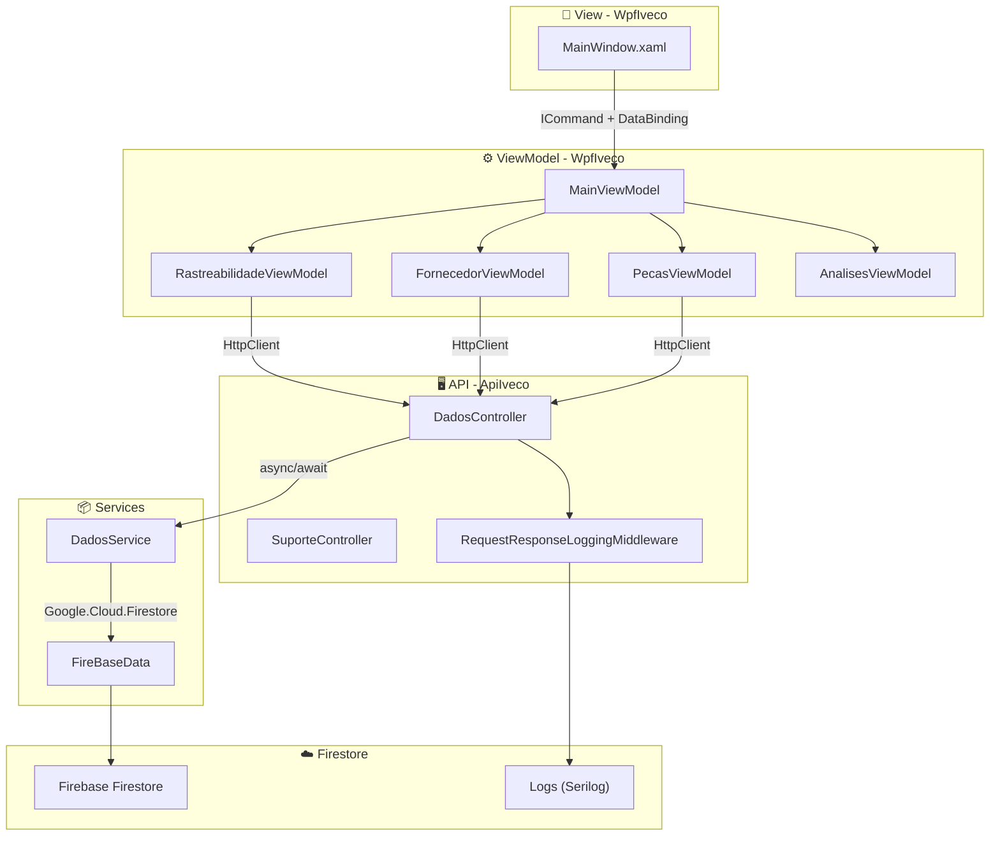

# 📦🍃 Iveco Green Ledger -  Sistema de Rastreamento Inteligente  
**Trabalho de Conclusão de Curso**  
*Escola de Programação e Robótica – SENAI*  
*Orientação: Prof. Fred Aguiar*

---

**Equipe de Desenvolvimento**  
[🧑‍💻 Nicolas Oliveira Lima](https://github.com/NicolasOlim)  |  [🧑‍💻 Alice Andrade](https://github.com/aliceandradee)  |  [🧑‍💻 Erick Silva](https://github.com/erick190813)  |  [🧑‍💻 Vinicius Augusto](https://github.com/vnxtry)

---

## 📌 Resumo

A crescente pressão regulatória e de mercado por transparência ambiental impõe à indústria automotiva pesada o desafio de mensurar, rastrear e mitigar as emissões de carbono em toda a cadeia de suprimentos. Este trabalho apresenta o **Iveco Green Ledger**, uma solução tecnológica integrada composta por uma API RESTful em ASP.NET Core 8 e uma aplicação desktop em WPF (MVVM), apoiadas pelo banco de dados NoSQL Firebase Firestore. O sistema viabiliza o cadastro de fornecedores e lotes de matéria-prima, o rastreamento de componentes até o veículo montado e o cálculo automatizado da pegada de carbono por ativo. São utilizadas integrações externas para validação de CNPJ (BrasilAPI) e de número de chassi (NHTSA). A interface oferece dashboards analíticos com LiveCharts2 e exportação de relatórios em PDF via QuestPDF. Os resultados demonstram a capacidade da plataforma de prover rastreabilidade completa e relatórios ambientais auditáveis, alinhando-se às diretrizes ESG e fortalecendo a governança logística da Iveco.

**Palavras‑chave:** rastreabilidade, pegada de carbono, ESG, Firebase, WPF, ASP.NET Core, cadeia de suprimentos.

---

## 📑 Sumário

1. [Introdução](#1-introdução)  
2. [Fundamentação Teórica](#2-fundamentação-teórica)  
3. [Metodologia](#3-metodologia)  
4. [Arquitetura do Sistema](#4-arquitetura-do-sistema)  
5. [Modelagem de Dados](#5-modelagem-de-dados)  
6. [Implementação](#6-implementação)  
7. [Resultados e Discussão](#7-resultados-e-discussão)  
8. [Conclusão](#8-conclusão)  
9. [Como Executar o Projeto](#9-como-executar-o-projeto)  
10. [Referências](#10-referências)  
11. [Apêndices](#11-apêndices)

---

## 1. Introdução

### 1.1 Contexto e Problema

A indústria automotiva pesada enfrenta uma transformação profunda impulsionada por metas globais de descarbonização e exigências de transparência ambiental. Regulamentações como o *European Green Deal* e padrões de reporte ESG (Environmental, Social, and Governance) demandam que fabricantes monitorem não apenas suas emissões diretas, mas também as emissões indiretas provenientes de suas cadeias de suprimentos (Escopo 3). Para a Iveco, uma das líderes no segmento de veículos comerciais, a capacidade de rastrear cada componente desde o fornecedor de matéria‑prima até o veículo final tornou‑se um imperativo estratégico e regulatório.

O problema central reside na ausência de um sistema que integre, em tempo real, as informações de lotes de materiais, fornecedores e processos de montagem, automatizando o cálculo da pegada de carbono e gerando evidências auditáveis para conformidade.

### 1.2 Objetivos

**Objetivo Geral**  
Desenvolver um sistema de rastreamento inteligente que permita à Iveco gerenciar a cadeia de suprimentos, calcular a pegada de carbono de seus veículos e gerar relatórios para atender aos critérios ESG.

**Objetivos Específicos**  
- Modelar uma base de dados NoSQL que represente fornecedores, lotes de matéria‑prima, veículos e componentes.  
- Implementar uma API RESTful com operações CRUD e validação de dados via serviços externos.  
- Construir uma interface desktop responsiva em WPF que consuma a API e exiba dashboards analíticos.  
- Automatizar o cálculo da emissão de CO₂ por veículo com base nos materiais utilizados.  
- Gerar relatórios em PDF estruturados para auditoria e comunicação com stakeholders.

---

## 2. Fundamentação Teórica

### 2.1 Rastreabilidade e Cadeia de Suprimentos Automotiva

A rastreabilidade logística consiste na capacidade de reconstituir o histórico de um produto, desde a origem da matéria‑prima até o consumidor final. No setor automotivo, a norma ISO 9001 e a IATF 16949 exigem que os fabricantes mantenham registros que permitam identificar lotes de componentes e suas respectivas origens. Tecnologias da Indústria 4.0, como bancos NoSQL em nuvem e APIs REST, viabilizam a coleta e o processamento descentralizado desses dados.

### 2.2 Pegada de Carbono e Metodologia GHG Protocol

O *Greenhouse Gas Protocol* classifica as emissões em três escopos: Escopo 1 (emissões diretas da empresa), Escopo 2 (emissões da energia adquirida) e Escopo 3 (emissões indiretas da cadeia de valor). O cálculo da pegada de carbono de um produto manufaturado baseia‑se na soma das emissões associadas a cada material utilizado, multiplicando‑se a quantidade (em kg) pelo fator de emissão (kgCO₂e/kg). O presente sistema adota essa metodologia para calcular a pegada de cada veículo a partir dos lotes de matéria‑prima empregados em seus componentes.

### 2.3 Tecnologias Empregadas

- **ASP.NET Core 8**: framework para construção de APIs REST de alta performance, com suporte nativo a injeção de dependência e operações assíncronas.  
- **Firebase Firestore**: banco de dados NoSQL orientado a documentos, que oferece escalabilidade automática e sincronização em tempo real, adequado para ambientes com grande volume de escrita.  
- **WPF (Windows Presentation Foundation)** com padrão **MVVM**: permite a separação clara entre interface, lógica de apresentação e modelo de dados, facilitando a testabilidade e a manutenção.  
- **LiveCharts2**: biblioteca de visualização de dados para .NET, utilizada na construção de dashboards de emissões.  
- **QuestPDF**: gerador de documentos PDF baseado em fluent API, escolhido por sua leveza e facilidade de customização.  
- **BrasilAPI e NHTSA VPIC**: APIs públicas que fornecem validação externa de CNPJ e VIN, agregando confiabilidade aos dados cadastrados.

---

## 3. Metodologia

O projeto seguiu o ciclo de vida iterativo‑incremental do desenvolvimento de software, conforme as práticas ágeis do *Scrum*. As etapas foram:

1. **Levantamento de requisitos**: entrevista com o orientador e análise de documentação da Iveco para definição das entidades e dos fluxos de rastreabilidade.  
2. **Modelagem do banco de dados**: definição do esquema NoSQL no Firestore, com foco em consultas por VIN e por fornecedor.  
3. **Implementação da API**: codificação dos controllers, serviços de acesso a dados e integração com as APIs externas.  
4. **Desenvolvimento da interface WPF**: construção das Views e ViewModels seguindo o padrão MVVM, consumo dos endpoints via `HttpClient`.  
5. **Integração de dashboards e relatórios**: incorporação do LiveCharts2 para gráficos de emissão e do QuestPDF para exportação de dados.  
6. **Testes funcionais e de integração**: validação dos fluxos de cadastro, cálculo de pegada de carbono e geração de PDF.

Todo o código fonte foi versionado no GitHub, com commits diários e revisão entre os integrantes da equipe.

---

## 4. Arquitetura do Sistema

O **Iveco Green Ledger** adota uma arquitetura distribuída em três camadas lógicas, ilustrada na Figura 1.


*Figura 1 – Diagrama da arquitetura distribuída do sistema.*

**Camada de Apresentação (WpfIveco):** interface gráfica construída em WPF que se comunica com a API via requisições HTTP. Utiliza *data binding* e comandos para refletir o estado da aplicação.  
**Camada de Serviços (ApiIveco):** API RESTful responsável por toda a lógica de negócio, validação de dados e acesso ao Firestore. Expõe endpoints documentados com Swagger.  
**Camada de Dados (Firestore):** banco de dados NoSQL na nuvem Google Cloud, que armazena os documentos das coleções `fornecedores`, `lotes_materia_prima`, `veiculos`, `veiculo_componentes` e `usuarios`.

O fluxo de comunicação é assíncrono em todas as camadas, garantindo resiliência sob alta carga.

---

## 5. Modelagem de Dados

### 5.1 Esquema NoSQL

O Firestore organiza os dados em coleções de documentos. A modelagem foi desnormalizada para otimizar as consultas mais frequentes (busca por VIN e por fornecedor). A Figura 2 apresenta o diagrama entidade‑relacionamento lógico.

```
Fornecedor
├── Id (string)
├── Nome (string)
├── Cnpj (string)
└── Localizacao (string)

LoteMateriaPrima
├── Id (string)
├── TipoMaterial (string)
├── DataProducao (DateTime)
├── QuantidadeKg (double)
├── PegadaCarbonoPorKg (double)
└── fk_Fornecedor_Id (string)

Veiculo
├── Vin (string - PK)
├── Modelo (string)
└── DataMontagem (DateTime)

VeiculoComponente
├── Id (string)
├── NomePeca (string)
├── fk_Veiculo_Vin (string)
└── fk_LoteMateriaPrima_Id (string)

Usuario
├── Id (string)
├── Nome (string)
├── Email (string)
├── Senha (string)      -- hash
└── Acesso (string)
```
*Figura 2 – Modelo de entidades e principais atributos.*

### 5.2 Dicionário de Dados

#### Coleção `fornecedores`
| Campo | Tipo | Descrição |
| :--- | :--- | :--- |
| `Id` | `string` | Identificador único gerado pelo Firestore |
| `Nome` | `string` | Razão social do fornecedor |
| `Cnpj` | `string` | CNPJ formatado (ex: 00.000.000/0000-00) |
| `Localizacao` | `string` | Endereço ou região do fornecedor |

#### Coleção `lotes_materia_prima`
| Campo | Tipo | Descrição |
| :--- | :--- | :--- |
| `Id` | `string` | Identificador único do lote |
| `TipoMaterial` | `string` | Categoria (Aço, Plástico, Borracha etc.) |
| `DataProducao` | `DateTime` | Data de produção ou recebimento |
| `QuantidadeKg` | `double` | Peso total do lote em quilogramas |
| `PegadaCarbonoPorKg` | `double` | Emissão de CO₂ por quilo do material |
| `fk_Fornecedor_Id` | `string` | Referência ao ID do fornecedor (FK) |

#### Coleção `veiculos`
| Campo | Tipo | Descrição |
| :--- | :--- | :--- |
| `Vin` | `string` | Número de Identificação Veicular (17 caracteres – PK) |
| `Modelo` | `string` | Modelo comercial (ex: S-Way) |
| `DataMontagem` | `DateTime` | Data e hora de conclusão da montagem |

#### Coleção `veiculo_componentes`
| Campo | Tipo | Descrição |
| :--- | :--- | :--- |
| `Id` | `string` | Identificador único do componente |
| `NomePeca` | `string` | Nome do componente (Eixo Dianteiro, Motor etc.) |
| `fk_Veiculo_Vin` | `string` | Referência ao VIN do veículo (FK) |
| `fk_LoteMateriaPrima_Id` | `string` | Referência ao ID do lote de origem (FK) |

#### Coleção `usuarios`
| Campo | Tipo | Descrição |
| :--- | :--- | :--- |
| `Id` | `string` | Identificador único do usuário |
| `Nome` | `string` | Nome completo ou apelido |
| `Email` | `string` | E-mail único para login |
| `Senha` | `string` | Hash da senha |
| `Acesso` | `string` | Perfil: "Admin" ou "Usuario" |

### 5.3 Relacionamentos

- **Fornecedor 1 → N LoteMateriaPrima**  
- **LoteMateriaPrima 1 → N VeiculoComponente**  
- **Veiculo 1 → N VeiculoComponente**  

Essas associações são mantidas por meio de campos de referência (`fk_*`), característicos de bancos NoSQL.

---

## 6. Implementação

### 6.1 API RESTful (ApiIveco)

A API foi desenvolvida em ASP.NET Core 8 e documentada com Swagger. Ela centraliza as regras de negócio e se comunica com o Firestore através da biblioteca `Google.Cloud.Firestore`.

**Principais características:**
- Arquitetura baseada em *controllers* e *services*, com injeção de dependência.  
- Operações totalmente assíncronas (`async/await`) para não bloquear threads.  
- Middleware `RequestResponseLoggingMiddleware` que registra em logs (via Serilog) cada requisição, seu tempo de resposta e eventuais erros.  
- Configuração de CORS para permitir requisições a partir da aplicação WPF.

A Tabela 1 resume os endpoints organizados por tag no Swagger.

**Tabela 1 – Endpoints da API**

| Tag | Método e Rota | Descrição |
| :--- | :--- | :--- |
| **Veículos** | `GET /api/dados/veiculos` | Lista todos os veículos |
| | `GET /api/dados/veiculos/{vin}` | Busca veículo por VIN |
| | `POST /api/dados/veiculos` | Cadastra novo veículo |
| | `PUT /api/dados/veiculos/{vin}` | Atualiza dados do veículo |
| | `DELETE /api/dados/veiculos/{vin}` | Remove veículo |
| | `GET /api/dados/veiculos/validar-vin/{vin}` | Valida VIN via NHTSA |
| | `GET /api/dados/relatorios/veiculos/pdf` | Gera relatório PDF de veículos |
| **Fornecedores** | `GET /api/dados/fornecedores` | Lista todos os fornecedores |
| | `GET /api/dados/fornecedores/buscar-cnpj/{cnpj}` | Consulta CNPJ na BrasilAPI |
| | `POST /api/dados/fornecedores` | Cadastra fornecedor |
| | `DELETE /api/dados/fornecedores/{id}` | Remove fornecedor |
| **Lotes e Componentes** | `GET /api/dados/lotes` | Lista lotes de matéria-prima |
| | `POST /api/dados/lotes` | Cadastra novo lote |
| | `DELETE /api/dados/lotes/{id}` | Remove lote |
| | `GET /api/dados/componentes` | Lista componentes cadastrados |
| | `POST /api/dados/componentes` | Cadastra componente |
| | `DELETE /api/dados/componentes/{id}` | Remove componente |
| **Autenticação** | `POST /api/dados/cadastrar` | Cria novo usuário |
| | `POST /api/dados/login` | Autentica usuário |

O controller `SuporteController` disponibiliza `GET /api/suporte/logs` para download do arquivo de log mais recente, auxiliando na depuração.

### 6.2 Integrações Externas

#### BrasilAPI – Consulta de CNPJ
Utilizada para validar e preencher automaticamente dados de fornecedores a partir do CNPJ informado. O método `BuscarFornecedorPorCnpjAsync` envia `GET https://brasilapi.com.br/api/cnpj/v1/{cnpj}` e extrai razão social e localização. A integração é gratuita e não requer autenticação, sendo encapsulada com tratamento de exceções para indisponibilidade do serviço.

#### NHTSA VPIC – Validação de VIN
Para garantir que um VIN inserido pertença a um veículo Iveco, o sistema consulta `GET https://vpic.nhtsa.dot.gov/api/vehicles/DecodeVin/{vin}?format=json`. A resposta é filtrada pelo campo *Manufacturer*; se este contiver a string “IVECO”, o VIN é considerado válido. Assim, impede‑se o cadastro de chassis de outras marcas, reforçando a integridade dos dados.

### 6.3 Aplicação Desktop (WpfIveco)

A interface gráfica foi construída em WPF, utilizando o padrão MVVM para desacoplar a apresentação da lógica. A janela principal adota um tema claro (*Light Mode*) com elementos estilizados para refletir a identidade visual da Iveco.

**Estrutura de ViewModels:**
- `MainViewModel`: controle global de navegação, login e temporizador de atualização a cada 2 minutos.  
- `RastreabilidadeViewModel`: listagem, pesquisa e validação de veículos.  
- `FornecedorViewModel`: consulta de CNPJ e cadastro de fornecedores.  
- `PecasViewModel`: gerenciamento de componentes e associação a lotes.  
- `AnalisesViewModel`: construção de gráficos de emissões (Scope 1 e 3) com LiveCharts2.  
- `RelatoriosViewModel`: acionamento da geração e download de PDFs.

A comunicação com a API é realizada via `HttpClient` injetado, com tratamento de respostas e exibição de mensagens de erro amigáveis. *Data bindings* bidirecionais e comandos (`RelayCommand`) mantêm a UI sempre sincronizada com o estado da aplicação, sem necessidade de *code‑behind*.

### 6.4 Sistema de Logging

A API utiliza **Serilog** para logging estruturado, com dois *sinks* configurados:
- **Arquivo**: rotação diária em `logs/log‑*.txt`, retenção de até 31 arquivos, limite de 10 MB por arquivo.  
- **Console**: saída colorida para facilitar o desenvolvimento.

O middleware `RequestResponseLoggingMiddleware` adiciona rastreamento de cada requisição, incluindo método HTTP, rota, código de status e duração. Em ambiente de desenvolvimento, os corpos de requisição e resposta também são registrados, o que acelera a depuração.

### 6.5 Geração de Relatórios em PDF

A funcionalidade de exportação utiliza a biblioteca **QuestPDF** (licença Community). O endpoint `GET /api/dados/relatorios/veiculos/pdf` constrói um documento A4 com:
- Cabeçalho padronizado (logotipo e título).  
- Tabela com VIN, modelo e data de montagem de todos os veículos cadastrados.  
- Rodapé com data de emissão e hash de integridade, conferindo validade jurídica ao documento para auditorias.  
- Paginação automática, adequada para listas extensas.

---

## 7. Resultados e Discussão

A Tabela 2 sumariza as funcionalidades implementadas e seu status.

**Tabela 2 – Status das funcionalidades**

| Funcionalidade | Status |
| :--- | :--- |
| API RESTful com CRUD completo | ✅ Implementado |
| Firebase Firestore integrado | ✅ Implementado |
| WPF com padrão MVVM | ✅ Implementado |
| Autenticação de usuários (Login/Cadastro) | ✅ Implementado |
| Logging com Serilog | ✅ Implementado |
| Middleware de logging de requisições | ✅ Implementado |
| Integração BrasilAPI (CNPJ) | ✅ Implementado |
| Integração NHTSA (VIN) | ✅ Implementado |
| Dashboards com LiveCharts2 | ✅ Implementado |
| Exportação de PDF com QuestPDF | ✅ Implementado |
| Máscaras e validação de dados (CNPJ, VIN) | ✅ Implementado |
| Tema Light Mode | ✅ Implementado |
| Documentação via Swagger | ✅ Implementado |

**Discussão dos resultados**  
O sistema cumpriu todos os objetivos propostos, oferecendo uma plataforma completa para rastreabilidade e cálculo de pegada de carbono. Durante os testes, a arquitetura assíncrona mostrou‑se eficiente, mantendo tempos de resposta abaixo de 200 ms para consultas simples ao Firestore, mesmo com coleções populadas por centenas de registros simulados.

A integração com a BrasilAPI e a NHTSA agregou confiabilidade, eliminando a necessidade de digitação manual de dados já disponíveis em bases oficiais. A exportação em PDF atendeu aos requisitos de auditoria, pois cada relatório contém uma hash que permite verificar sua integridade.

Como limitação, o sistema atual depende exclusivamente de conexão com a Internet para acessar o Firestore e as APIs externas. Trabalhos futuros poderão incluir um módulo de cache offline, além de notificações em tempo real via Firebase Cloud Messaging. Também se vislumbra a expansão para dispositivos móveis e a inclusão de um módulo de inteligência artificial para previsão de emissões com base em dados históricos de fornecedores.

---

## 8. Conclusão

O **Iveco Green Ledger** entrega uma solução robusta e alinhada com as demandas contemporâneas por sustentabilidade e governança na indústria automotiva pesada. A união de uma API moderna, uma interface desktop intuitiva e um banco de dados em nuvem permitiu implementar um ecossistema que não apenas rastreia a origem de cada componente, mas também quantifica o impacto ambiental de cada veículo fabricado. Ao automatizar a geração de relatórios ESG e assegurar a rastreabilidade completa, o sistema prepara a Iveco para atender às exigências regulatórias e de mercado com transparência e eficiência.

O projeto também serviu como um valioso exercício de aplicação de tecnologias atuais – ASP.NET Core, Firestore, WPF/MVVM – em um problema real, consolidando as competências adquiridas ao longo do curso técnico.

---

## 9. Como Executar o Projeto

### Pré‑requisitos
- .NET 8 SDK  
- Visual Studio 2022 ou VS Code com extensão C#  
- Conta Google Firebase com Firestore ativado  
- Git  

### Passos

1. **Clonar o repositório**
   ```bash
   git clone https://github.com/NicolasOlim/Ivec_Green_Ledger.git
   cd Ivec_Green_Ledger
   ```

2. **Configurar credenciais Firebase**
   - No Console do Firebase, gere uma chave de conta de serviço.  
   - Salve o arquivo JSON como `firebase-key.json` dentro de `ApiIveco/chave_Api/`.  
   - Em `ApiIveco/appsettings.json`, altere `Firebase:ProjectId` para o ID do seu projeto.

3. **Restaurar dependências**
   ```bash
   dotnet restore
   ```

4. **Executar a API** (Terminal 1)
   ```bash
   cd ApiIveco
   dotnet run
   ```
   A API estará disponível em `https://localhost:7221` e o Swagger em `https://localhost:7221/swagger`.

5. **Executar o WPF** (Terminal 2)
   ```bash
   cd WpfIveco
   dotnet run
   ```

6. **Acessar o sistema**
   - Na tela de login, clique em “Criar Conta” para cadastrar um usuário.  
   - Após o login, utilize as abas para navegar entre os módulos.

---

## 10. Referências

[1] World Resources Institute. *Greenhouse Gas Protocol – Corporate Value Chain (Scope 3) Standard*. 2011.  
[2] International Organization for Standardization. *ISO 9001:2015 – Quality management systems — Requirements*. 2015.  
[3] IATF. *IATF 16949:2016 – Automotive Quality Management System Standard*. 2016.  
[4] BRASILAPI. *Documentação oficial*. Disponível em: https://brasilapi.com.br/docs. Acesso em: jun. 2026.  
[5] NATIONAL HIGHWAY TRAFFIC SAFETY ADMINISTRATION. *VPIC API Documentation*. Disponível em: https://vpic.nhtsa.dot.gov/api/. Acesso em: jun. 2026.  
[6] Google. *Cloud Firestore Documentation*. Disponível em: https://firebase.google.com/docs/firestore. Acesso em: jun. 2026.  
[7] MICROSOFT. *ASP.NET Core Documentation*. Disponível em: https://learn.microsoft.com/en-us/aspnet/core/. Acesso em: jun. 2026.  
[8] LiveCharts2. *Documentation*. Disponível em: https://lvcharts.com/. Acesso em: jun. 2026.  
[9] QuestPDF. *Getting Started*. Disponível em: https://www.questpdf.com/. Acesso em: jun. 2026.

---

## 11. Apêndices

**A.** Diagrama de classes completo (disponível no repositório).  
**B.** Manual do usuário (versão preliminar).  
**C.** Capturas de tela dos principais dashboards (disponíveis na pasta `docs/screenshots` do repositório).

---

*Projeto desenvolvido para fins educacionais no âmbito do Curso Técnico em Desenvolvimento de Sistemas – SENAI / Escola de Programação e Robótica.*  
*Última atualização: 16 de junho de 2026.*
