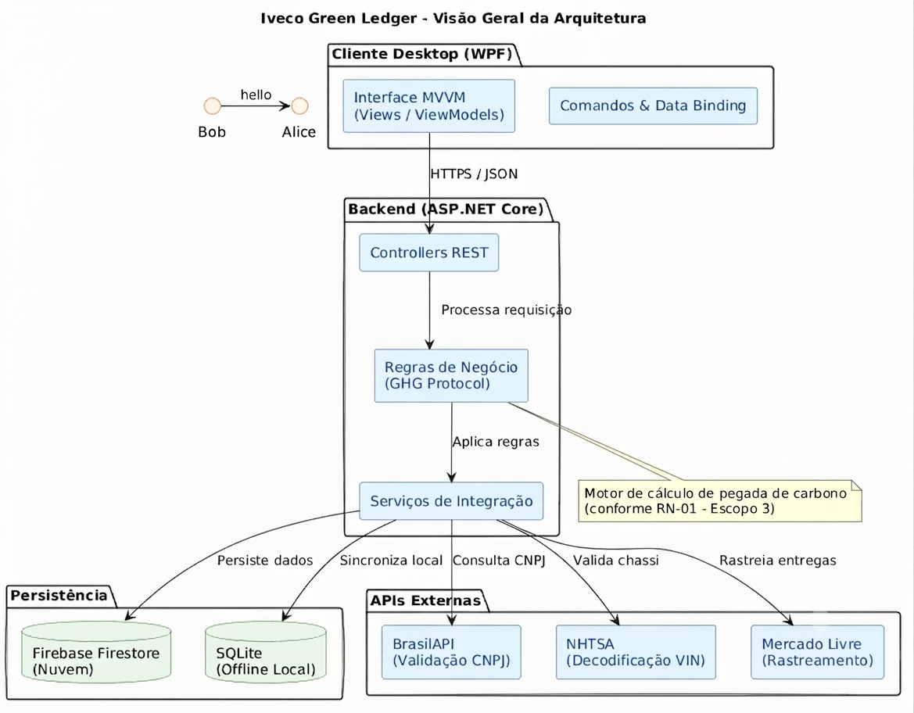
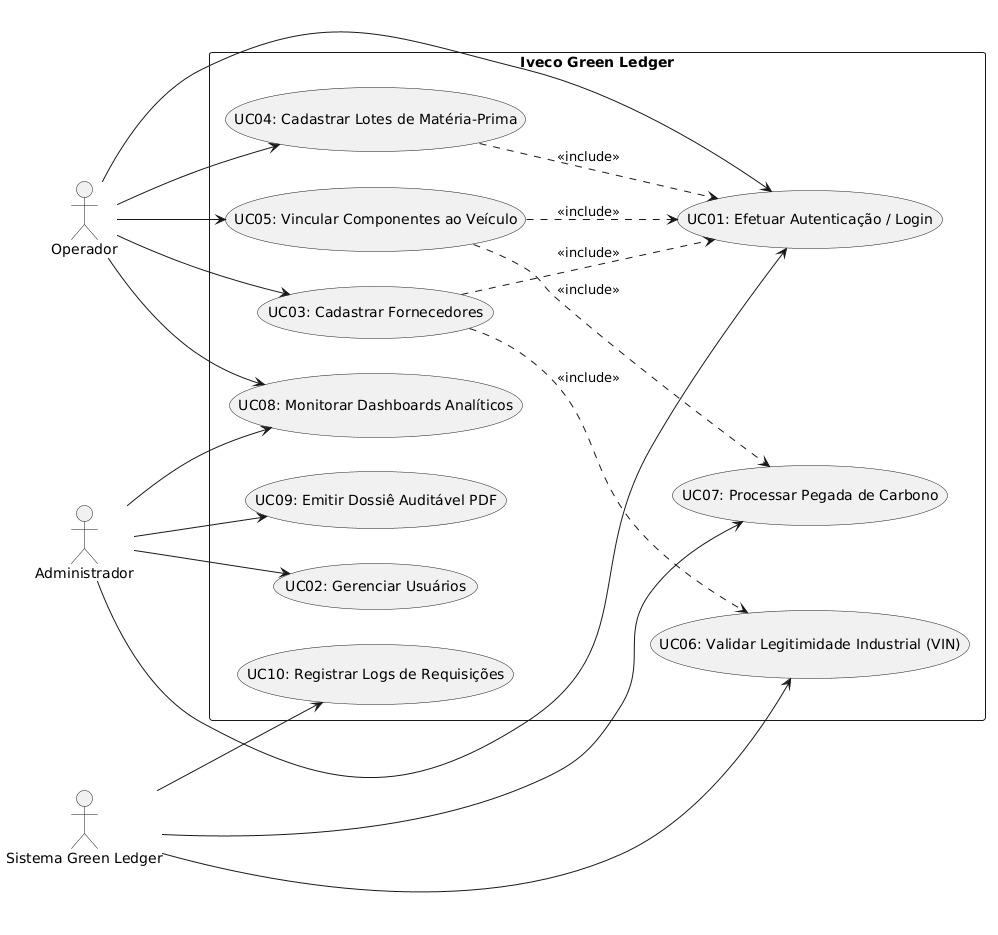
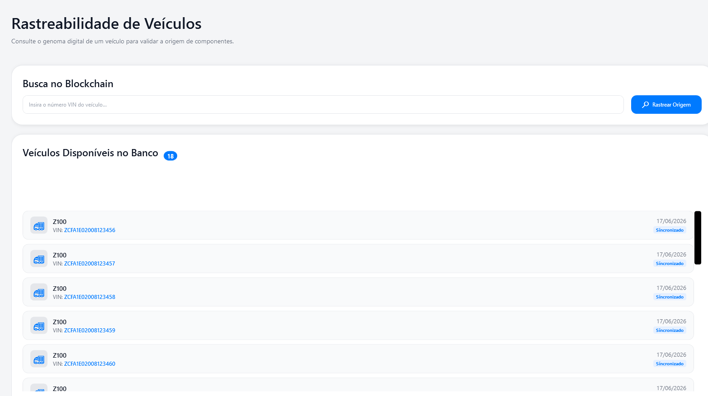
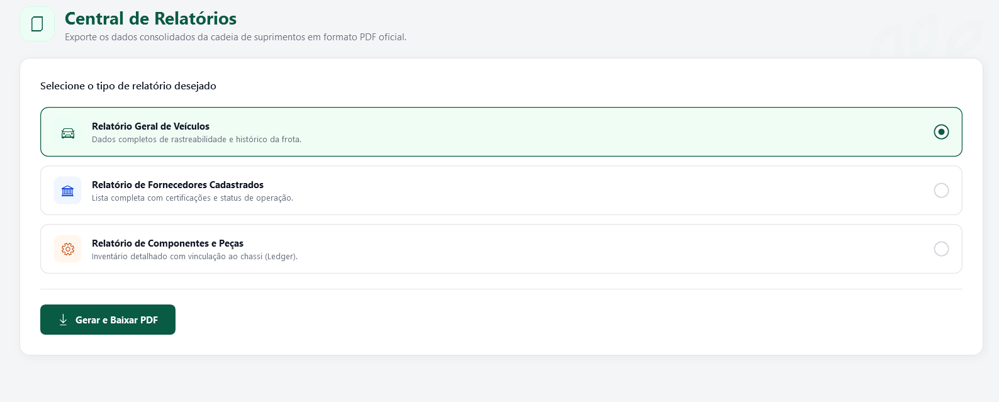
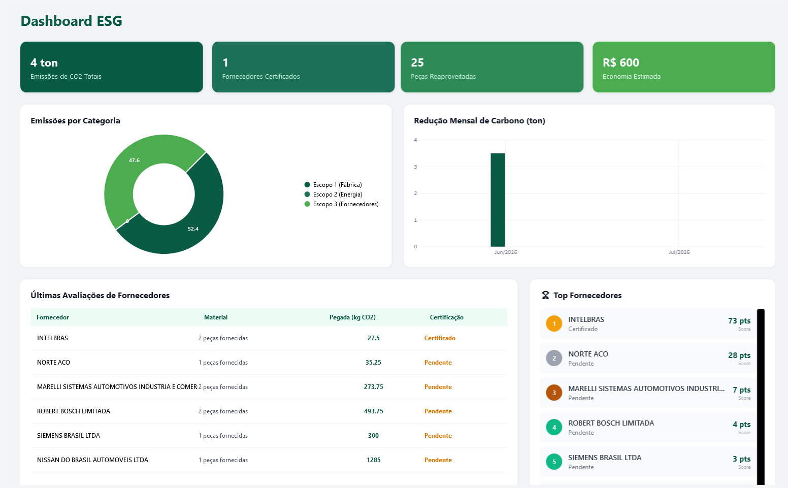
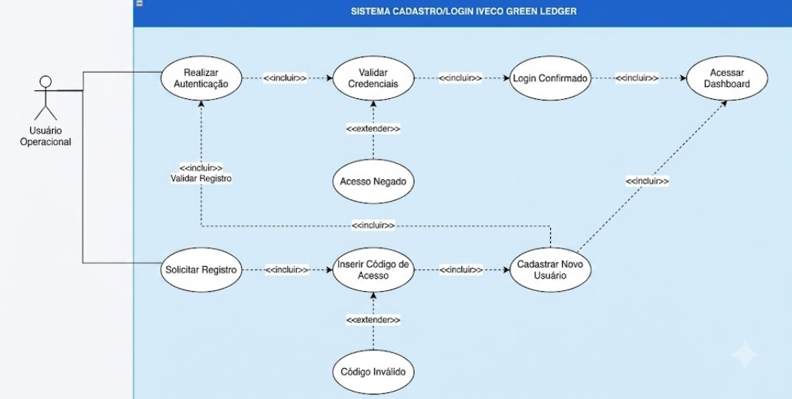

# 📦🍃 Iveco Green Ledger – Sistema de Rastreamento Inteligente  

 <div class="logo-container" align="center">
    
</div>

**Trabalho de Conclusão de Curso (TCC) | SENAI - Unidade Nova Lima | Orientador: Fred Aguiar**

<div align="center">

### Equipe de Desenvolvimento

[🧑‍💻 Alice Andrade](https://github.com/aliceandradee)  |  [🧑‍💻 Erick Silva](https://github.com/erick190813)  | [🧑‍💻 Nicolas Oliveira Lima](https://github.com/NicolasOlim) | [🧑‍💻 Vinicius Augusto](https://github.com/vnxtry)
</div>

O projeto Iveco Green Ledger foi idealizado, modelado e implementado como conclusão do nosso curso técnico em Desenvolvimento de Sistemas da Escola de Programação e Robótica – SENAI, atuando sob a orientação do educador Fred Aguiar. Diante do cenário de transformação digital e das crescentes pressões globais por transparência climática, unimso competências complementares nas áreas de arquitetura de software distribuída, engenharia de dados avançada e análise de balanços de sustentabilidade corporativa (ESG).

---

## 📌 Sumário do Projeto

- [Problema Encontrado](#problema-encontrado)
- [Metodologia](#metodologia)
- [Mini Mundo Da Demanda](#mini-mundo-da-demanda)
- [Modelagem Do Banco De Dados](#modelagem-do-banco-de-dados)
- [Arquitetura e Modelagem Do Sistema](#arquitetura-e-modelagem-do-sistema)
- [API REST - Endpoints e Integração](#api-rest---endpoints-e-integracão)
- [Viabilidade Técnica](#viabilidade-técnica)
- [Arquitetura do Projeto MVVM](#arquitetura-do-projeto-MVVM)
- [Processo de Desenvolvimento](#processo-de-desenvolvimento)
- [Business Model Canvas](#business-model-canvas)
- [Viabilidade Econômica](#viabilidade-econômica)
- [Requisitos](#requisitos)
- [Diagramas](#diagramas)
- [Regra de Negócio](#regrra-de-negócio)
- [Considerações Finais](#considerações-finais)
- [Referências Bibliográficas](#referências-bibliográficas)


---

---

<div align="center">

## Problema Encontrado
</div>

A rotina de uma grande fábrica de veículos envolve uma movimentação enorme de materiais o tempo todo, desde matéria-prima bruta até peças prontas que chegam dos fornecedores. O grande desafio é que a maioria das empresas não consegue acompanhar de perto a jornada dessas peças e nem o impacto real que elas causam no meio ambiente.

Isso gera três problemas principais:
* **Cálculos aproximados:** Como não há um controle detalhado, a estimativa de poluição de cada veículo produzido acaba sendo feita de forma muito genérica.
* **Erros em papéis e fichas:** O controle de entrada de materiais na portaria ainda depende muito de preenchimento manual, o que causa erros de digitação e perda de tempo.
* **Dependência da internet:** Se a internet da fábrica cai, o sistema para de funcionar. Isso gera filas de caminhões e atrasos caros na produção.

Pensando nisso criamos uma plataforma para facilitar o recebimento dessas peças e calcular automaticamente o impacto ambiental na linha de produção. 

O grande diferencial do nosso sistema é que ele **funciona mesmo sem internet**. Assim, o trabalho no pátio da fábrica nunca precisa parar por falta de conexão, os erros manuais são eliminados e a empresa passa a ter relatórios automáticos, rápidos e confiáveis sobre suas metas de sustentabilidade.

---

<div align="center">

## Metodologia:
</div>

O desenvolvimento do sistema foi realizado em etapas bem organizadas, divididas em três fases principais para garantir que o programa atendesse perfeitamente às necessidades reais da fábrica:

* **Fase 1 (Levantamento e Planejamento):** Focada na definição das regras de negócio, validações de segurança e estruturação inicial do projeto.
* **Fase 2 (Raciocínio e Interface):** Voltada para a construção da interface visual em WPF, criação das tabelas do banco de dados local para funcionamento offline e montagem dos painéis de gráficos analíticos.
* **Fase 3 (Integração e Nuvem):** Conclusão da API principal, desenvolvimento do motor de cálculo da pegada de carbono, configuração das notificações e a sincronização automática dos dados com a nuvem.

---

<div align="center">

## Mini Mundo Da Demanda
</div>

 Este capítulo descreve o contexto organizacional que motivou o desenvolvimento da Green Ledger, os atores envolvidos e as regras de negócio que orientaram a modelagem do sistema. 

### Contexto organizacional:
 Para sanar os gargalos operacionais e ambientais identificados na planta da Iveco, o sistema foi estruturado a partir de uma arquitetura de serviços desacoplados com armazenamento balanceado entre a rede local e a nuvem. O ciclo de vida da informação inicia-se com o mapeamento físico dos insumos que chegam à fábrica e com a validação das características técnicas dos veículos de transporte. Previamente, o analista de governança socioambiental configura no sistema os índices oficiais de emissão do GHG Protocol e homologa a lista de fornecedores autorizados na base de dados centralizada.

### Atores do sistema: 

### *Empresa IVECO*
A Iveco atua como o ator institucional e gestor central da plataforma. Suas responsabilidades concentram-se na parametrização dos índices oficiais de emissão de gases poluentes baseados no GHG Protocol e na homologação inicial de fornecedores autorizados. A organização utiliza o ecossistema como uma ferramenta de auditoria climática automatizada, consolidando os relatórios de pegada ecológica gerados no chão de fábrica para prestar contas a órgãos reguladores e auditorias externas de governança ESG.

### *Usuário do sistema*
 Este ator compreende os profissionais internos que interagem diretamente com a interface do software para gerenciar o fluxo logístico e ambiental. Suas atribuições e responsabilidades no ecossistema envolvem:

- Controle de Acesso e Segurança

- Entrada de Dados de Inventário

- Monitoramento de Resiliência

- Vínculo Técnico e Rastreabilidade

- Análise de Indicadores Ambientais

### *Administrador*
 Este ator representa o perfil de nível gerencial e de governança técnica com privilégios totais de controle sobre o ecossistema. Suas responsabilidades e ações práticas na plataforma englobam: 

- Governança de Acesso e Controle de Usuários

- Homologação e Parâmetros Ecológicos

- Auditoria de Conformidade e Gestão de Logs

### *Sistema green ledger*
- Controle de Cubagem e Gestão de Inventário

- Gerenciamento de Persistência e Sincronização Assíncrona

- Validação Automatizada de Fornecedores e Chassis

- Emissão de Relatórios

### Regra de negócio: 
1. Um lote de matéria-prima pertence obrigatoriamente a um fornecedor;

2. Exige a validação cadastral do CNPJ do fornecedor;

3. Um componente ou insumo deve estar associado a uma categoria de material; 

4. Um chassi de veículo deve ser validado por meio do VIN (17 caracteres);

5. Um lote de matéria-prima pode ser vinculado a múltiplos chassis, assim como um chassi consome múltiplos lotes de materiais;

6. O sistema registra automaticamente a data, hora exata e o usuário responsável por cada operação;

7. O ecossistema controla o ciclo de vida e a integridade de cada registro;

---

<div align="center">

## Modelagem Do Banco De Dados
</div>

Este capítulo apresenta os três níveis de modelagem do banco de dados do sistema Green Ledger: conceitual, lógico e físico, conforme as metodologias de modelagem relacional adotadas no curso. 

### **Modelo Conceitual (DER) :**

 


O modelo conceitual representa as entidades do domínio e seus relacionamentos em nível de abstração, sem preocupação com tipos de dados ou chaves de implementação. A modelagem segue a notação do BRModelo, utilizando Diagrama Entidade- Relacionamento (DER). 

### **Entidades e Atributos:**

#### Usuario
| Atributo | Tipo/papel | Observação |
| :--- | :--- | :--- |
| **id** | PK | Identificador único do usuário |
| **nome** | Atributo | Nome completo do usuário |
| **email** | Atributo | Email de contato corporativo |
| **senhaHash** | Atributo | Senha criptografada para acesso |
| **perfil** | Atributo | Permissão para acesso ao sistema |


---

#### Fornecedor
| Atributo | Tipo/papel | Observação |
| :--- | :--- | :--- |
| **id** | PK | Identificador único do fornecedor |
| **cnpj** | Atributo | CNPJ do fornecedor |
| **razaoSocial** | Atributo | Razão Social ou nome empresarial |
| **status** | Atributo | Estado lógico do fornecedor no sistema |


---

#### Lote_materia_prima
| Atributo | Tipo/papel | Observação |
| :--- | :--- | :--- |
| **id** | PK | Identificador único do lote |
| **fk_fornecedor** | FK | Chave estrangeira que referencia da tabela fornecedor |
| **tipoMaterial** | Atributo | Descrição do material recebido |
| **quantidadeKg** | Atributo | Massa total do lote em Kg |
| **pegadaCarbonoPorKg** | Atributo | Fator de emissão de carbono po Kg |
| **dataProducao** | Atributo | Data e hora em que o lote foi produzido |


---

#### Veiculo
| Atributo | Tipo/papel | Observação |
| :--- | :--- | :--- |
| **vin** | PK | Identificação do veículo |
| **modelo** | Atributo | Nome do veículo |
| **marca** | Atributo | Fabricante do Veículo |
| **dataMontagem** | Atributo | Data e Hora que o veículo entrou na linha de montagem |

---

#### Veiculo_Componente
| Atributo | Tipo/papel | Observação |
| :--- | :--- | :--- |
| **id** | PK | Identificação do veículo do componente |
| **fk_veiculo_vin** | FK | Chave estrangeira que relacionada a tabela VEICULO |
| **fk_lotemateria_id** | PK | Chave estrangeira que relacionada a tabela LOTE_MATERIA_PRIMA |
| **nomeComponente** | Atributo | Nome da peça instalada |
| **pesoKg** | Atributo | Peso Físico da peça e componente |
| **totalCO2eCalculado** | Atributo | Total de carbono calculado para essa peça |

---

### **Relacionamentos:**

Os relacionamentos entre as entidades do sistema são definidos a seguir: 

| Atributo | Tipo/papel | Semântica |
| :--- | :--- | :--- |
| **FORNECEDOR — LOTE_MATERIA_PRIMA** | 1 : N | Um fornecedor pode fornecer vários lotes de matéria-prima, mas um lote pertence obrigatoriamente a um único fornecedor. |
| **VEICULO — VEICULO_COMPONENTE** | 1 : N | Um veículo pode ser associado a vários componentes na linha de montagem. |
| **LOTE_MATERIA_PRIMA — VEICULO_COMPONENTE** | 1 : N | Um lote de matéria-prima pode dar origem ou fornecer insumos para vários registros de componentes aplicados. |
| **VEICULO — LOTE_MATERIA_PRIMA** | N:M | Um veículo consome insumos de vários lotes de matéria-prima, e um lote de matéria-prima pode ser distribuído entre múltiplos veículos. |

---

### Modelo Lógico:


O modelo lógico do ecossistema converte as entidades conceituais em estruturas relacionais normatizadas, definindo as chaves primárias (PK), chaves estrangeiras (FK) e restrições de integridade de cada atributo. A tipagem de identificação foi padronizada como TEXT de forma unificada entre os campos de amarração (id, fk_fornedor, vin, fk_veiculo_vin, fk_loteMateriaPrima_id).


#### Veiculo
| Coluna | Chave/Relacionamento | Tipo | Descrição |
| :---: | :---: | :---: | :--- |
| **id** | PK | TEXT | Identificador único do usuário |
| **nome** | - | TEXT | Nome do usuário |
| **email** | - | TEXT | Email de contato corporativo |
| **senhaHash** | - | TEXT | Senha para a autenticação |
| **perfil** | - | TEXT | Nível de permissão |


---


#### Fornecedor
| Coluna | Chave/relacionamento | Tipo | Descrição |
| :--- | :--- | :--- |  :--- |
| **id** | PK | TEXT | Identificador único do fornecedor |
| **cnpj** | - | TEXT | CNPJ da empresa |
| **razaosocial** | - | TEXT | Nome empresarial |
| **status** | - | TEXT | Estado do cadastro |
| **perfil** | - | TEXT | Nivel de permissão |


---

#### Lote Materia Prima
| Coluna | Chave/relacionamento | Tipo | Descrição |
| :--- | :--- | :--- | :--- |
| **vin** | PK | TEXT | Número de identificação do chassi (17 caracteres) |
| **modelo** | - | TEXT | Modelo do veículo comercial |
| **marca** | - | TEXT | Fabricante do automóvel |
| **dataMontagem** | - | DATETIME | Data e hora de entrada para a montagem |


---

#### Veiculo_componente
| Coluna | Chave/relacionamento | Tipo | Descrição |
| :--- | :--- | :---  | :--- |
| **id** | PK | TEXT | Identificador único do veículo |
| **fk_veiculo_vin** | FK | TEXT | Referencia Veiculo (Vin) |
| **fk_loteMateriaPrima_id** | FK | TEXT | Referencia Lote_materia_prima |
| **nomeComponente** | - | REAL | Nome da peça em quilogramas |
| **pesoKg** | - | REAL | Peso de peça em quilogramas |
| **totalCO2Calculado** | - | - | Total de carbono calculado para essa peça |


---

<div align="center">

## Arquitetura e Modelagem Do Sistema
</div>

O Green Ledger adota uma arquitetura distribuída e desacoplada, separando claramente as responsabilidades entre o cliente desktop de pátio, a API REST corporativa e a camada de persistência híbrida. Esta seção descreve cada componente técnico, suas integrações de borda com serviços externos e os padrões de resiliência a falhas de rede.

### **Visão Geral Da Arquitetura:**

O Green Ledger adota uma arquitetura distribuída e desacoplada, separando claramente as responsabilidades entre o cliente desktop de pátio, a API REST corporativa e a camada de persistência híbrida. Esta seção descreve cada componente técnico, suas integrações de borda com serviços externos e os padrões de resiliência a falhas de rede.
O ecossistema Iveco Green Ledger foi projetado sob uma arquitetura de serviços desacoplados e distribuídos, baseada em uma infraestrutura híbrida de persistência de dados para garantir alta disponibilidade e resiliência no ambiente industrial. A solução é estruturada em quatro pilares fundamentais de tecnologia e comunicação, descritos a seguir:

- **Cliente WPF (Frontend Desktop):** Camada de interface com o usuário implantada nas estações de trabalho do chão de fábrica. Construída em XAML e C# sob o padrão arquitetural MVVM (Model-View-ViewModel), essa camada assegura a separação rígida entre a lógica de apresentação e os dados operacionais, garantindo uma experiência de usuário fluida e de fácil manutenção.

- **API REST em ASP.NET Core (Backend):** Módulo centralizador da inteligência analítica do sistema, desenvolvido em .NET 8. Esta camada expõe endpoints HTTP seguros e processa de forma assíncrona as principais regras de negócio do ecossistema, tais como o motor de cálculo ecológico do GHG Protocol, o algoritmo de cubagem volumétrica e o consumo das APIs externas de validação cadastral e fiscal.

- **Firebase Firestore (Persistência em Nuvem):** Banco de dados não relacional (NoSQL) baseado em documentos, responsável pelo armazenamento definitivo e centralizado de todas as operações homologadas. Sua infraestrutura escalável provê sincronização em tempo real para alimentar de forma instantânea os painéis visuais (dashboards) de governança ESG utilizados pela gerência.

- **SQLite (Persistência e Contingência Local):** Banco de dados relacional leve e embutido diretamente na aplicação desktop. Atua de forma estratégica como uma camada de persistência local temporária, viabilizando o mecanismo de resiliência offline-safe. Esse componente garante que os registros logísticos continuem sendo capturados continuamente caso ocorram interrupções na conectividade com a nuvem.

---



---

| ID | Caso de Uso | Ator Principal | Descrição Operacional |
| :--- | :--- | :--- | :--- |
| **UC01** | Efetuar Autenticação (Login) | Administrador / Operador | Realiza a validação das credenciais do usuário comparando o hash da senha no banco de dados. |
| **UC02** | Gerenciar Usuários | Administrador | Permite cadastrar, atualizar e definir os níveis de privilégio (Acesso) dos colaboradores. |
| **UC03** | Cadastrar Fornecedores | Operador / Administrador | Registra empresas parceiras na base de dados, utilizando a integração com a BrasilAPI para preenchimento via CNPJ. |
| **UC04** | Cadastrar Lotes de Matéria-Prima | Operador | Registra a entrada de insumos industriais, especificando o tipo de material, peso em quilogramas e o fator de pegada ecológica. |
| **UC05** | Vincular Componentes ao Veículo | Operador | Associa peças específicas a um chassi através do código VIN, estabelecendo a árvore de rastreabilidade de materiais. |
| **UC06** | Validar Legitimidade Industrial (VIN) | Sistema | Consome de forma automatizada a API da NHTSA VPIC para verificar se o chassi informado pertence à fabricante Iveco. |
| **UC07** | Processar Pegada de Carbono | Sistema | Executa o motor algorítmico que calcula a emissão de CO₂ equivalente ($CO_2e$) com base na massa do lote e no indicador do material (Escopo 3). |
| **UC08** | Monitorar Dashboards Analíticos | Operador / Administrador | Renderiza gráficos em tempo real (LiveCharts2) com o balanço de emissões segmentado e o histórico de produção. |
| **UC09** | Emitir Dossiê Auditável (PDF) | Administrador | Compila os dados consolidados de um chassi ou período em um relatório paginado e criptografado gerado pelo QuestPDF. |
| **UC10** | Registrar Logs de Requisições | Sistema | Intercepta o tráfego HTTP por meio do middleware do Serilog para auditar a latência e o status das operações. |

---

### Padrão MVVM no cliente WPF:

O cliente desktop segue rigorosamente o padrão MVVM (Model-View-ViewModel), complementado por uma camada de serviços, estabelecendo quatro divisões claras de responsabilidade:

### **Base ViewModel e INotifyPropertyChanged:**

A BaseViewModel atua como a classe mãe de todas as ViewModels do projeto, centralizando a lógica de comunicação reativa com a interface. Sua principal função é herdar e implementar a interface INotifyPropertyChanged, expondo o evento PropertyChanged. Através de um método auxiliar (geralmente chamado OnPropertyChanged ou RaisePropertyChanged), ela dispara um alerta para a View sempre que o valor de uma propriedade do Model ou do estado interno é alterado pelo operador ou por um processo assíncrono. Isso ativa o mecanismo de Data Binding bidirecional do WPF, garantindo que as telas atualizem seus elementos gráficos em tempo real de forma automática, mantendo o código totalmente limpo e livre de acoplamento visual.

### **Relay Command:**

O RelayCommand é a implementação concreta da interface ICommand no padrão MVVM do WPF, atuando como o gatilho lógico que conecta as ações do operador à ViewModel. Em vez de criar uma classe separada para cada botão do chão de fábrica, ele encapsula os métodos da ViewModel por meio de delegados (Action e Func<bool>), permitindo que cliques, atalhos e eventos visuais invoquem a lógica de negócios diretamente no C#. Ele gerencia duas funções essenciais: a execução da ação propriamente dita (através do método Execute) e a verificação dinâmica se aquela ação é permitida no momento (através do CanExecute), o que habilita ou desabilita automaticamente os controles da interface gráfica (como travar o botão de salvar enquanto os campos obrigatórios do fornecedor não forem validados). Seguindo a seguinte estrutura:

```
Ivec_Green_Ledger/
├── ApiIveco/                  # Backend principal — ASP.NET Core REST API
│   ├── Controllers/           # Endpoints HTTP (CRUD completo)
│   ├── Data/                  # Configuração do Firebase Client
│   ├── Models/                # Entidades do domínio
│   ├── Services/              # Regras de negócio e acesso ao Firebase
│   └── Program.cs             # Configuração da aplicação, DI, Swagger, CORS
│
├── WpfIveco/                  # Frontend — WPF Desktop (MVVM)
│   ├── Commands/              # RelayCommand (padrão Command do MVVM)
│   ├── Converters/            # IValueConverter para binding de UI
│   ├── Imgs/                  # Recursos de imagem
│   ├── Models/                # Espelho das entidades do domínio
│   ├── Services/              # Serviços de negócio e integrações
│   │   └── Interface/         # Interfaces dos serviços
│   ├── Styles/                # Estilos XAML globais
│   ├── ViewModels/            # Lógica de apresentação
│   └── Views/                 # Janelas e controles XAML
│       └── Controls/          # Dashboard, Rastreabilidade, Análises, ESG, Relatórios...
│
├── Documentaçao/              # Documentação técnica
├── Banco de Dados/            # Scripts e documentação do banco
├── imagens/                   # Recursos visuais (logos, diagramas)
├── Ivec_Green_Ledger.sln      # Solução .NET unificada
└── README.md                  # Este arquivo
```

### **Modelo físico do sistema**



---

### **Modelo lógico do sistema**


---

### **Modelagem de domínio**


---

<div align="center">

## API REST - Endpoints e Integração
</div>

A API REST da aplicação é desenvolvida sobre a plataforma ASP.NET Core e exposta no domínio corporativo do ecossistema. Ela é a responsável por receber as requisições assíncronas originadas pelo WPF, processando de forma centralizada as regras de negócio, como os algoritmos de cálculos de emissões baseados no GHG Protocol e as validações integradas com os serviços externos da BrasilAPI e da NHTSA. Após a conclusão dessas etapas, o back-end realiza a persistência definitiva dos dados consolidados no banco de dados em nuvem Firebase Firestore.

### **Endpoints implementados:**

<div align="center">

| Método | Endpoint | Descrição |
| :--- | :--- | :--- | 
| **POST** | /api/usuario/login | Realiza a autenticação do usuário e retorna as permissões de perfil (Operador/Admin) | 
| **GET** | /api/usuario | Lista todos os usuários cadastrados (Restrito ao perfil Admin) |
| **GET** | /api/fornecedor | Lista todos os fornecedores parceiros com filtros por status | 
| **POST** | /api/fornecedor | Cadastra um novo fornecedor — consome a BrasilAPI para validação cadastral automática via CNPJ | 
| **GET** | /api/lote-materia-prima | Lista os lotes de matéria-prima recebidos no pátio | 
| **POST** | /api/lote-materia-prima | Cadastra um novo lote de entrada e calcula a pegada de carbono inicial baseada no fator de emissão | 
| **GET** | /api/veiculo/{vin} | Consulta os dados técnicos de um veículo específico pelo chassi | 
| **POST** | /api/veiculo | Registra a entrada de um novo chassi — consome a API da NHTSA para decodificação internacional do VIN | 
| **POST** | /api/veiculo-componente | Associa componentes/lotes a um veículo, processa o cálculo final do GHG Protocol e consolida o registro no Firebase | 

</div>

### **Fluxo Detalhado:**

1-) O operador digita o chassi do veículo na interface gráfica e aciona a opção para validar o código VIN.

2-) Esta ação dispara imediatamente a execução do componente lógico ValidarVinCommand.

3-) O comando invoca o método assíncrono correspondente parametrizado dentro da camada de serviço ApiService.

4-) A aplicação envia uma requisição HTTP do tipo POST contendo o código VIN estruturado em formato JSON para o endpoint.

5-) A API do back-end intercepta a requisição e encaminha o chassi recebido para o seu módulo interno de processamento.

6-) A API constrói e dispara uma requisição HTTP segura direcionada aos servidores externos da NHTSA.

7-) A API da NHTSA processa a decodificação dos 17 caracteres alfanuméricos e retorna os metadados técnicos do chassi.

8-) A API do sistema valida a integridade desses dados retornados e realiza a persistência definitiva do novo veículo na base de dados em nuvem do Firebase Firestore.

9-) O back-end responde à aplicação desktop transmitindo o status de sucesso acompanhado dos dados decodificados em formato JSON.

10-) O componente ApiService local na aplicação WPF captura o JSON enviado pelo servidor.

11-) A interface gráfica (View) reage instantaneamente através dos mecanismos de Data Binding e da interface INotifyPropertyChanged, exibindo os dados técnicos validados do veículo para o operador no chão de fábrica

---

### **Swagger:**

Por meio dessa interface interativa, desenvolvedores e engenheiros de software conseguem visualizar instantaneamente os contratos de entrada e saída estruturados em formato JSON, bem como os códigos de status HTTP esperados para cada operação, a exemplo das respostas 200 OK, 400 BadRequest ou 401 Unauthorized. A plataforma expõe de forma transparente os esquemas exatos das entidades de domínio, funcionando como uma especificação viva e continuamente atualizada do back-end. Além disso, o portal permite a execução de testes de requisições em tempo real diretamente pelo navegador, o que confere maior agilidade ao processo de integração com o cliente desktop WPF e com os serviços externos da BrasilAPI e da NHTSA.

---

### **Configuração CORS e segurança:**

Para mitigar acessos não autorizados e garantir a integridade dos dados de auditoria climática da ApiIveco, estabeleceu-se uma política rígida de CORS (Cross-Origin Resource Sharing) associada ao endurecimento (hardening) dos middlewares no .NET 8. Em vez de utilizar curingas abertos, a API restringe o acesso apenas a origens homologadas, mapeando os endereços de desenvolvimento do cliente WpfIveco e os domínios oficiais de produção. A política limita o tráfego aos métodos operacionais necessários (GET, POST, PUT, DELETE) e valida cabeçalhos específicos de autenticação com suporte seguro a credenciais.

Complementarmente, o sistema impõe o redirecionamento mandatório de HTTPS, interceptando requisições HTTP comuns (porta 80) para canais criptografados via TLS (porta 443) para evitar ataques Man-in-the-Middle. Foram também injetados cabeçalhos de segurança nativos nas respostas do servidor para neutralizar vetores clássicos de ataque: o X-Frame-Options (configurado como DENY) impede o encapsulamento de interfaces em iframes externos (Clickjacking); o X-XSS-Protection bloqueia scripts maliciosos injetados; o X-Content-Type-Options (nosniff) evita o mascaramento de arquivos executáveis ao impor o tipo application/json; e a Content-Security-Policy (CSP) restringe a execução de códigos em memória ao próprio domínio do servidor.

---

<div align="center">

## Viabilidade Técnica
</div>

A análise de viabilidade técnica avalia se o sistema Iveco Green Ledger pode ser desenvolvido, implantado e mantido com os recursos tecnológicos selecionados, considerando o contexto de desenvolvimento da solução .NET unificada e a realidade operacional do chão de fábrica e do pátio logístico a que se destina.

### **Infraestruturas e Tecnologias:**

Todas as tecnologias adotadas no Iveco Green Ledger são gratuitas, de ampla adoção no mercado e possuem documentação extensiva, eliminando barreiras de aprendizado, dependências proprietárias de alto custo e taxas de licenciamento comercial. A tabela a seguir resume a disponibilidade, o tipo de licença e a maturidade de cada componente:

<div align="center">

| Componente | Licença | Maturidade | Observação |
| :--- | :--- | :--- | :--- | 
| **C# / .NET 8** | MIT(open-source) | Alta | Plataforma Microsoft estável, unificada e com suporte LTS (Long-Term Support) garantido. |
| **ASP.NET Core** |  MIT(open-source) | Alta | Framework web de alto desempenho, escalável e utilizado globalmente para APIs empresariais |
| **WPF** | MIT(open-source) | Alta | Framework nativo Windows estável, ideal para aplicações de pátio industrial com interface robusta |
| **Firebase Firestore** | Gratuito (Plano Spark) | Alta | Banco de dados NoSQL do Google na nuvem com 99,95% de SLA e sincronização em tempo real |
| **SQLite** | Domínio Público | Alta | Banco de dados embutido leve e ultrarrápido, ideal para contingência offline no cliente desktop |
| **BrasilAPI** | MIT(open-source) | Alta | Serviço gratuito e integrado de alta disponibilidade para checagem cadastral automatizada de CNPJ |
| **API da NHTSA** | Domínio Público | Alta | Base governamental norte-americana padrão global para decodificação técnica e validação de VIN (Chassi) |
| **Swagger / Open API** | Apache 2.0 | Alta | Padrão internacional de mercado adotado na ApiIveco para documentação e testes de endpoints REST |
| **Github** | Gratuito | Alta | Plataforme de controle de versão do mercado |

</div>

### *Requisitos Mínimos de Hardware:*

Para execução do sistema em ambiente de produção, os  requisitos mínimos recomendados são: 

- **Processador:** Intel Core i3;
- **Memória RAM:** 4 GB;
- **Armazenamento:** 500MB de espaço em disco disponível;
- **Sistema Operacional:** Windows 10 ou Windows 11(64 - bits);
- **Conexão com a internet:** Para o funcionamento das integrações em nuvem.

### *Requisitos Mínimos de Software:*

Para execução do sistema em ambiente de produção, os  requisitos mínimos recomendados são: 

- **Microsoft .NET Runtime 8.0:** Requisito obrigatório
- **ASP.NET Core Runtime 8.0:** Necessário para a hospedagem do servidor;
- **Navegador WEB:**  500MB de espaço em disco disponível;
- **Sistema Operacional:** Windows 10 ou Windows 11(64 - bits);
- **Conexão com a internet:** Para o funcionamento das integrações em nuvem.

### Riscos Técnicos e Mistigações:

<div align="center">

| Risco | Probabilidade | Impacto | Mistigação |
| :--- | :--- | :--- | :--- | 
| Cota gratuita do Firebase excedida com alto volume de dados | Média | Alta | Migrar para o plano Blaze (pay-as-you-go) do Firebase para suportar a escala industrial ou migrar a persistência de longo prazo para uma instância dedicada de banco de dados relacional próprio |
| Cota gratuita ou limites de requisições das APIs externas |  Média | Médio | Implementar uma camada de cache local no banco SQLite da estação de trabalho e na API corporativa, evitando chamadas repetidas para o mesmo CNPJ ou mesmo chassi (VIN) já validados |
| Interrupção de conectividade | Alta | Médio | Utilização automática da camada de persistência em borda com SQLite. O cliente desktop armazena os registros localmente |
| Incompatibilidade ou quebra de contrato em atualizações das API’s | Baixa | Médio | Criação de contratos de integração isolados por meio de interfaces (Services/Interface/) na ApiIveco, permitindo a substituição do provedor de dados de chassi ou CNPJ com impacto zero no cliente WPF |

</div>

### Escalabilidade:

A arquitetura adotada para o Iveco Green Ledger foi projetada estrategicamente para suportar o crescimento gradual do volume de dados e de acessos no pátio logístico sem a necessidade de refatorações estruturais complexas. Os principais aspectos de escalabilidade são:

- Escabilidade Horizontal da API;

- Escabilidade de Dados Baseada em Nuvem;

- Modularidade Extensível no Front-end (MVVM);

- Abstração por Interfaces;

- Prontidão para Microserviços.

---

<div align="center">

| Componente | Tipo | Mecanismo de Expansão | Impacto no crescimento de sistema |
| :--- | :--- | :--- | :--- | 
| API REST(ApiIveco) | Horizontal (Stateless) | Adição de novas instâncias da API em paralelo por trás de um balanceador de carga |Suporta o aumento exponencial de requisições |
| Firebase Firestore |  Automática (Nuvem) | Divisão automática de dados | Mantém o tempo de resposta das consultas linear e estável |
| Interface Desktop | Funcional (Padrão MVVM) | Desacoplamento | Permite a acoplagem de novos módulos operacionais |
| Integração com Api’s Externas | Arquitetura | Interfaces abstratas | Facilita a substituição ou adição de novos provedores de dados com impacto zero no cliente desktop |
| Persistência em Borda (SQLite) | Descentralizada | Distribuição da carga| Evita gargalos de escrita e sobrecarga no servidor principal |

</div>

### *C# E.NET:*

A linguagem C# oferece tipagem estática, suporte nativo a programação assíncrona (async/await) e o ecossistema .NET 8, que viabiliza tanto o desenvolvimento desktop industrial (WPF) quanto o desenvolvimento de APIs web de alta performance (ASP.NET Core) dentro de uma mesma solução unificada. A escolha por uma única linguagem para o front-end de pátio e o back-end em nuvem reduz drasticamente a curva de aprendizado, elimina barreiras de integração e facilita o compartilhamento direto das entidades de domínio (como os modelos de dados de veículos, lotes de matéria-prima e rastreamento),acelerando o ciclo de entrega.

### *WPF e MVVM:*

O WPF combinado com o padrão arquitetural MVVM estabelece uma separação rígida e clara entre a interface gráfica com o usuário (UI) e a lógica de apresentação do sistema. No terminal de pátio industrial da solução, as telas em XAML (Views) são completamente desacopladas das regras de negócio. Essa comunicação ocorre de forma reativa e assíncrona por meio de mecanismos nativos de Data Binding e do disparo de comandos (Commands), que interagem diretamente com a ViewModel.

A ViewModel, por sua vez, atua como o cérebro da interface: ela consome os serviços locais (como o banco de contingência SQLite) e os endpoints da ApiIveco, expõe propriedades observáveis que notificam a tela sobre mudanças de estado e atualiza os dados operacionais em tempo real para o operador, garantindo uma aplicação robusta, altamente testável e de fácil manutenção.

### *ASP .NET Core Web API:*

A ASP.NET Core Web API constitui o núcleo unificado de serviços e inteligência de negócio do ecossistema do projeto. Desenvolvida sob uma arquitetura stateless (sem retenção de estado), ela atua como uma ponte segura e de alto desempenho entre o cliente desktop WPF e os provedores de persistência e validação.

A API é estruturada rigidamente sob o padrão de separação entre controladores (Controllers), que expõem os endpoints RESTful e gerenciam as requisições HTTP (JSON), e serviços (Services), responsáveis por processar as regras de negócio complexas — como os motores de cálculo de indicadores ecológicos e pegada de carbono baseados no GHG Protocol.

Ao centralizar o consumo dos serviços externos da BrasilAPI, API da NHTSA e API de rastreamento do Mercado Livre, a ASP.NET Core Web API blinda a aplicação cliente de pátio contra instabilidades externas, padroniza as respostas de dados e garante a consolidação íntegra de todos os registros históricos no banco de dados em nuvem Firebase Firestore.

### *Firebase firestore:*

O Firebase Firestore constitui a camada principal de persistência global e consolidação de dados em nuvem do ecossistema. Estruturado como um banco de dados NoSQL orientado a documentos, ele organiza as informações críticas do sistema, como o histórico de auditoria de chassis (VIN), o cadastro de fornecedores e os registros logísticos de rastreamento do Mercado Livre, em coleções flexíveis de alta escalabilidade.

A escolha pelo Firestore elimina a complexidade de gerenciamento de infraestrutura física de servidores de banco de dados, oferecendo sincronização assíncrona, altíssima disponibilidade e mecanismos nativos de segurança baseados em regras de acesso. Ao receber as requisições tratadas e validadas pela ApiIveco, o Firestore consolida de forma definitiva os cálculos de emissões de carbono em conformidade com o GHG Protocol, servindo como uma fonte única da verdade para a geração de relatórios ecológicos e auditorias corporativas.

### *BrasilAPI:*

A escolha pela BrasilAPI garante uma infraestrutura de altíssima disponibilidade, sem custos de licenciamento ou limites restritivos de uso que inviabilizariam a operação. Ao centralizar essa validação no back-end, o sistema assegura que apenas cadastros íntegros, atualizados e em conformidade fiscal e jurídica sejam consolidados no banco de dados em nuvem, otimizando o fluxo de triagem no pátio industrial e blindando o cliente desktop de oscilações ou complexidades de integração direta com órgãos governamentais.

### *NHTSA responsive:*

A API da NHTSA (National Highway Traffic Safety Administration) é o serviço internacional de utilidade pública integrado ao ecossistema do projeto para a validação e decodificação técnica automatizada de veículos. Consumida de forma assíncrona pela ApiIveco por meio do protocolo HTTPS, ela atua como uma barreira de segurança e conformidade na triagem de entrada do pátio logístico.

A API da NHTSA é o serviço internacional de utilidade pública integrado ao ecossistema do projeto para a validação e decodificação técnica automatizada de veículos. Consumida de forma assíncrona pela ApiIveco por meio do protocolo HTTPS, ela atua como uma barreira de segurança e conformidade na triagem de entrada do pátio logístico.

### *API Mercado livre:*

O Firebase Firestore constitui a camada principal de persistência global e consolidação de dados em nuvem do ecossistema. Estruturado como um banco de dados NoSQL orientado a documentos, ele organiza as informações críticas do sistema, como o histórico de auditoria de chassis (VIN), o cadastro de fornecedores e os registros logísticos de rastreamento do Mercado Livre, em coleções flexíveis de alta escalabilidade. Ao centralizar o consumo dos serviços externos da BrasilAPI, API da NHTSA e API de rastreamento do Mercado Livre, a ASP.NET Core Web API blinda a aplicação cliente de pátio contra instabilidades externas, padroniza as respostas de dados e garante a consolidação íntegra de todos os registros históricos no banco de dados em nuvem Firebase Firestore.

---

<div align="center">

## Arquitetura Do Projeto MVVM
</div>

O padrão arquitetural MVVM foi adotado no desenvolvimento do cliente desktop para garantir o completo desacoplamento entre a interface gráfica com o usuário e as regras de apresentação da aplicação de pátio. Ao isolar a lógica de controle dos elementos visuais da tela, essa abordagem elimina a necessidade de codificação direta nos arquivos de código associados à interface. Essa separação rígida garante que as alterações estéticas no layout gráfico possam ser realizadas de forma independente, sem o risco de corromper ou afetar o comportamento das regras operacionais subjacentes que gerenciam o fluxo logístico de entrada de dados.

No ambiente de chão de fábrica, essa divisão estrutural reduz de forma significativa a complexidade envolvida na manutenção corretiva e evolutiva do software. Além de otimizar a legibilidade do código-fonte, a arquitetura viabiliza a execução de testes unitários automatizados diretamente sobre as camadas de controle, de maneira isolada e sem dependência de simulações visuais complexas. Como resultado direto, o ecossistema atinge maior robustez operacional, blindando as rotinas essenciais de validação de insumos e chassis contra falhas inesperadas no terminal de atendimento.

---

## Módulos do Sistema:

Iveco Green Ledger é organizado em módulos funcionais isolados através do padrão MVVM, cada um com escopo operacional e status de desenvolvimento bem definidos. A tabela abaixo apresenta o panorama atual da solução:

### *Módulo: Cadastro de veículos*



Este é o módulo principal de controle de acesso e conformidade do pátio industrial. Ele permite o registro e a auditoria instantânea de veículos na recepção através de uma triagem automatizada: o CNPJ do fornecedor é validado nas bases federais pela BrasilAPI e o número de chassi (VIN) é decodificado tecnicamente via API da NHTSA. O módulo previne erros humanos de digitação e garante que apenas cadastros 100% íntegros sigam para o fluxo de pesagem e cálculo de carbono.

### *Módulo: Sincronização em nuvem*

Este módulo atua de forma invisível nos bastidores como o motor de persistência global da solução. Ele gerencia as chamadas feitas pela ApiIveco ao Firebase Firestore, garantindo que as coleções NoSQL de documentos estruturados sejam atualizadas de forma escalável e com alta disponibilidade. Ele consolida de maneira definitiva o histórico de auditorias e relatórios ambientais, servindo como a fonte centralizada da verdade de todo o ecossistema.

### *Módulo: Relatorio*



Este módulo consolida de forma analítica todos os dados históricos processados pelo sistema. Ele permite aos gestores e auditores extrair relatórios ambientais completos e balanços consolidados das emissões de carbono geradas pela frota e pela cadeia de suprimentos. As informações, estruturadas sob os parâmetros do GHG Protocol, são recuperadas diretamente do Firebase Firestore através da ApiIveco e apresentadas prontas para exportação corporativa, garantindo transparência e conformidade jurídica para fins de auditoria interna e externa.

### **Módulo: Dashboard**



Este módulo centraliza a inteligência ecológica da aplicação através de uma interface analítica e reativa construída em WPF. Ele consome diretamente os endpoints de cálculo da ApiIveco, que processa dados operacionais com base nas diretrizes internacionais do GHG Protocol. Os gráficos e indicadores de pegada de carbono são atualizados em tempo real na tela do operador à medida que novos dados de insumos e transportes entram no sistema.

---

<div align="center">

## Processo De Desenvolvimento
</div>

### **Processo de Desenvolvimento**
| Fase | Status |
| :--- | :--- | 
| Fase 1 - Setup e Infraestrutura | Concluído ✅ | 
| Fase 2 - Core UI e Telas | Concluído ✅ | 
| Fase 3 - API REST e Regras de Negócio | Concluído ✅ | 
| Fase 4 - Integrações e Validações externas | Concluído ✅ | 
| Fase 5 - Persistência na nuvem | Concluído ✅ | 
| Fase 6 - Expansão Futura | Em Progresso ⚙️| 
| Central de Notificações |Implementação Futura 💡| 

---

### **Ambiente de Desenvolvimento**

- **IDE:** Visual Studio
- **SDK:** NET 8;
- **Gerenciamento de pacotes:**  NuGet;
- **Sistema Operacional:** Windows 10 ou Windows 11(64 - bits);
- **Banco de dados:** Firebase e SQLite.

---

<div align="center">

## Business model canvas
</div>


<div class="logo-container" align="center">
    
</div>

---

<div align="center">

## Viabilidade Econômica
</div>

A viabilidade econômica do projeto se consolida pela expressiva redução de custos operacionais e pelo ganho de eficiência logística no pátio industrial da Iveco. Ao automatizar a triagem de veículos com as APIs da NHTSA e BrasilAPI, o sistema elimina os custos decorrentes de erros humanos de digitação, fraudes cadastrais e o tempo ocioso de caminhões em filas de espera. Além disso, a adoção de uma arquitetura Open-Source baseada em .NET 8 e SQLite, combinada à infraestrutura sob demanda e altamente escalável do Firebase Firestore, minimiza o investimento inicial em servidores físicos e licenças de software proprietárias. Sob a ótica estratégica, o motor de cálculo alinhado ao GHG Protocol posiciona a companhia em estrita conformidade com as exigências globais de ESG, mitigando riscos de sanções ambientais e abrindo portas para incentivos fiscais e captação de fundos verdes, o que garante um retorno sobre o investimento.

### **Custos de Desenvolvimento**

Por tratar-se de um projeto acadêmico focado em inovação industrial, os custos de engenharia e desenvolvimento foram essencialmente de tempo, pesquisa e capacitação da equipe. A tabela abaixo projeta esses custos em valores reais de mercado, considerando as horas técnicas investidas e a remuneração média de desenvolvedores Júnior/Pleno no Brasil em 2026 para o desenvolvimento do ecossistema.


| Item | Hora estimada | Valor por Hora | Custo Total |
| :--- | :--- | :--- | :--- | 
| Levantamento de Requisitos | 35h |  R$ 40,00 |  R$ 1.400,00 | 
| Modelagem do banco e Estrutura Relacional | 15h |  R$ 40,00 |  R$ 600,00 | 
| Desenvolvimento da API | 50h |  R$ 50,00 |  R$ 2.500,00 | 
| Desenvolvimento da WPF | 60h |  R$ 50,00 |  R$ 3.000,00 | 
| Integração API’s e Regras de Negócio | 35h |  R$ 50,00 |  R$ 1.750,00 |
| Testes, Validações e Homologação | 25h |  R$ 45,00 |  R$ 1.125,00 | 
| Total | 220h |  - |  R$ 10.375,00 | 

---

<div align="center">

## Requisitos
</div>

### **Requisitos funcionais**

Os requisitos funcionais descrevem as ações, facilidades e comportamentos que o sistema Green Ledger deve oferecer:

- **RF - 001: Autenticação de Usuários:** O sistema deve permitir o controle de acesso de operários da portaria, gestores de pátio e analistas ambientais através de login e senha integrados ao Firebase.

- **RF - 002: Triagem de Entrada de Veículos:** O sistema deve registrar o ingresso de caminhões no pátio logístico da Iveco, capturando dados do motorista, placa e hora de entrada.

- **RF - 003: Integração e Decodificação de Chassi (VIN):** O sistema deve consumir a API da NHTSA para decodificar automaticamente o número do chassi do veículo, extraindo o modelo, ano de fabricação e especificações de motorização.

- **RF - 004: Rastreamento de Entregas e Rotas:** O sistema deve integrar-se com a API do Mercado Livre (ou serviços equivalentes de logística) para monitorar o status do trajeto e a quilometragem percorrida pela frota parceira.

- **RF - 005: Sincronização Híbrida e Operação Offline:** Persistência dos dados localmente no banco SQLite caso haja queda de internet, sincronizando tudo com o Firebase Firestore de forma automática assim que a conexão for restabelecida.

- **RF - 006: Cálculo da Pegada de Carbono:** O sistema deve calcular as emissões de gases de efeito estufa geradas pela queima de combustível da frota com base nas diretrizes e fatores de emissão.

- **RF - 007: Monitoramento:** O sistema deve contabilizar o tempo em que o veículo permaneceu parado com o motor ligado no pátio e projetar o desperdício de combustível e emissão de carbono gerados nesse intervalo.

- **RF - 008: Geração de Relatórios:** O sistema deve emitir relatórios gerenciais consolidados mostrando a redução de emissões, eficiência logística e indicadores ambientais da cadeia de suprimentos da Iveco.

- RF - 003: Integração e Decodificação de Chassi (VIN):

---

### **Requisitos não funcionais**

- **RNF - 001: Arquitetura e Framework Base:** A API do sistema deve ser desenvolvida em ambiente multipataforma utilizando o framework .NET 8 (ASP.NET Core REST API), garantindo escalabilidade e alta performance no processamento das requisições.

- **RNF - 002: Padrão Arquitetural de Interface:** O sistema deve utilizar uma abordagem de banco de dados híbrido, empregando o SQLite como banco de dados relacional.

- **RNF - 003: Persistência:** O sistema deve consumir a API da NHTSA para decodificar automaticamente o número do chassi do veículo, extraindo o modelo, ano de fabricação e especificações de motorização.

- **RNF - 004: Tempo de Resposta da API:** Os endpoints da ApiIveco devem processar e responder às requisições locais e de cálculo de emissões do GHG Protocol em um tempo máximo de 2 segundos sob condições normais de rede.

- **RNF - 005: Segurança e Criptografia de Dados:** Persistência dos dados localmente no banco SQLite caso haja queda de internet, sincronizando tudo com o Firebase Firestore de forma automática assim que a conexão for restabelecida.

- **RNF - 006: Compatibilidade:** O módulo de triagem e controle de pátio (WpfIveco) deve ser totalmente compatível e otimizado para execução em sistemas operacionais.

- **RNF - 007: Disponibilidade:** O ecossistema deve possuir alta tolerância a falhas de conectividade externa.

- **RNF - 008: Concorrência e Consistência:** O banco de dados em nuvem deve suportar o acesso e a escrita simultânea de múltiplos terminais de portaria operando em paralelo, garantindo a sincronização das triagens através de regras de consistência eventual integradas ao Firebase.
 
---

<div align="center">

## Diagramas
</div>

### **Diagrama de fluxo do Projeto (Visao Geral)**



---


### **Diagrama de fluxo do login**


---

### **Diagrama de fluxo de Validaçao de Veiculo**


---

### **Diagrama de fluxo de Validaçao de Fornecedor**


---

### **Diagrama de fluxo do Calculo da Pegada de Carbono**


---

### **Diagrama de fluxo do Registro das Peças**


---

### **Diagrama de caso de uso**


---

### **Diagrama de Dominio (MVVM)**


---


### **Diagrama sequencial**


---

### **Diagrama de fluxo de Classes**


### **Requisitos funcionais**

A implementação do Iveco Green Ledger atua como uma ferramenta estratégica na descarbonização da cadeia logística da Iveco, gerando redução direta e indireta nas emissões de Dióxido de Carbono ($CO_2$) e outros gases de efeito estufa (GEE). O impacto positivo do sistema se consolida em três pilares fundamentais: 
- Mitigação do Tempo de Marcha Lenta;
- Otimização de Rotas;
- Auditoria Confiável.

<div align="center">

| Indicador | Sem Green Ledger | Com Green Ledger | 
| :--- | :--- | :--- |
| Tempo médio de triagem | 15 min por veículo |  2 minutos por veículo |  
| Emissão diária de CO2 em marcha lenta | 45,0 kg de CO2 por dia |  6,0 kg - 9,0 kg de CO2 por dia |  
| Economia mensal de CO2 | - | 900 kg - 1,100 kg de CO2 por dia |  
| Economia anual estimada de CO2 | - | 10,8 t - 13,2 t de CO2 por ano |  
| Domínio e Certificado SSL | R$ 0,00 | R$ 5,00 - R$ 40,00 |  

</div>

---

<div align="center">
 
## Regra de Negócio
</div>

A camada de regras de negócio do ecossistema Iveco Green Ledger constitui o núcleo de inteligência da aplicação, sendo responsável por ditar o comportamento da ApiIveco e orientar as tomadas de decisão da interface cliente WpfIveco. Esta seção detalha as diretrizes operacionais, validações de pátio e o motor de cálculo ambiental que governam o projeto.

**1-) Fluxo de Triagem e Orquestração Logística:** 
O sistema opera sob o modelo de validação em barreira, o que significa que nenhum veículo de transporte de carga tem sua entrada autorizada ou concluída no pátio logístico da Iveco sem passar por uma verificação multifacetada e automatizada. As regras que regem essa barreira consistem em:

- Automação do Vínculo de Ordem de Coleta: O sistema intercepta o código identificador da viagem (via leitura de QR Code ou digitação de contingência). A aplicação dispara uma requisição assíncrona integrada ao microsserviço de rotas (baseado na API do Mercado Livre), verificando o status do trajeto. Caso a rota conste como "Cancelada" ou "Concluída", o fluxo de triagem é imediatamente interrompido por uma trava de negócio, notificando o operador de portaria.

- Decodificação Técnica de Frota (Mecanismo VIN): Ao capturar o chassi do caminhão, a API interna dispara uma consulta à API da NHTSA. O sistema valida se o chassi possui o padrão internacional de 17 caracteres. O retorno da API externa é processado para extrair o ano de fabricação, o modelo e a capacidade de carga do motor. Esses dados técnicos são injetados diretamente na memória do sistema e salvos no banco de dados NoSQL (Firebase Firestore), servindo de insumo indispensável para o cálculo posterior de pegada ecológica.

- Homologação Cadastral e Fiscal: Para mitigar riscos fiscais na cadeia de suprimentos, o CNPJ da transportadora associada à carga é submetido à BrasilAPI. Se o cadastro retornar com situação inválida ou inexistente perante os órgãos reguladores, o sistema impede a finalização do registro de entrada, exigindo intervenção ou liberação manual por parte de um supervisor de logística.

 **2-) Motor de Cálculo Ambiental:** 
A grande inteligência ecológica do projeto reside na automatização do inventário de emissões de Gases de Efeito Estufa (GEE), focando especificamente nas emissões indiretas da cadeia de valor (Escopo 3).

- Cálculo Baseado em Distância e Combustível: Os fatores de emissão variam dinamicamente se o caminhão utiliza Diesel S10, Diesel S500 ou Gás Natural Veicular (GNV). O ano do modelo (extraído no fluxo da NHTSA) aplica um fator de degradação e eficiência, tornando o cálculo altamente preciso e auditável.

 **3-) Algoritmo de Monitoramento:** 
A marcha lenta de veículos pesados dentro das dependências da fábrica representa um dos maiores gargalos ocultos de sustentabilidade e custo. O Iveco Green Ledger implementa uma regra de negócio severa para combater esse cenário:

- Contabilização do Tempo de Pátio: O sistema registra o timestamp (carimbo de data/hora) exato no momento em que a portaria autoriza a entrada do veículo e quando a balança/doca registra a pesagem ou descarga.

- Métrica de Desperdício: Com base no delta de tempo em minutos gasto pelo caminhão trafegando ou esperando em fila com o motor ligado no pátio, o algoritmo calcula o desperdício de combustível presumido (sabendo que um motor pesado consome em média de 2 a 3,5 litros de óleo diesel por hora em marcha lenta). O sistema projeta instantaneamente a quantidade de $CO_2$ liberada desnecessariamente na atmosfera naquele intervalo, gerando alertas no painel do Analista de ESG caso o tempo de pátio ultrapasse a meta operacional estipulada de 15 minutos.

**4-) Regra de Persistência Resiliência:** 
Visando a alta disponibilidade do chão de fábrica, a lógica de armazenamento foi arquitetada para ser tolerante a falhas completas de infraestrutura de rede:

- Garantia de Operação: Durante a execução do aplicativo desktop WpfIveco, o sistema testa periodicamente a conectividade com o backend na nuvem. Detectada qualquer oscilação ou queda na internet, o fluxo de triagem não é bloqueado. A regra de negócio instrui o sistema a persistir todos os registros de entrada, cálculos do GHG e validações em andamento no banco de dados embutido e local SQLite.

- Sincronização Eventual em Lote: Assim que os serviços de rede detectam que a conexão com o Firebase Firestore foi restabelecida, uma rotina em segundo plano (background worker) é disparada de forma assíncrona. 
Esse módulo realiza a varredura no banco local, extrai os dados gerados e resolve possíveis conflitos de concorrência de horários e faz o upload em lote para a nuvem, atualizando os dashboards gerenciais de forma transparente para o usuário final.

---
<div align="center">
 
## Considerações Finais:
</div>

A camada de regras de negócio (Business Logic Layer) do ecossistema Iveco Green Ledger constitui o núcleo de inteligência da aplicação, sendo responsável por ditar o comportamento da ApiIveco e orientar as tomadas de decisão da interface cliente WpfIveco. Esta seção detalha as diretrizes operacionais, validações de pátio e o motor de cálculo ambiental que governam o projeto.

Sob a ótica do desenvolvimento de software, a divisão da solução em uma arquitetura desacoplada, composta pelo backend de microsserviços em ASP.NET Core (ApiIveco) e o cliente rico desktop (WpfIveco) baseado no padrão arquitetural MVVM, provou-se altamente eficaz. Essa separação assegurou uma interface ágil e limpa para o operador de portaria, enquanto centralizou na API a inteligência pesada de dados. Além disso, a implementação do modelo híbrido de banco de dados, combinando a flexibilidade na nuvem do Firebase Firestore com a resiliência Offline-First do SQLite local, garantiu a tolerância a falhas indispensável para o fluxo contínuo e ininterrupto exigido pelo chão de fábrica da Iveco.

No aspecto comercial e de negócios, a validação de dados em barreira por meio do consumo automatizado de APIs chaves (NHTSA, BrasilAPI e Mercado Livre) erradicou os erros manuais de digitação e os tempos ociosos de triagem, reduzindo o tempo médio por veículo de 15 para apenas 2 minutos. Essa fluidez no pátio logístico não apenas evitou prejuízos com multas de retenção de frota (Demurrage), como também atacou diretamente a emissão de Gases de Efeito Estufa (GEE) gerados por caminhões pesados em marcha lenta (idling). O motor de cálculo baseado nas diretrizes oficiais do GHG Protocol elevou o sistema ao patamar de ferramenta estratégica de governança, fornecendo dados automatizados e auditáveis para o inventário de Escopo 3 da companhia.

A análise de viabilidade econômico-financeira realizada reforça o alto retorno sobre o investimento (ROI) do projeto. Ao confrontar os custos estimados de desenvolvimento e manutenção com a receita indireta projetada de R$ 44.400,00 anuais (provenientes da eliminação de retrabalhos, economia de diesel e automação de auditorias ambientais), constatou-se que o ecossistema recupera integralmente o capital investido em aproximadamente 7 meses de operação real na planta.


---
<div align="center">
 
## Referências Bibliográficas:
</div>

- https://firebase.google.com/?hl=pt-br;
- (Esta referência fundamenta a escolha e a modelagem do banco de dados não-relacional (NoSQL) utilizado na nuvem)
- https://learn.microsoft.com/en-us/dotnet/desktop/wpf/
- (Serviu de diretriz para a construção da interface gráfica rica de usuário (GUI) voltada ao ambiente de desktop)
- https://livecharts.dev/
- (Documenta o ecossistema de componentes visuais adotado para a camada analítica do projeto)

*Projeto desenvolvido para fins educacionais no Curso Técnico em Desenvolvimento de Sistemas – SENAI / Escola de Programação e Robótica.*  
*Última atualização: 26 de junho de 2026.*
