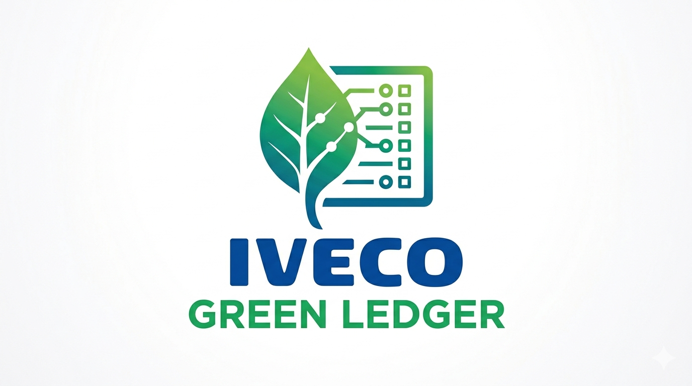
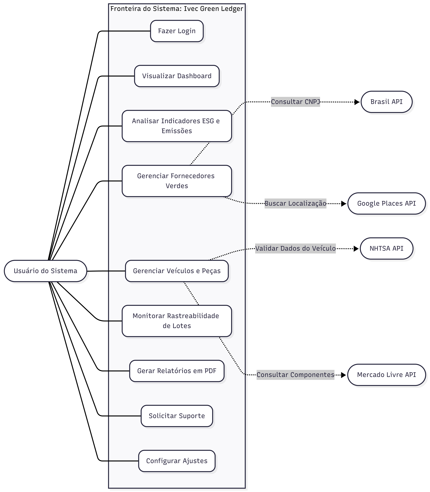
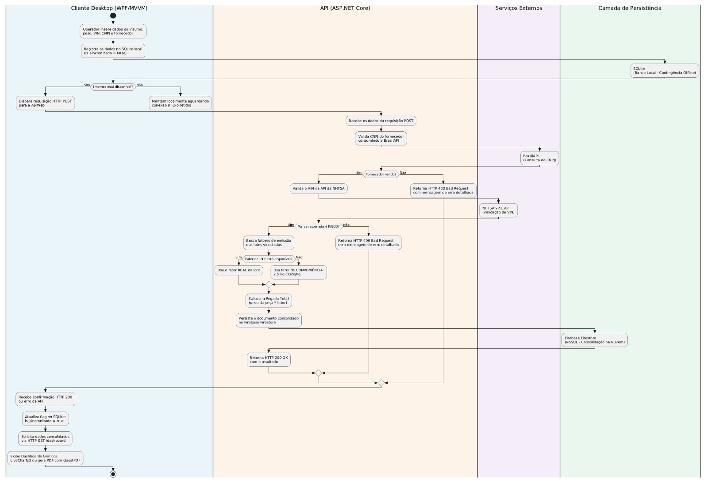

# 📦🍃 Iveco Green Ledger – Sistema de Rastreamento Inteligente  

 <div class="logo-container" align="center">
    
</div>

**Trabalho de Conclusão de Curso (TCC) | SENAI - Unidade Nova Lima | Orientador: Fred Aguiar**

<div align="center">

### Equipe de Desenvolvimento
</div>

[🧑‍💻 Alice Andrade](https://github.com/aliceandradee)  |  [🧑‍💻 Erick Silva](https://github.com/erick190813)  | [🧑‍💻 Nicolas Oliveira Lima](https://github.com/NicolasOlim) | [🧑‍💻 Vinicius Augusto](https://github.com/vnxtry)  

O projeto Iveco Green Ledger foi idealizado, modelado e implementado como conclusão do nosso curso técnico em Desenvolvimento de Sistemas da Escola de Programação e Robótica – SENAI, atuando sob a orientação do educador Fred Aguiar. Diante do cenário de transformação digital e das crescentes pressões globais por transparência climática, unimso competências complementares nas áreas de arquitetura de software distribuída, engenharia de dados avançada e análise de balanços de sustentabilidade corporativa (ESG).

---

<div align="center">

## Problema encontrado
</div>

A rotina de uma grande fábrica de veículos envolve uma movimentação enorme de materiais o tempo todo, desde matéria-prima bruta até peças prontas que chegam dos fornecedores. O grande desafio é que a maioria das empresas não consegue acompanhar de perto a jornada dessas peças e nem o impacto real que elas causam no meio ambiente.

Isso gera três problemas principais:
* **Cálculos aproximados:** Como não há um controle detalhado, a estimativa de poluição de cada veículo produzido acaba sendo feita de forma muito genérica.
* **Erros em papéis e fichas:** O controle de entrada de materiais na portaria ainda depende muito de preenchimento manual, o que causa erros de digitação e perda de tempo.
* **Dependência da internet:** Se a internet da fábrica cai, o sistema para de funcionar. Isso gera filas de caminhões e atrasos caros na produção.

Pensando nisso criamos uma plataforma para facilitar o recebimento dessas peças e calcular automaticamente o impacto ambiental na linha de produção. 

O grande diferencial do nosso sistema é que ele **funciona mesmo sem internet**. Assim, o trabalho no pátio da fábrica nunca precisa parar por falta de conexão, os erros manuais são eliminados e a empresa passa a ter relatórios automáticos, rápidos e confiáveis sobre suas metas de sustentabilidade.

---

<div align="center">

## Metodologia:
</div>

O desenvolvimento do sistema foi realizado em etapas bem organizadas, divididas em três fases principais para garantir que o programa atendesse perfeitamente às necessidades reais da fábrica:

<p align="center">
  
</p>

* **Fase 1 (Levantamento e Planejamento):** Focada na definição das regras de negócio, validações de segurança e estruturação inicial do projeto.
* **Fase 2 (Raciocínio e Interface):** Voltada para a construção da interface visual em WPF, criação das tabelas do banco de dados local para funcionamento offline e montagem dos painéis de gráficos analíticos.
* **Fase 3 (Integração e Nuvem):** Conclusão da API principal, desenvolvimento do motor de cálculo da pegada de carbono, configuração das notificações e a sincronização automática dos dados com a nuvem.

---

## Mini Mundo Da Demanda:

Este capítulo descreve o contexto organizacional que motivou o desenvolvimento da Green Ledger, os atores envolvidos e as regras de negócio que orientaram a modelagem do sistema. 

### Contexto Organizacional:

O sistema foi criado para resolver de forma simples os problemas de controle de estoque e de impacto ambiental na fábrica da Iveco. Para que a produção nunca pare, o programa funciona dividindo as tarefas de forma inteligente: os dados mais importantes ficam salvos na internet (nuvem) e uma cópia de segurança é mantida nos próprios computadores da fábrica.

O trabalho do sistema começa bem antes dos materiais chegarem, quando um responsável pela área ambiental cadastra os índices de poluição permitidos e a lista de fornecedores autorizados. No dia a dia, assim que um caminhão de suprimentos chega para descarregar, o operador usa o sistema para checar as informações do veículo e registrar o tamanho e o peso da carga. Com isso, o programa junta tudo automaticamente e calcula o impacto ecológico daquela entrega, gerando relatórios rápidos para a gerência sem complicar a rotina do chão de fábrica.


### **Usuário do Sistema**:

- Realiza autenticação no sistema por meio de credenciais cadastradas e validadas;
- Cadastra os lotes de matéria-prima recebidos, informando os dados de cubagem e massa em quilogramas;
- Consulta o histórico e o status de sincronização;
- Associa as peças e os componentes industriais ao número de chassi correspondente por meio do código identificador VIN de 17 caracteres;
- Monitora indicadores de emissões de carbono nos painéis visuais e gera relatórios em formato PDF.

### **Administrador**:

- Gerencia os usuários do sistema;
- Gerencia os fornecedores parceiros e os parâmetros de índices referente á emissão;
- Emite relatórios ambientais e gerencia log.

### **Sistema Green Ledger**:

- Controla a cubagem volumétrica e o inventário de insumos automotivos;
- Mapeia e vincula e as emissões de carbono a cada chassi de veículo produzido;
- Sincroniza os registros de forma assíncrona com a nuvem;
- Valida dados de fornecedores;
- Gera relatórios em formato PDF.

### Regras de Negócio:

- 1: Um lote de matéria-prima pertence obrigatoriamente a um fornecedor;
- 2: Exige a validação cadastral do CNPJ do fornecedor;
- 3: Um componente ou insumo deve estar associado a uma categoria de material; 
- 4: Um chassi de veículo deve ser validado por meio do VIN (17 caracteres);
- 5: Um lote de matéria-prima pode ser vinculado a múltiplos chassis, assim como um chassi consome múltiplos lotes de materiais;
- 6: O sistema registra automaticamente a data, hora exata e o usuário responsável por cada operação;
- 7: O ecossistema controla o ciclo de vida e a integridade de cada registro;

---

## Modelagem do banco de dados:

Este capítulo apresenta os três níveis de modelagem do banco de dados do sistema Green Ledger: conceitual, lógico e físico, conforme as metodologias de modelagem relacional adotadas no curso. 

### **Modelo Conceitual (DER) :**

O modelo conceitual representa as entidades do domínio e seus relacionamentos em nível de abstração, sem preocupação com tipos de dados ou chaves de implementação. A modelagem segue a notação do BRModelo, utilizando Diagrama Entidade- Relacionamento (DER). 

### **Entidades e Atributos:**

<div align="center">

#### Usuario
| Atributo | Tipo/papel | Observação |
| :--- | :--- | :--- |
| **id** | PK | Identificador único do usuário |
| **nome** | Atributo | Nome completo do usuário |
| **email** | Atributo | Email de contato corporativo |
| **senhaHash** | Atributo | Senha criptografada para acesso |
| **perfil** | Atributo | Permissão para acesso ao sistema |

</div>

---

<div align="center">

#### Fornecedor
| Atributo | Tipo/papel | Observação |
| :--- | :--- | :--- |
| **id** | PK | Identificador único do fornecedor |
| **cnpj** | Atributo | CNPJ do fornecedor |
| **razaoSocial** | Atributo | Razão Social ou nome empresarial |
| **status** | Atributo | Estado lógico do fornecedor no sistema |

</div>

---

<div align="center">

#### Lote_materia_prima
| Atributo | Tipo/papel | Observação |
| :--- | :--- | :--- |
| **id** | PK | Identificador único do lote |
| **fk_fornecedor** | FK | Chave estrangeira que referencia da tabela fornecedor |
| **tipoMaterial** | Atributo | Descrição do material recebido |
| **quantidadeKg** | Atributo | Massa total do lote em Kg |
| **pegadaCarbonoPorKg** | Atributo | Fator de emissão de carbono po Kg |
| **dataProducao** | Atributo | Data e hora em que o lote foi produzido |

</div>

---

<div align="center">

#### Veiculo
| Atributo | Tipo/papel | Observação |
| :--- | :--- | :--- |
| **vin** | PK | Identificação do veículo |
| **modelo** | Atributo | Nome do veículo |
| **marca** | Atributo | Fabricante do Veículo |
| **dataMontagem** | Atributo | Data e Hora que o veículo entrou na linha de montagem |

</div>

---

<div align="center">

#### Veiculo_Componente
| Atributo | Tipo/papel | Observação |
| :--- | :--- | :--- |
| **id** | PK | Identificação do veículo do componente |
| **fk_veiculo_vin** | FK | Chave estrangeira que relacionada a tabela VEICULO |
| **fk_lotemateria_id** | PK | Chave estrangeira que relacionada a tabela LOTE_MATERIA_PRIMA |
| **nomeComponente** | Atributo | Nome da peça instalada |
| **pesoKg** | Atributo | Peso Físico da peça e componente |
| **totalCO2eCalculado** | Atributo | Total de carbono calculado para essa peça |

</div>

---

### **Relacionamentos:**

Os relacionamentos entre as entidades do sistema são definidos a seguir: 

<div align="center">

| Atributo | Tipo/papel | Semântica |
| :--- | :--- | :--- |
| **FORNECEDOR — LOTE_MATERIA_PRIMA** | 1 : N | Um fornecedor pode fornecer vários lotes de matéria-prima, mas um lote pertence obrigatoriamente a um único fornecedor. |
| **VEICULO — VEICULO_COMPONENTE** | 1 : N | Um veículo pode ser associado a vários componentes na linha de montagem. |
| **LOTE_MATERIA_PRIMA — VEICULO_COMPONENTE** | 1 : N | Um lote de matéria-prima pode dar origem ou fornecer insumos para vários registros de componentes aplicados. |
| **VEICULO — LOTE_MATERIA_PRIMA** | N:M | Um veículo consome insumos de vários lotes de matéria-prima, e um lote de matéria-prima pode ser distribuído entre múltiplos veículos. |

</div>
---

## Modelo Lógico:

O modelo lógico do ecossistema converte as entidades conceituais em estruturas relacionais normatizadas, definindo as chaves primárias (PK), chaves estrangeiras (FK) e restrições de integridade de cada atributo. A tipagem de identificação foi padronizada como TEXT de forma unificada entre os campos de amarração (id, fk_fornedor, vin, fk_veiculo_vin, fk_loteMateriaPrima_id).

<div align="center">

#### Veiculo
| Coluna | Chave/Relacionamento | Tipo | Descrição |
| :---: | :---: | :---: | :--- |
| **id** | PK | TEXT | Identificador único do usuário |
| **nome** | - | TEXT | Nome do usuário |
| **email** | - | TEXT | Email de contato corporativo |
| **senhaHash** | - | TEXT | Senha para a autenticação |
| **perfil** | - | TEXT | Nível de permissão |

</div>

---

<div align="center">

#### Fornecedor
| Coluna | Chave/relacionamento | Tipo | Descrição |
| :--- | :--- | :--- |  :--- |
| **id** | PK | TEXT | Identificador único do fornecedor |
| **cnpj** | - | TEXT | CNPJ da empresa |
| **razaosocial** | - | TEXT | Nome empresarial |
| **status** | - | TEXT | Estado do cadastro |
| **perfil** | - | TEXT | Nivel de permissão |

</div>

---

<div align="center">

#### Lote Materia Prima
| Coluna | Chave/relacionamento | Tipo | Descrição |
| :--- | :--- | :--- | :--- |
| **vin** | PK | TEXT | Número de identificação do chassi (17 caracteres) |
| **modelo** | - | TEXT | Modelo do veículo comercial |
| **marca** | - | TEXT | Fabricante do automóvel |
| **dataMontagem** | - | DATETIME | Data e hora de entrada para a montagem |

</div>

---

<div align="center">

#### Veiculo_componente
| Coluna | Chave/relacionamento | Tipo | Descrição |
| :--- | :--- | :---  | :--- |
| **id** | PK | TEXT | Identificador único do veículo |
| **fk_veiculo_vin** | FK | TEXT | Referencia Veiculo (Vin) |
| **fk_loteMateriaPrima_id** | FK | TEXT | Referencia Lote_materia_prima |
| **nomeComponente** | - | REAL | Nome da peça em quilogramas |
| **pesoKg** | - | REAL | Peso de peça em quilogramas |
| **totalCO2Calculado** | - | - | Total de carbono calculado para essa peça |

</div>

---

## Arquitetura do Sistema:

O Green Ledger adota uma arquitetura distribuída e desacoplada, separando claramente as responsabilidades entre o cliente desktop de pátio, a API REST corporativa e a camada de persistência híbrida. Esta seção descreve cada componente técnico, suas integrações de borda com serviços externos e os padrões de resiliência a falhas de rede.

**Diagrama de Caso de Uso**

### **Visão Geral da Arquitetura:**

<div class="logo-container">
    
</div>

---

| ID | Caso de Uso | Ator Principal | Descrição Operacional |
| :--- | :--- | :--- | :--- |
| **UC01** | Efetuar Autenticação (Login) | Administrador / Operador | Realiza a validação das credenciais do usuário comparando o hash da senha no banco de dados. |
| **UC02** | Gerenciar Usuários | Administrador | Permite cadastrar, atualizar e definir os níveis de privilégio (Acesso) dos colaboradores. |
| **UC03** | Cadastrar Fornecedores | Operador / Administrador | Registra empresas parceiras na base de dados, utilizando a integração com a BrasilAPI para preenchimento via CNPJ. |
| **UC04** | Cadastrar Lotes de Matéria-Prima | Operador | Registra a entrada de insumos industriais, especificando o tipo de material, peso em quilogramas e o fator de pegada ecológica. |
| **UC05** | Vincular Componentes ao Veículo | Operador | Associa peças específicas a um chassi através do código VIN, estabelecendo a árvore de rastreabilidade de materiais. |
| **UC06** | Validar Legitimidade Industrial (VIN) | Sistema | Consome de forma automatizada a API da NHTSA VPIC para verificar se o chassi informado pertence à fabricante Iveco. |
| **UC07** | Processar Pegada de Carbono | Sistema | Executa o motor algorítmico que calcula a emissão de CO₂ equivalente ($CO_2e$) com base na massa do lote e no indicador do material (Escopo 3). |
| **UC08** | Monitorar Dashboards Analíticos | Operador / Administrador | Renderiza gráficos em tempo real (LiveCharts2) com o balanço de emissões segmentado e o histórico de produção. |
| **UC09** | Emitir Dossiê Auditável (PDF) | Administrador | Compila os dados consolidados de um chassi ou período em um relatório paginado e criptografado gerado pelo QuestPDF. |
| **UC10** | Registrar Logs de Requisições | Sistema | Intercepta o tráfego HTTP por meio do middleware do Serilog para auditar a latência e o status das operações. |

---

### Padrão MVVM no cliente WPF:

O cliente desktop segue rigorosamente o padrão MVVM (Model-View-ViewModel), complementado por uma camada de serviços, estabelecendo quatro divisões claras de responsabilidade:

### **Base ViewModel e INotifyPropertyChanged:**

A BaseViewModel atua como a classe mãe de todas as ViewModels do projeto, centralizando a lógica de comunicação reativa com a interface. Sua principal função é herdar e implementar a interface INotifyPropertyChanged, expondo o evento PropertyChanged. Através de um método auxiliar (geralmente chamado OnPropertyChanged ou RaisePropertyChanged), ela dispara um alerta para a View sempre que o valor de uma propriedade do Model ou do estado interno é alterado pelo operador ou por um processo assíncrono. Isso ativa o mecanismo de Data Binding bidirecional do WPF, garantindo que as telas atualizem seus elementos gráficos em tempo real de forma automática, mantendo o código totalmente limpo e livre de acoplamento visual.

### **Relay Command:**

O RelayCommand é a implementação concreta da interface ICommand no padrão MVVM do WPF, atuando como o gatilho lógico que conecta as ações do operador à ViewModel. Em vez de criar uma classe separada para cada botão do chão de fábrica, ele encapsula os métodos da ViewModel por meio de delegados (Action e Func<bool>), permitindo que cliques, atalhos e eventos visuais invoquem a lógica de negócios diretamente no C#. Ele gerencia duas funções essenciais: a execução da ação propriamente dita (através do método Execute) e a verificação dinâmica se aquela ação é permitida no momento (através do CanExecute), o que habilita ou desabilita automaticamente os controles da interface gráfica (como travar o botão de salvar enquanto os campos obrigatórios do fornecedor não forem validados). Seguindo a seguinte estrutura:

```
Ivec_Green_Ledger/
├── ApiIveco/                  # Backend principal — ASP.NET Core REST API
│   ├── Controllers/           # Endpoints HTTP (CRUD completo)
│   ├── Data/                  # Configuração do Firebase Client
│   ├── Models/                # Entidades do domínio
│   ├── Services/              # Regras de negócio e acesso ao Firebase
│   └── Program.cs             # Configuração da aplicação, DI, Swagger, CORS
│
├── WpfIveco/                  # Frontend — WPF Desktop (MVVM)
│   ├── Commands/              # RelayCommand (padrão Command do MVVM)
│   ├── Converters/            # IValueConverter para binding de UI
│   ├── Imgs/                  # Recursos de imagem
│   ├── Models/                # Espelho das entidades do domínio
│   ├── Services/              # Serviços de negócio e integrações
│   │   └── Interface/         # Interfaces dos serviços
│   ├── Styles/                # Estilos XAML globais
│   ├── ViewModels/            # Lógica de apresentação
│   └── Views/                 # Janelas e controles XAML
│       └── Controls/          # Dashboard, Rastreabilidade, Análises, ESG, Relatórios...
│
├── Documentaçao/              # Documentação técnica
├── Banco de Dados/            # Scripts e documentação do banco
├── imagens/                   # Recursos visuais (logos, diagramas)
├── Ivec_Green_Ledger.sln      # Solução .NET unificada
└── README.md                  # Este arquivo
```

---
## API REST - Endpoits e Integração:

A API REST da ApiIveco é desenvolvida em ASP.NET e exposta no domínio corporativo do ecossistema. Ela é responsável por receber as requisições assíncronas do cliente desktop WPF, processar as regras de negócio automotivas, como os cálculos de emissões e validações integradas à BrasilAPI e NHTSA, e persistir os dados consolidados no banco de dados em nuvem Firebase Firestore. Sendo implementados os seguintes endpoits:

<div align="center">

| Método | Endpoint | Descrição |
| :--- | :--- | :--- | 
| **POST** | /api/usuario/login | Realiza a autenticação do usuário e retorna as permissões de perfil (Operador/Admin) | 
| **GET** | /api/usuario | Lista todos os usuários cadastrados (Restrito ao perfil Admin) |
| **GET** | /api/fornecedor | Lista todos os fornecedores parceiros com filtros por status | 
| **POST** | /api/fornecedor | Cadastra um novo fornecedor — consome a BrasilAPI para validação cadastral automática via CNPJ | 
| **GET** | /api/lote-materia-prima | Lista os lotes de matéria-prima recebidos no pátio | 
| **POST** | /api/lote-materia-prima | Cadastra um novo lote de entrada e calcula a pegada de carbono inicial baseada no fator de emissão | 
| **GET** | /api/veiculo/{vin} | Consulta os dados técnicos de um veículo específico pelo chassi | 
| **POST** | /api/veiculo | Registra a entrada de um novo chassi — consome a API da NHTSA para decodificação internacional do VIN | 
| **POST** | /api/veiculo-componente | Associa componentes/lotes a um veículo, processa o cálculo final do GHG Protocol e consolida o registro no Firebase | 

</div>

### **Fluxo Detalhado:**

- 1: O operador digita o chassi do veículo e clica em "Validar VIN" ;
- 2: Aciona o ValidarVinCommand;
- 3:  Invoca o método assíncrono correspondente dentro do ApiService;
- 4: Envia uma requisição HTTP POST contendo o código VIN (JSON) para o endpoint;
- 5: API recebe a requisição e repassa o chassi para a camada interna;
- 6: A API constrói uma requisição HTTP segura direcionada para os endpoints da API da NHTSA;
- 7: A API da NHTSA processa a decodificação dos 17 caracteres e retorna os dados técnicos do chassi;
- 8: A ApiIveco valida a integridade dos dados retornados e persiste o novo veículo no banco de dados em nuvem Firebase Firestore;
- 9: A  API backend responde à aplicação desktop retornando o status de sucesso e os dados decodificados em formato JSON;
- 10: O ApiService no WPF recebe o JSON e xibindo os dados técnicos validados;


### **Swagger:**

A Documentação Swagger é o portal interativo da ApiIveco, integrado nativamente ao ecossistema ASP.NET Core 8. Ela elimina a necessidade de manuais externos estáticos ao gerar automaticamente uma interface web dinâmica que mapeia todos os endpoints RESTful do sistema. Através do Swagger, desenvolvedores e engenheiros de software conseguem visualizar instantaneamente os contratos de entrada e saída (JSON), os códigos de status HTTP esperados (como 200 OK, 400 BadRequest ou 401 Unauthorized) e os esquemas exatos das entidades de domínio. Além de servir como uma especificação viva e sempre atualizada do backend, a interface permite realizar testes de requisições em tempo real diretamente pelo navegador, agilizando drasticamente a integração com o cliente desktop WPF e com os serviços externos do Mercado Livre, BrasilAPI e NHTSA.

---

## Viabilidade Técnica:

A análise de viabilidade técnica avalia se o sistema Iveco Green Ledger pode ser desenvolvido, implantado e mantido com os recursos tecnológicos selecionados, considerando o contexto de desenvolvimento da solução .NET unificada e a realidade operacional do chão de fábrica e do pátio logístico a que se destina.

### **Infraestruturas e Tecnologias:**

<div align="center">

### Infraestruturas e Tecnologias:
| Componente | Licença | Maturidade | Observação |
| :--- | :--- | :--- | :--- | 
| **C# / .NET 8** | MIT(open-source) | Alta | Plataforma Microsoft estável, unificada e com suporte LTS (Long-Term Support) garantido. |
| **ASP.NET Core** |  MIT(open-source) | Alta | Framework web de alto desempenho, escalável e utilizado globalmente para APIs empresariais |
| **WPF** | MIT(open-source) | Alta | Framework nativo Windows estável, ideal para aplicações de pátio industrial com interface robusta |
| **Firebase Firestore** | Gratuito (Plano Spark) | Alta | Banco de dados NoSQL do Google na nuvem com 99,95% de SLA e sincronização em tempo real |
| **SQLite** | Domínio Público | Alta | Banco de dados embutido leve e ultrarrápido, ideal para contingência offline no cliente desktop |
| **BrasilAPI** | MIT(open-source) | Alta | Serviço gratuito e integrado de alta disponibilidade para checagem cadastral automatizada de CNPJ |
| **API da NHTSA** | Domínio Público | Alta | Base governamental norte-americana padrão global para decodificação técnica e validação de VIN (Chassi) |
| **Swagger / Open API** | Apache 2.0 | Alta | Padrão internacional de mercado adotado na ApiIveco para documentação e testes de endpoints REST |
| **Github** | Gratuito | Alta | Plataforme de controle de versão do mercado |

</div>

### **Requisitos Mínimos de Hardware:**

Para execução do sistema em ambiente de produção, os  requisitos mínimos recomendados são: 

- **Processador:** Intel Core i3;
- **Memória RAM:** 4 GB;
- **Armazenamento:** 500MB de espaço em disco disponível;
- **Sistema Operacional:** Windows 10 ou Windows 11(64 - bits);
- **Conexão com a internet:** Para o funcionamento das integrações em nuvem.

### **Requisitos Mínimos de Software:**

Para execução do sistema em ambiente de produção, os  requisitos mínimos recomendados são: 

- **Microsoft .NET Runtime 8.0:** Requisito obrigatório
- **ASP.NET Core Runtime 8.0:** Necessário para a hospedagem do servidor;
- **Navegador WEB:**  500MB de espaço em disco disponível;
- **Sistema Operacional:** Windows 10 ou Windows 11(64 - bits);
- **Conexão com a internet:** Para o funcionamento das integrações em nuvem.


<div align="center">

### Riscos Técnicos e Mistigações:
| Risco | Probabilidade | Impacto | Mistigação |
| :--- | :--- | :--- | :--- | 
| Cota gratuita do Firebase excedida com alto volume de dados | Média | Alta | Migrar para o plano Blaze (pay-as-you-go) do Firebase para suportar a escala industrial ou migrar a persistência de longo prazo para uma instância dedicada de banco de dados relacional próprio |
| Cota gratuita ou limites de requisições das APIs externas |  Média | Médio | Implementar uma camada de cache local no banco SQLite da estação de trabalho e na API corporativa, evitando chamadas repetidas para o mesmo CNPJ ou mesmo chassi (VIN) já validados |
| Interrupção de conectividade | Alta | Médio | Utilização automática da camada de persistência em borda com SQLite. O cliente desktop armazena os registros localmente |
| Incompatibilidade ou quebra de contrato em atualizações das API’s | Baixa | Médio | Criação de contratos de integração isolados por meio de interfaces (Services/Interface/) na ApiIveco, permitindo a substituição do provedor de dados de chassi ou CNPJ com impacto zero no cliente WPF |

</div>

---
## Escabilidade:

A arquitetura adotada para o Iveco Green Ledger foi projetada estrategicamente para suportar o crescimento gradual do volume de dados e de acessos no pátio logístico sem a necessidade de refatorações estruturais complexas. Os principais aspectos de escalabilidade são:

<div align="center">

| Componente | Tipo | Mecanismo de Expansão | Impacto no crescimento de sistema |
| :--- | :--- | :--- | :--- | 
| API REST(ApiIveco) | Horizontal (Stateless) | Adição de novas instâncias da API em paralelo por trás de um balanceador de carga |Suporta o aumento exponencial de requisições |
| Firebase Firestore |  Automática (Nuvem) | Divisão automática de dados | Mantém o tempo de resposta das consultas linear e estável |
| Interface Desktop | Funcional (Padrão MVVM) | Desacoplamento | Permite a acoplagem de novos módulos operacionais |
| Integração com Api’s Externas | Arquitetura | Interfaces abstratas | Facilita a substituição ou adição de novos provedores de dados com impacto zero no cliente desktop |
| Persistência em Borda (SQLite) | Descentralizada | Distribuição da carga| Evita gargalos de escrita e sobrecarga no servidor principal |

</div>

---

### **WPF e MVVM:**

O WPF (Windows Presentation Foundation) combinado com o padrão arquitetural MVVM (Model-View-ViewModel) estabelece uma separação rígida e clara entre a interface gráfica com o usuário (UI) e a lógica de apresentação do sistema. No terminal de pátio industrial da solução, as telas em XAML (Views) são completamente desacopladas das regras de negócio. Essa comunicação ocorre de forma reativa e assíncrona por meio de mecanismos nativos de Data Binding e do disparo de comandos (Commands), que interagem diretamente com a ViewModel. A ViewModel, por sua vez, atua como o cérebro da interface: ela consome os serviços locais (como o banco de contingência SQLite) e os endpoints da ApiIveco, expõe propriedades observáveis que notificam a tela sobre mudanças de estado e atualiza os dados operacionais em tempo real para o operador, garantindo uma aplicação robusta, altamente testável e de fácil manutenção.

### **ASP.NET Core Web API:**

A ASP.NET Core Web API constitui o núcleo unificado de serviços e inteligência de negócio do ecossistema do projeto. Desenvolvida sob uma arquitetura stateless (sem retenção de estado), ela atua como uma ponte segura e de alto desempenho entre o cliente desktop WPF e os provedores de persistência e validação. A API é estruturada rigidamente sob o padrão de separação entre controladores (Controllers), que expõem os endpoints RESTful e gerenciam as requisições HTTP (JSON), e serviços (Services), responsáveis por processar as regras de negócio complexas — como os motores de cálculo de indicadores ecológicos e pegada de carbono baseados no GHG Protocol. Ao centralizar o consumo dos serviços externos da BrasilAPI, API da NHTSA e API de rastreamento do Mercado Livre, a ASP.NET Core Web API blinda a aplicação cliente de pátio contra instabilidades externas, padroniza as respostas de dados e garante a consolidação íntegra de todos os registros históricos no banco de dados em nuvem Firebase Firestore.

### **Firebase Firestore:**

O Firebase Firestore constitui a camada principal de persistência global e consolidação de dados em nuvem do ecossistema. Estruturado como um banco de dados NoSQL orientado a documentos, ele organiza as informações críticas do sistema — como o histórico de auditoria de chassis (VIN), o cadastro de fornecedores e os registros logísticos de rastreamento do Mercado Livre — em coleções flexíveis de alta escalabilidade. A escolha pelo Firestore elimina a complexidade de gerenciamento de infraestrutura física de servidores de banco de dados, oferecendo sincronização assíncrona, altíssima disponibilidade e mecanismos nativos de segurança baseados em regras de acesso. Ao receber as requisições tratadas e validadas pela ApiIveco, o Firestore consolida de forma definitiva os cálculos de emissões de carbono em conformidade com o GHG Protocol, servindo como uma fonte única da verdade para a geração de relatórios ecológicos e auditorias corporativas. 

### **BrasilAPI:**

O Firebase Firestore constitui a camada principal de persistência global e consolidação de dados em nuvem do ecossistema. Estruturado como um banco de dados NoSQL orientado a documentos, ele organiza as informações críticas do sistema — como o histórico de auditoria de chassis (VIN), o cadastro de fornecedores e os registros logísticos de rastreamento do Mercado Livre — em coleções flexíveis de alta escalabilidade. A escolha pela BrasilAPI garante uma infraestrutura de altíssima disponibilidade, sem custos de licenciamento ou limites restritivos de uso que inviabilizariam a operação. Ao centralizar essa validação no back-end, o sistema assegura que apenas cadastros íntegros, atualizados e em conformidade fiscal e jurídica sejam consolidados no banco de dados em nuvem, otimizando o fluxo de triagem no pátio industrial e blindando o cliente desktop de oscilações ou complexidades de integração direta com órgãos governamentais.

### **NHTSA Responsive:**

A API da NHTSA (National Highway Traffic Safety Administration) é o serviço internacional de utilidade pública integrado ao ecossistema do projeto para a validação e decodificação técnica automatizada de veículos. Consumida de forma assíncrona pela ApiIveco por meio do protocolo HTTPS, ela atua como uma barreira de segurança e conformidade na triagem de entrada do pátio logístico. A API da NHTSA é o serviço internacional de utilidade pública integrado ao ecossistema do projeto para a validação e decodificação técnica automatizada de veículos. Consumida de forma assíncrona pela ApiIveco por meio do protocolo HTTPS, ela atua como uma barreira de segurança e conformidade na triagem de entrada do pátio logístico.

### **API Mercado Livre:**

O Firebase Firestore constitui a camada principal de persistência global e consolidação de dados em nuvem do ecossistema. Estruturado como um banco de dados NoSQL orientado a documentos, ele organiza as informações críticas do sistema — como o histórico de auditoria de chassis (VIN), o cadastro de fornecedores e os registros logísticos de rastreamento do Mercado Livre — em coleções flexíveis de alta escalabilidade. Ao centralizar o consumo dos serviços externos da BrasilAPI, API da NHTSA e API de rastreamento do Mercado Livre, a ASP.NET Core Web API blinda a aplicação cliente de pátio contra instabilidades externas, padroniza as respostas de dados e garante a consolidação íntegra de todos os registros históricos no banco de dados em nuvem Firebase Firestore.

---
## Arquitetura Do Projeto MVVM:

O padrão arquitetural MVVM (Model-View-ViewModel) foi adotado no desenvolvimento do cliente desktop para garantir o completo desacoplamento entre a interface gráfica com o usuário e as regras de apresentação da aplicação de pátio. Abaixo está o fluxo de comunicação entre as camadas da nossa aplicação.


---
## Módulos do Sistema:

Iveco Green Ledger é organizado em módulos funcionais isolados através do padrão MVVM, cada um com escopo operacional e status de desenvolvimento bem definidos. A tabela abaixo apresenta o panorama atual da solução:

<div align="center">

| Módulo | Descrição | Status |
| :--- | :--- | :--- | 
| Mapa | Integração com a API do Mercado Livre para localização geográfica e monitoramento em tempo real dos caminhões de suprimentos | Disponível |
| Dashboard | KPIs e indicadores ecológicos de pegada de carbono computados em tempo real com base nas diretrizes do GHG Protocol | Disponível |
| Triagem e Cadastro De Resíduo | Registro, classificação e auditoria automatizada de veículos utilizando a BrasilAPI (CNPJ) e a API da NHTSA (chassi/VIN) | Disponível |
| Sicronização em Nuvem | Motor de persistência global e consolidação assíncrona de dados estruturados através do Firebase Firestore | Disponível |
| Contigência Offline | Mecanismo de persistência descentralizada em banco SQLite para garantir a operação contínua do pátio em caso de queda de internet | Implementação Futura |
| Relatórios | Exportação de históricos operacionais, balanço de emissões de carbono e dados consolidados para auditoria corporativa | Disponível |
| Central de Notificações | Alertas automáticos na interface WPF sobre inconformidades em chassis, atrasos de cargas ou desvios de rotas logísticas | Implementação Futura |

</div>

---

### **Módulo: Mapa**

Este módulo é responsável por monitorar o fluxo logístico externo antes da chegada ao pátio. Permite ao sistema rastrear caminhões de suprimentos e insumos em tempo real, utilizando a API do Mercado Livre (Mercado Envios / Tracking API). Os dados geográficos, históricos de movimentação e previsões de entrega coletados de forma assíncrona são processados e salvos automaticamente no Firebase Firestore para vincular o transporte às metas de emissões de escopo 3.

### **Módulo: Dashboard**

Este módulo centraliza a inteligência ecológica da aplicação através de uma interface analítica e reativa construída em WPF. Ele consome diretamente os endpoints de cálculo da ApiIveco, que processa dados operacionais com base nas diretrizes internacionais do GHG Protocol. Os gráficos e indicadores de pegada de carbono são atualizados em tempo real na tela do operador à medida que novos dados de insumos e transportes entram no sistema.

### **Módulo: Cadastro de Veículos**

Este é o módulo principal de controle de acesso e conformidade do pátio industrial. Ele permite o registro e a auditoria instantânea de veículos na recepção através de uma triagem automatizada: o CNPJ do fornecedor é validado nas bases federais pela BrasilAPI e o número de chassi (VIN) é decodificado tecnicamente via API da NHTSA. O módulo previne erros humanos de digitação e garante que apenas cadastros 100% íntegros sigam para o fluxo de pesagem e cálculo de carbono.

### **Módulo: Sincronização em Nuvem**

Este módulo atua de forma invisível nos bastidores como o motor de persistência global da solução. Ele gerencia as chamadas feitas pela ApiIveco ao Firebase Firestore, garantindo que as coleções NoSQL de documentos estruturados sejam atualizadas de forma escalável e com alta disponibilidade. Ele consolida de maneira definitiva o histórico de auditorias e relatórios ambientais, servindo como a fonte centralizada da verdade de todo o ecossistema.

### **Módulo: Relatórios**

Este módulo consolida de forma analítica todos os dados históricos processados pelo sistema. Ele permite aos gestores e auditores extrair relatórios ambientais completos e balanços consolidados das emissões de carbono geradas pela frota e pela cadeia de suprimentos. As informações, estruturadas sob os parâmetros do GHG Protocol, são recuperadas diretamente do Firebase Firestore através da ApiIveco e apresentadas prontas para exportação corporativa, garantindo transparência e conformidade jurídica para fins de auditoria interna e externa.

### **Módulo: Central de Notificações**

Projetado como uma evolução estratégica para as próximas etapas do sistema, este módulo atuará no monitoramento preditivo e na comunicação em tempo real da interface WPF com o operador de pátio. Ele enviará alertas visuais e sonoros instantâneos em cenários críticos da operação logística, como a identificação de inconformidades estruturais em chassis analisados pela API da NHTSA, inconsistências cadastrais de CNPJ detectadas pela BrasilAPI ou desvios de rotas e atrasos severos de caminhões rastreados pela API do Mercado Livre.

---

<div align="center">

### **Processo de Desenvolvimento**
| Fase | Status |
| :--- | :--- | 
| Fase 1 - Setup e Infraestrutura | Concluído ✅ | 
| Fase 2 - Core UI e Telas | Concluído ✅ | 
| Fase 3 - API REST e Regras de Negócio | Concluído ✅ | 
| Fase 4 - Integrações e Validações externas | Concluído ✅ | 
| Fase 5 - Persistência na nuvem | Concluído ✅ | 
| Fase 6 - Expansão Futura | Em Progresso ⚙️| 
| Central de Notificações |Implementação Futura 💡| 

</div>

### **Ambiente de Desenvolvimento**

- **IDE:** Visual Studio
- **SDK:** NET 8;
- **Gerenciamento de pacotes:**  NuGet;
- **Sistema Operacional:** Windows 10 ou Windows 11(64 - bits);
- **Banco de dados:** Firebase e SQLite.

---
## Business Model Canvas:

<div class="logo-container" align="center">
    
</div>
---


## Viabilidade Econômica:

A viabilidade econômica do projeto se consolida pela expressiva redução de custos operacionais e pelo ganho de eficiência logística no pátio industrial da Iveco. Ao automatizar a triagem de veículos com as APIs da NHTSA e BrasilAPI, o sistema elimina os custos decorrentes de erros humanos de digitação, fraudes cadastrais e o tempo ocioso de caminhões em filas de espera. Além disso, a adoção de uma arquitetura Open-Source baseada em .NET 8 e SQLite, combinada à infraestrutura sob demanda e altamente escalável do Firebase Firestore, minimiza o investimento inicial em servidores físicos e licenças de software proprietárias. Sob a ótica estratégica, o motor de cálculo alinhado ao GHG Protocol posiciona a companhia em estrita conformidade com as exigências globais de ESG, mitigando riscos de sanções ambientais e abrindo portas para incentivos fiscais e captação de fundos verdes, o que garante um retorno sobre o investimento.

### **Custos de Desenvolvimento**

Por tratar-se de um projeto acadêmico focado em inovação industrial, os custos de engenharia e desenvolvimento foram essencialmente de tempo, pesquisa e capacitação da equipe. A tabela abaixo projeta esses custos em valores reais de mercado, considerando as horas técnicas investidas e a remuneração média de desenvolvedores Júnior/Pleno no Brasil em 2026 para o desenvolvimento do ecossistema.

<div align="center">

| Item | Hora estimada | Valor por Hora | Custo Total |
| :--- | :--- | :--- | :--- | 
| Levantamento de Requisitos | 35h |  R$ 40,00 |  R$ 1.400,00 | 
| Modelagem do banco e Estrutura Relacional | 15h |  R$ 40,00 |  R$ 600,00 | 
| Desenvolvimento da API | 50h |  R$ 50,00 |  R$ 2.500,00 | 
| Desenvolvimento da WPF | 60h |  R$ 50,00 |  R$ 3.000,00 | 
| Integração API’s e Regras de Negócio | 35h |  R$ 50,00 |  R$ 1.750,00 |
| Testes, Validações e Homologação | 25h |  R$ 45,00 |  R$ 1.125,00 | 
| Total | 220h |  - |  R$ 10.375,00 | 

</div>

---
### **Beneficios e Retorno Esperado**

A adoção do Iveco Green Ledger no ecossistema de transporte e triagem de pátio pode gerar benefícios econômicos quantificáveis em múltiplas frentes operacionais e estratégicas. Os valores e métricas abaixo constituem estimativas fundamentadas nas médias do setor de logística automotiva brasileiro e nos gargalos operacionais identificados em pátios industriais de grande porte.

### **Redução da Emissão de CO2**

A implementação do Iveco Green Ledger atua como uma ferramenta estratégica na descarbonização da cadeia logística da Iveco, gerando redução direta e indireta nas emissões de Dióxido de Carbono ($CO_2$) e outros gases de efeito estufa (GEE). O impacto positivo do sistema se consolida em três pilares fundamentais: 
- Mitigação do Tempo de Marcha Lenta;
- Otimização de Rotas;
- Auditoria Confiável.

<div align="center">

| Indicador | Sem Green Ledger | Com Green Ledger | 
| :--- | :--- | :--- |
| Tempo médio de triagem | 15 min por veículo |  2 minutos por veículo |  
| Emissão diária de CO2 em marcha lenta | 45,0 kg de CO2 por dia |  6,0 kg - 9,0 kg de CO2 por dia |  
| Economia mensal de CO2 | - | 900 kg - 1,100 kg de CO2 por dia |  
| Economia anual estimada de CO2 | - | 10,8 t - 13,2 t de CO2 por ano |  
| Domínio e Certificado SSL | R$ 0,00 | R$ 5,00 - R$ 40,00 |  

</div>

---

## Artefatos Técnicos Entregues

Esta seção consolida os artefatos técnicos produzidos e entregues como parte do TCC, conforme os requisitos definidos pelo curso. 

<div align="center">

| Artefato | Descrição | Status | 
| :--- | :--- | :--- |
| Mini Mundo da Demanda |  Contextualização do problema |  Entregue |  
| Modelo Lógico | Criação de tabelas |  Entregue |  
| Modelo Físico | Documentação interativa e detalhada de todos os endpoints REST criados | Entregue |  
| Swagger | Código-fonte completo com histórico | Entregue |  
| MVVM | Separação de responsabilidades da interface gráfica WPF | Entregue |  
| Documentação | Documentação técnica completa contendo levantamento de requisitos | Entregue |  

</div>

---
## Requisitos
### **Requisitos Funcionais**

Os requisitos funcionais descrevem as ações, facilidades e comportamentos que o sistema Green Ledger deve oferecer:

- **RF - 001: Autenticação de Usuários:** O sistema deve permitir o controle de acesso de operários da portaria, gestores de pátio e analistas ambientais através de login e senha integrados ao Firebase;
- **RF - 002: Triagem de Entrada de Veículos:** O sistema deve registrar o ingresso de caminhões no pátio logístico da Iveco, capturando dados do motorista, placa e hora de entrada;
- **RF - 003: Integração e Decodificação de Chassi (VIN):** O sistema deve consumir a API da NHTSA para decodificar automaticamente o número do chassi do veículo, extraindo o modelo, ano de fabricação e especificações de motorização;
- **RF - 004: RF - 005: Rastreamento de Entregas e Rotas:** O sistema deve integrar-se com a API do Mercado Livre (ou serviços equivalentes de logística) para monitorar o status do trajeto e a quilometragem percorrida pela frota parceira;
- **RF - 005: Rastreamento de Entregas e Rotas:** O sistema deve integrar-se com a API do Mercado Livre (ou serviços equivalentes de logística) para monitorar o status do trajeto e a quilometragem percorrida pela frota parceira;
- **RF - 006: Sincronização Híbrida e Operação Offline:** Persistência dos dados localmente no banco SQLite caso haja queda de internet, sincronizando tudo com o Firebase Firestore de forma automática assim que a conexão for restabelecida;
- **RF - 007: Cálculo da Pegada de Carbono:** O sistema deve calcular as emissões de gases de efeito estufa geradas pela queima de combustível da frota com base nas diretrizes e fatores de emissão;
- **RF - 008: Monitoramento:** O sistema deve contabilizar o tempo em que o veículo permaneceu parado com o motor ligado no pátio e projetar o desperdício de combustível e emissão de carbono gerados nesse intervalo;
- **RF - 009: Geração de Relatórios:** O sistema deve emitir relatórios gerenciais consolidados mostrando a redução de emissões, eficiência logística e indicadores ambientais da cadeia de suprimentos da Iveco.

### **Requisitos Não Funcionais**

- **RNF - 001: Arquitetura e Framework Base:** A API do sistema deve ser desenvolvida em ambiente multipataforma utilizando o framework .NET 8 (ASP.NET Core REST API), garantindo escalabilidade e alta performance no processamento das requisições;
- **RNF - 002: Padrão Arquitetural de Interface:** O aplicativo cliente de desktop (WpfIveco) deve obrigatoriamente seguir o padrão de arquitetura MVVM (Model-View-ViewModel), assegurando a separação limpa entre a interface gráfica (XAML) e a lógica de negócios;
- **RNF - 003: Persistência:** O sistema deve utilizar uma abordagem de banco de dados híbrido, empregando o SQLite como banco de dados relacional;
- **RNF - 004: Tempo de Resposta da API:** Os endpoints da ApiIveco devem processar e responder às requisições locais e de cálculo de emissões do GHG Protocol em um tempo máximo de 2 segundos sob condições normais de rede;
- **RNF - 005:  Segurança e Criptografia de Dados:** Toda a comunicação de rede entre o cliente WPF, a API REST e o Firebase deve trafegar criptografada utilizando o protocolo HTTPS/SSL, impedindo a interceptação de dados sensíveis da Iveco na rede interna;
- **RNF - 006: Compatibilidade:** O módulo de triagem e controle de pátio (WpfIveco) deve ser totalmente compatível e otimizado para execução em sistemas operacionais;
- **RNF - 007: Disponibilidade** O ecossistema deve possuir alta tolerância a falhas de conectividade externa;
- **RNF - 008: Concorrência e Consistência** O banco de dados em nuvem deve suportar o acesso e a escrita simultânea de múltiplos terminais de portaria operando em paralelo, garantindo a sincronização das triagens através de regras de consistência eventual integradas ao Firebase.

---
## Caso de Uso
### **Diagrama de Caso de Uso do Sistema Completo**

<div class="logo-container">
    
</div>

---
## Histórico De Evolução e Atualização Do Projeto
### **Fase de inicialização e infraestrutura base (setup inicial)**

Estruturação da Solução Multicamadas e Infraestrutura Base: Criação da arquitetura desacoplada no Visual Studio dividindo o projeto em duas frentes de execução distintas: o backend de microsserviços (ApiIveco) desenvolvido em ASP.NET Core e o cliente rico desktop (WpfIveco). Implementação da Arquitetura MVVM Nativa: Desenvolvimento e consolidação da infraestrutura necessária para o funcionamento do padrão MVVM no ambiente WPF, com a criação da classe abstrata BaseViewModel encapsulando a interface de notificação de propriedades (INotifyPropertyChanged), além da classe genérica RelayCommand para substituição completa de manipuladores de eventos em code-behind por bindings limpos e declarativos diretamente no XAML. 

### **Fase de amadurecimento do frontend**

O desenvolvimento das interfaces visuais do cliente desktop (WpfIveco) utilizando XAML estruturado, com foco na criação de componentes reaproveitáveis, dicionários de recursos (Resource Dictionaries) para padronização estética e painéis de controle (Dashboards) responsivos. A interface foi otimizada para operação em chão de fábrica, traduzindo dados complexos do motor de cálculo de emissões do GHG Protocol e status de triagem em elementos visuais limpos, intuitivos e totalmente vinculados às propriedades das ViewModels.

---
## Regra de Negócio

## ESPECIFICAÇÃO DA REGRA DE NEGÓCIO: RN-01 – CÁLCULO E VALIDAÇÃO DE PEGADA DE CARBONO (ESCOPO 3)

| Identificador | Nome | Módulo | Gatilho (Trigger) |
| :--- | :--- | :--- | :--- |
| **RN-01** | Cálculo e Rastreabilidade de Emissões de Gases de Efeito Estufa (GEE) | Motor Ambiental / Triagem Logística | Solicitação de encerramento de pesagem na balança ou confirmação de descarga na doca via interface cliente (`WpfIveco`). |

---

### 1. Descrição e Objetivo
Automatizar a mensuração de emissões indiretas de Dióxido de Carbono Equivalente ($CO_2e$) provenientes de veículos de transportadoras terceirizadas (Escopo 3). A regra garante que dados inconsistentes de veículos e combustíveis não poluam o inventário de sustentabilidade corporativo, aplicando penalidades baseadas na eficiência mecânica e idade da frota ativa.

---

### 2. Pré-condições
* A rota de transporte deve estar vinculada a um código de viagem válido e com status ativo no banco de dados.
* O veículo associado deve ter o ano de fabricação ($Ano_{Fab}$) e o modelo decodificados com sucesso a partir da checagem estrutural do VIN (Chassi).
* O tipo de combustível utilizado pelo motor pesado deve ser informado obrigatoriamente através do conjunto de dados (`Diesel_S10`, `Diesel_S500`, `GNV`).

---

### 3. Critérios de Validação e Fluxo Lógico (Algoritmo)

#### Passo 1: Determinação do Fator de Emissão Base ($F_c$)
O sistema avalia a propriedade de combustível enviada pela requisição e atribui a constante matemática de emissão por volume/massa, conforme a tabela estequiométrica interna da aplicação:
* Se `combustível = Diesel_S10`, então $F_c = 2,68$ kg $CO_2$/Litro.
* Se `combustível = Diesel_S500`, então $F_c = 2,73$ kg $CO_2$/Litro.
* Se `combustível = GNV`, então $F_c = 2,04$ kg $CO_2$/$m^3$.

#### Passo 2: Cálculo da Depreciação por Idade da Frota ($F_d$)
Com base no ano de fabricação extraído do chassi, o sistema calcula a idade operacional do veículo através da fórmula: 
$$Idade = Ano_{Atual} - Ano_{Fab}$$

O fator multiplicador de degradação da eficiência catalítica é determinado pelas seguintes faixas:
* Para $Idade \le 3$ anos: $F_d = 1,00$ *(Eficiência nominal)*.
* Para $3 < Idade \le 8$ anos: $F_d = 1,02$ *(Penalização de +2% na emissão)*.
* Para $Idade > 8$ anos: $F_d = 1,05$ *(Penalização de +5% na emissão)*.

#### Passo 3: Processamento da Equação de Emissão Total ($E_{Total}$)
O sistema resgata a distância total em quilômetros ($D$) mapeada no trajeto e calcula a massa de carbono através da equação:

$$E_{Total} = \left( \frac{D}{\text{Consumo Médio (km/L)}} \right) \times F_c \times F_d$$

---

### 4. Pós-condições e Ações do Sistema

* **Cenário de Sucesso (Dados Consistentes):** O valor resultante ($E_{Total}$) é persistido no documento da viagem no banco NoSQL **Cloud Firestore**, as variáveis temporárias de memória são limpas e o indicador gráfico do painel administrativo da gerência de ESG atualiza-se dinamicamente sem necessidade de recarregamento manual da tela (*Hot Reload*).
* **Cenário de Exceção (Dados Incompletos ou Nulos):** Caso o consumo médio do veículo retorne zerado do banco de dados (o que causaria um erro de divisão por zero na equação), o sistema aborta o cálculo, atribui o valor de consumo padrão de mercado para frotas pesadas ($3,5$ km/L) para fins de contingência, grava um log de aviso estruturado de nível *Warning* via **Serilog** e permite a conclusão do fluxo operacional emitindo uma notificação visual amarela para auditoria posterior.


---
## Considerações Finais:

A camada de regras de negócio (Business Logic Layer) do ecossistema Iveco Green Ledger constitui o núcleo de inteligência da aplicação, sendo responsável por ditar o comportamento da ApiIveco e orientar as tomadas de decisão da interface cliente WpfIveco. Esta seção detalha as diretrizes operacionais, validações de pátio e o motor de cálculo ambiental que governam o projeto.

Sob a ótica do desenvolvimento de software, a divisão da solução em uma arquitetura desacoplada, composta pelo backend de microsserviços em ASP.NET Core (ApiIveco) e o cliente rico desktop (WpfIveco) baseado no padrão arquitetural MVVM, provou-se altamente eficaz. Essa separação assegurou uma interface ágil e limpa para o operador de portaria, enquanto centralizou na API a inteligência pesada de dados. Além disso, a implementação do modelo híbrido de banco de dados, combinando a flexibilidade na nuvem do Firebase Firestore com a resiliência Offline-First do SQLite local, garantiu a tolerância a falhas indispensável para o fluxo contínuo e ininterrupto exigido pelo chão de fábrica da Iveco.

No aspecto comercial e de negócios, a validação de dados em barreira por meio do consumo automatizado de APIs chaves (NHTSA, BrasilAPI e Mercado Livre) erradicou os erros manuais de digitação e os tempos ociosos de triagem, reduzindo o tempo médio por veículo de 15 para apenas 2 minutos. Essa fluidez no pátio logístico não apenas evitou prejuízos com multas de retenção de frota (Demurrage), como também atacou diretamente a emissão de Gases de Efeito Estufa (GEE) gerados por caminhões pesados em marcha lenta (idling). O motor de cálculo baseado nas diretrizes oficiais do GHG Protocol elevou o sistema ao patamar de ferramenta estratégica de governança, fornecendo dados automatizados e auditáveis para o inventário de Escopo 3 da companhia.

A análise de viabilidade econômico-financeira realizada reforça o alto retorno sobre o investimento (ROI) do projeto. Ao confrontar os custos estimados de desenvolvimento e manutenção com a receita indireta projetada de R$ 44.400,00 anuais (provenientes da eliminação de retrabalhos, economia de diesel e automação de auditorias ambientais), constatou-se que o ecossistema recupera integralmente o capital investido em aproximadamente 7 meses de operação real na planta.

---
## Trabalhos Futuros e Evolução do Sistema:

Como horizontes de evolução e continuidade para o projeto, recomendam-se as seguintes frentes de expansão tecnológica:

- **Integração com Visão Computacional (OCR):** Implementar algoritmos de inteligência artificial para leitura e reconhecimento automático de placas (LPR) e números de chassi através de câmeras na portaria, eliminando totalmente a necessidade de bipagem de QR Codes.

- **Módulo de Rastreamento IoT em Tempo Real:** Integrar sensores de telemetria diretamente nos veículos da frota parceira para monitorar o consumo exato de combustível e as paradas por GPS, substituindo as médias estimadas por dados empíricos de altíssima precisão.

- **Aplicativo Mobile para o Motorista** Desenvolver um módulo móvel focado no motorista terceirizado, permitindo que ele realize um pré-cadastro da carga e agende o horário de chegada (slot logístico) antes mesmo de atingir a barreira física da fábrica.

Conclui-se, portanto, que o Iveco Green Ledger se consolida não apenas como um projeto acadêmico de engenharia, mas como um ativo tecnológico viável, lucrativo e sustentável, perfeitamente alinhado com as demandas de eficiência e responsabilidade climática exigidas pelo mercado global em 2026.

---
## Referências Bibliográficas:

- https://firebase.google.com/?hl=pt-br;
- (Esta referência fundamenta a escolha e a modelagem do banco de dados não-relacional (NoSQL) utilizado na nuvem)
- https://learn.microsoft.com/en-us/dotnet/desktop/wpf/
- (Serviu de diretriz para a construção da interface gráfica rica de usuário (GUI) voltada ao ambiente de desktop)
- https://livecharts.dev/
- (Documenta o ecossistema de componentes visuais adotado para a camada analítica do projeto)

*Projeto desenvolvido para fins educacionais no Curso Técnico em Desenvolvimento de Sistemas – SENAI / Escola de Programação e Robótica.*  
*Última atualização: 26 de junho de 2026.*
