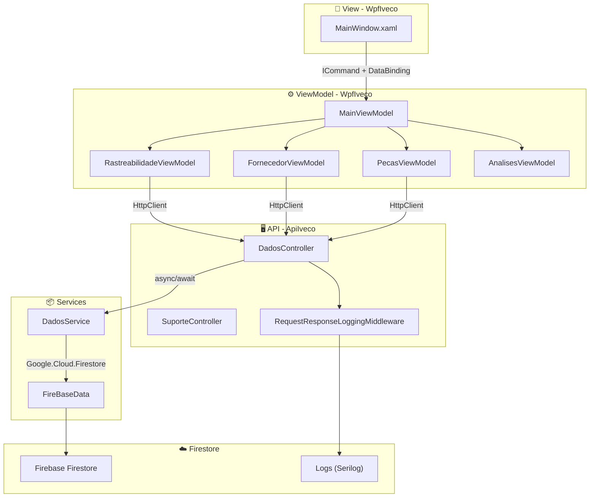
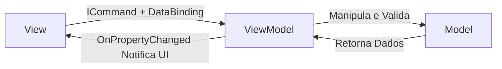

# 📦🍃 Sistema de Rastreamento Inteligente - Iveco Green Ledger
 
### Trabalho de Conclusão de Curso - Desenvolvimento de Sistemas
 
### Escola De Programação e Robótica - SENAI 
 
#### Orientado por: Fred Aguiar
 
👥 **Equipe de Desenvolvimento**

<p align="center">
<strong>Colaboradores:</strong><br>
<a href="https://github.com/NicolasOlim">🧑‍💻 Nicolas  Oliveira Lima</a> |
<a href="https://github.com/aliceandradee">🧑‍💻 Alice Andrade</a> |
<a href="https://github.com/erick190813">🧑‍💻 Erick Silva</a> |
<a href="https://github.com/vnxtry">🧑‍💻 Vinicius Augusto </a> |
</p>

---

# 🎯 Proposta de Valor: Sistema de Rastreamento Inteligente (Projeto Iveco)


    

**Contexto:** Solução tecnológica voltada para a rastreabilidade logística e a transparência ambiental na cadeia de suprimentos da indústria automotiva pesada.

---

## 🎯 Principais Pilares de Valor

### 📦 1. Gerenciamento e Rastreabilidade Logística
* **Monitoramento em Tempo Real:** Capacidade de catalogar insumos e rastrear a produção instantaneamente.
* **Controle de Suprimentos:** Gestão integrada que atende à complexidade logística da manufatura de veículos industriais.

### 🌱 2. Sustentabilidade e Conformidade ESG
* **Cálculo da Pegada de Carbono:** Automação no cálculo da emissão de gases de efeito estufa para a frota.
* **Alinhamento a Diretrizes:** Facilita o atendimento aos rigorosos requisitos de conformidade e auditoria estabelecidos pelas políticas Ambientais, Sociais e de Governança Corporativa (ESG).

### ⚙️ 3. Infraestrutura de Alta Performance e Resiliência
* **Arquitetura Distribuída:** Solução escalável estruturada em nuvem (Firebase Firestore - NoSQL) e preparada para suportar a demanda de produção em escala industrial.
* **Processamento Assíncrono:** Absorve alta demanda de operações sem interrupções utilizando `async/await` e padrões de processamento paralelo, garantindo integridade e resposta ágil.

### 📊 4. Ferramenta Estratégica de Monitoramento
* **Inteligência de Dados:** Atua como o núcleo de governança e painel de controle administrativo das operações logísticas (Dashboards com LiveCharts2).
* **Comprovação Ecológica:** Estruturada para gerar relatórios em PDF (QuestPDF) como prova estratégica de responsabilidade ecológica e eficiência operacional.

---

## 🛠️ Tecnologias e Stack

<p align="center">
  
  
  
  
  
  
  
  
  
  
  
  
  
  
  
</p>

---

## 📢 Pitch de Negócios & Defesa Estratégica

Desenvolvemos uma solução integrada para monitorar e otimizar a cadeia de suprimentos da Iveco, focando em descarbonização, rastreabilidade de componentes e conformidade ESG. O sistema captura dados em tempo real de fornecedores, lotes de matéria-prima, processos de montagem e gera relatórios ambientais estruturados.

---

### 🚨 1. O Problema e a Proposta de Valor

A descarbonização e a eficiência energética tornaram-se pilares críticos na manufatura da indústria automotiva pesada. O desafio central consiste em monitorar, quantificar e mitigar o consumo de recursos e as emissões de carbono em operações de larga escala.

Nossa solução propõe uma abordagem estruturada que entrega:

* **Sustentabilidade Mensurável:** Transparência no consumo de recursos e emissões por ativo através de cálculos de pegada de carbono.
* **Rastreabilidade Completa:** Histórico auditável de fornecedores, lotes e componentes de cada veículo montado.
* **Geração de Relatórios:** Exportação de dados em PDF para conformidade regulatória e stakeholders.

---

## 📐 Documentação do Ecossistema: Cadeia de Suprimentos, Veículos e Persistência em Nuvem

O ecossistema **Iveco Green Ledger** é composto por dois pilares principais integrados:

1. **`ApiIveco` (Back-End)**: API Web construída em ASP.NET Core 8 que centraliza as regras de negócio, expõe endpoints RESTful documentados via **Swagger** e comunica com Firebase Firestore de forma assíncrona.

2. **`WpfIveco` (Front-End Desktop)**: Aplicação desktop desenvolvida em WPF estruturada sob o padrão **MVVM (Model-View-ViewModel)** com interface em tema **Light Mode** para máxima usabilidade.

3. **`Firebase Firestore` (Banco de Dados)**: Banco de dados NoSQL baseado em nuvem, garantindo persistência assíncrona, escalabilidade automática e sincronização em tempo real.

---

**Arquitetura Visual do Fluxo de Dados:**



---

## 📐 Diagramas e Modelagem

### 📐 1. Modelo de Dados - Entidades Principais

O projeto utiliza **Firebase Firestore** como banco de dados NoSQL. As entidades principais são:

```
Fornecedor
├── Id (string)
├── Nome (string)
├── Cnpj (string)
└── Localizacao (string)

LoteMateriaPrima
├── Id (string)
├── TipoMaterial (string)
├── DataProducao (DateTime)
├── QuantidadeKg (double)
├── PegadaCarbonoPorKg (double)
└── fk_Fornecedor_Id (string)

Veiculo
├── Vin (string - PK)
├── Modelo (string)
└── DataMontagem (DateTime)

VeiculoComponente
├── Id (string)
├── NomePeca (string)
├── fk_Veiculo_Vin (string)
└── fk_LoteMateriaPrima_Id (string)

Usuario
├── Id (string)
├── Nome (string)
├── Email (string)
├── Senha (string)
└── Acesso (string)
```

---

<a id="dicionario-de-dados"></a>
## 🗄️ Dicionário de Dados

### 1. Coleção `fornecedores`

| Campo | Tipo | Descrição |
| :--- | :--- | :--- |
| `Id` | `string` | Identificador único gerado pelo Firebase |
| `Nome` | `string` | Razão social do fornecedor |
| `Cnpj` | `string` | CNPJ registrado junto à Receita Federal (ex: 00.000.000/0000-00) |
| `Localizacao` | `string` | Endereço ou localização do fornecedor |

### 2. Coleção `lotes_materia_prima`

| Campo | Tipo | Descrição |
| :--- | :--- | :--- |
| `Id` | `string` | Identificador único do lote |
| `TipoMaterial` | `string` | Categoria (Aço, Plástico, Borracha, etc) |
| `DataProducao` | `DateTime` | Data de produção ou recebimento |
| `QuantidadeKg` | `double` | Peso total do lote em quilogramas |
| `PegadaCarbonoPorKg` | `double` | Emissão de CO2 por quilo do material |
| `fk_Fornecedor_Id` | `string` | Referência ao ID do fornecedor (FK) |

### 3. Coleção `veiculos`

| Campo | Tipo | Descrição |
| :--- | :--- | :--- |
| `Vin` | `string` | Vehicle Identification Number (17 caracteres - PK) |
| `Modelo` | `string` | Modelo comercial (ex: Stralis, S-Way) |
| `DataMontagem` | `DateTime` | Data e hora de conclusão da montagem |

### 4. Coleção `veiculo_componentes`

| Campo | Tipo | Descrição |
| :--- | :--- | :--- |
| `Id` | `string` | Identificador único do componente |
| `NomePeca` | `string` | Nome do componente (Eixo Dianteiro, Motor, etc) |
| `fk_Veiculo_Vin` | `string` | Referência ao VIN do veículo (FK) |
| `fk_LoteMateriaPrima_Id` | `string` | Referência ao ID do lote de origem (FK) |

### 5. Coleção `usuarios`

| Campo | Tipo | Descrição |
| :--- | :--- | :--- |
| `Id` | `string` | Identificador único do usuário |
| `Nome` | `string` | Nome completo ou apelido |
| `Email` | `string` | E-mail único para login |
| `Senha` | `string` | Hash de senha (nunca em texto puro) |
| `Acesso` | `string` | Perfil: "Admin" ou "Usuario" |

---

<a id="relacionamentos"></a>
## 🔗 Relacionamentos

* **Fornecedor 1 → N LoteMateriaPrima**: Um fornecedor entrega múltiplos lotes.
* **LoteMateriaPrima 1 → N VeiculoComponente**: Um lote gera múltiplas peças instaladas.
* **Veiculo 1 → N VeiculoComponente**: Um veículo possui múltiplos componentes rastreáveis.

---

## 📚 Conhecendo cada camada do projeto

---

## 🌐 APIs Públicas Utilizadas

### **BrasilAPI - Consulta de CNPJ**

Integração com a plataforma comunitária brasileira para consulta de dados públicos da Receita Federal.

#### 🛠️ Integração no Projeto

- **Endpoint Utilizado**: `GET https://brasilapi.com.br/api/cnpj/v1/{cnpj}`
- **Localização**: `DadosService.BuscarFornecedorPorCnpjAsync(string cnpj)`
- **Método HTTP**: GET
- **Parâmetros**: CNPJ sem formatação (ex: 00000000000191)
- **Resposta**: JSON com dados de registro (Nome, Localização, Status)
- **Tratamento**: Encapsulado em requisições assíncronas com `HttpClient`

#### 🎯 Pilares Técnicos

1. **Gratuidade e Escalabilidade**: Sem custos, mantida pela comunidade, suporta milhões de requisições.
2. **Abstração de Autenticação**: Não requer API keys ou tokens, acesso livre.
3. **Cache Inteligente**: Redunda gargalos de disponibilidade dos servidores públicos.

---

### **NHTSA Response - Validação de VIN**

Integração com a agência federal norte-americana de segurança viária para decodificação de chassis.

#### 🛠️ Integração no Projeto

- **Endpoint Utilizado**: `GET https://vpic.nhtsa.dot.gov/api/vehicles/DecodeVin/{vin}?format=json`
- **Localização**: `DadosService.BuscarEValidarVinIvecoAsync(string vin)`
- **Método HTTP**: GET
- **Parâmetros**: VIN de 17 caracteres
- **Resposta**: JSON com metadados de fabricante, modelo, ano
- **Validação**: Verifica se fabricante contém "IVECO"

#### 🎯 Pilares Técnicos

1. **Padrão ISO 3779**: Decodificação normativa global de identificação veicular.
2. **Alta Disponibilidade**: Infraestrutura governamental com CDN global.
3. **Confiabilidade**: Sem custo, mantida por órgão federal de segurança.

---

## 🗂️ Camada de Serviços Intermediários - API (ApiIveco)

A **ApiIveco** é o núcleo inteligente que centraliza toda a lógica de negócio. Desenvolvida em **ASP.NET Core 8** com padrão **RESTful**.

### ✨ Características Principais

- **Documentação Swagger Automática**: Todos os endpoints são autodocumentados com tags e exemplos.
- **Validação Robusta**: Regras de negócio com tratamento granular de erros (400, 404, 409, 500).
- **Operações Assíncronas**: Pipeline completa com `async/await` para máxima performance.
- **Logging Estruturado**: Rastreamento de todas as operações críticas.
- **CORS Configurado**: Comunicação segura com WPF.

### 📝 Sistema de Logging Avançado (Serilog)

Implementação robusta de logging com múltiplos destinos:

**Componentes:**

1. **Arquivo Rotacionado**: Logs persistem em `logs/log-*.txt` com rotação diária e limite de 31 arquivos
2. **Console Colorido**: Saída visual com tema ANSI para desenvolvimento
3. **RequestResponseLoggingMiddleware**: Middleware que:
   - Registra cada requisição HTTP com emojis (➡️ entrada, ✅/⚠️/💥 saída)
   - Mede tempo de resposta em milissegundos
   - Captura request/response bodies em modo Development
   - Fornece rastreamento completo do fluxo

**Configuração Real (`appsettings.json`):**

```json
{
  "Serilog": {
    "MinimumLevel": {
      "Default": "Information",
      "Override": {
        "Microsoft": "Warning",
        "Microsoft.Hosting.Lifetime": "Warning"
      }
    },
    "WriteTo": [
      {
        "Name": "File",
        "Args": {
          "path": "logs/log-.txt",
          "rollingInterval": "Day",
          "outputTemplate": "{Timestamp:yyyy-MM-dd HH:mm:ss.fff zzz} [{Level:u3}] {Message:lj}{NewLine}{Exception}",
          "fileSizeLimitBytes": 10485760,
          "rollOnFileSizeLimit": true,
          "retainedFileCountLimit": 31
        }
      },
      {
        "Name": "Console",
        "Args": {
          "theme": "Serilog.Sinks.SystemConsole.Themes.AnsiConsoleTheme::Code, Serilog.Sinks.Console",
          "outputTemplate": "[{Timestamp:HH:mm:ss} {Level:u3}] {Message:lj}{NewLine}{Exception}"
        }
      }
    ],
    "Enrich": ["FromLogContext", "WithMachineName", "WithThreadId"]
  },
  "Firebase": {
    "ProjectId": "SEU_PROJECT_ID_AQUI",
    "CredentialPath": "chave_Api/firebase-key.json"
  }
}
```

### 📌 Controllers e Endpoints Implementados

#### **DadosController** (`/api/dados`)

**Tags Organizadas:**

| Tag | Endpoints |
| :--- | :--- |
| **Veículos** | `GET /veiculos`, `GET /veiculos/{vin}`, `POST /veiculos`, `PUT /veiculos/{vin}`, `DELETE /veiculos/{vin}`, `GET /veiculos/validar-vin/{vin}`, `GET /relatorios/veiculos/pdf` |
| **Fornecedores** | `GET /fornecedores`, `GET /fornecedores/buscar-cnpj/{cnpj}`, `POST /fornecedores`, `DELETE /fornecedores/{id}` |
| **Lotes e Componentes** | `GET /lotes`, `POST /lotes`, `DELETE /lotes/{id}`, `GET /componentes`, `POST /componentes`, `DELETE /componentes/{id}` |
| **Autenticação** | `POST /cadastrar`, `POST /login` |

#### **SuporteController** (`/api/suporte`)

| Endpoint | Descrição |
| :--- | :--- |
| `GET /logs` | Retorna o arquivo de logs mais recente em texto puro |

---

## 🗂️ Camada da Interface Gráfica - WPF (WpfIveco)

A **WpfIveco** é a aplicação desktop que consome a API e fornece interface amigável para usuários. Desenvolvida em **Windows Presentation Foundation (WPF)** com padrão **MVVM**.

### 🎨 Design System Modernizado (Light Mode)

- **Tema Claro e Profissional**: Interface minimalista com alto contraste
- **Moldura Customizada**: Sem moldura padrão do Windows para controle total visual
- **Responsividade**: Adapta-se a diferentes resoluções de tela
- **Paleta Corporativa**: Alinhada com identidade visual Iveco

### 🚀 Detalhamento Técnico e Implementações Avançadas

* **Padrão MVVM Puro e Data Binding:** A interface utiliza intensamente o motor de binding do WPF para conectar propriedades da ViewModel às propriedades de controles visuais, eliminando code-behind desnecessário.

* **Renderização Dinâmica de Coleções:** Uso de `ObservableCollection<T>` para atualizar UI automaticamente quando dados chegam da API.

* **Navegação Declarativa:** Roteamento entre módulos (Dashboard, Rastreabilidade, Fornecedores, Peças, Análises, Relatórios) via `TabControl` com conteúdo dinâmico.

* **Arquitetura Orientada a Comandos (ICommand Pattern):** Todas as interações mapeadas via `RelayCommand`:
  * `FazerLoginCommand`: Autenticação com e-mail/senha
  * `FazerCadastroCommand`: Criação de novo usuário
  * `MudarAbaCommand`: Navegação entre abas
  * Comandos específicos em cada sub-ViewModel

* **Data Masking e Validação:**
  * CNPJ: Formato `##.###.###/####-##` com validação de comprimento
  * VIN: Validação de 17 caracteres
  * Datas: Formato `dd/MM/yyyy` com validação de intervalo
  * Números: Separador decimal com máximo de 4 casas

* **Tratamento de Erros Robusto:** Try-catch com mensagens amigáveis e logging de exceções.

---

### 🗂️ Camada da View Model - WPF (WpfIveco)

O padrão **MVVM** implementado segue um ciclo reativo de comunicação:



#### **Ciclo de Interação Detalhado:**

**1. Disparo da UI: View → ViewModel (ICommand & Data Binding)**

Quando o utilizador clica em um botão ou digita em um TextBox na `MainWindow.xaml`:
- **DataBinding**: Propriedades dos controles vinculadas bidirecionalmente a propriedades da ViewModel
- **ICommand**: Ações encapsuladas via `RelayCommand` que dispara delegates assíncronos

**2. Sincronização Reativa: ViewModel → View (OnPropertyChanged)**

Após operações assíncronas (chamadas HTTP), a ViewModel actualiza propriedades e dispara `OnPropertyChanged()`:
- Motor de binding do WPF detecta mudanças
- UI renderiza automaticamente sem code-behind

**3. Manipulação de Entidades: ViewModel → Model**

ViewModel realiza operações CRUD e validações:
- Criar `Veiculo`, `Fornecedor`, `LoteMateriaPrima` etc
- Validar dados segundo regras de negócio
- Preparar para persistência na nuvem

**4. Retorno de Dados: Model → ViewModel**

Model retorna dados processados e ViewModel atualiza estado refletindo na UI

#### **Sub-ViewModels Principais:**

| ViewModel | Responsabilidade |
| :--- | :--- |
| `MainViewModel` | Coordenação global, login, navegação, timer de atualização (2 min) |
| `RastreabilidadeViewModel` | Listar e pesquisar veículos, validar VINs |
| `FornecedorViewModel` | Consultar CNPJ, registrar fornecedores |
| `PecasViewModel` | Gerenciar componentes de veículos |
| `AnalisesViewModel` | Gráficos de emissões (Scope 1 & 3) com LiveCharts |
| `RelatoriosViewModel` | Geração e exportação de PDFs |

---

### 📄 Modelo de Exportação e Relatórios em PDF

O sistema gera relatórios em PDF utilizando **QuestPDF** (versão Community):

**Funcionalidades:**

- **Sumário de Veículos**: Tabela A4 com VIN, Modelo, Data de Montagem
- **Formatação Profissional**: Headers verdes, bordas cinzentas, paginação automática
- **Assinatura Digital**: Hash de integridade para auditoria
- **Endpoint**: `GET /api/dados/relatorios/veiculos/pdf`

---

## 🚀 Como Executar o Projeto

### **Pré-requisitos:**

- .NET 8 SDK instalado
- Visual Studio 2022 ou VS Code com extensões C#
- Conta Firebase com credenciais configuradas
- Git para clone do repositório

### **Passos de Execução:**

**1. Clone o repositório:**
```bash
git clone https://github.com/NicolasOlim/Ivec_Green_Ledger.git
cd Ivec_Green_Ledger
```

**2. Configure as credenciais Firebase:**
   - Gere credenciais no Firebase Console
   - Coloque o arquivo `firebase-key.json` em `ApiIveco/chave_Api/`
   - Atualize `ProjectId` em `ApiIveco/appsettings.json`

**3. Restaure as dependências:**
```bash
dotnet restore
```

**4. Execute a API (primeiro terminal):**
```bash
cd ApiIveco
dotnet run
```
API disponível em: `https://localhost:7221`
Swagger disponível em: `https://localhost:7221/swagger/index.html`

**5. Execute o WPF (segundo terminal):**
```bash
cd WpfIveco
dotnet run
```

**6. Login na aplicação:**
   - Crie uma conta via "Criar Conta"
   - Utilize as credenciais para entrar

---

## 📊 Status do Projeto

| Funcionalidade | Status |
| :--- | :--- |
| API RESTful com CRUD completo | ✅ Implementado |
| Firebase Firestore integrado | ✅ Implementado |
| WPF com MVVM | ✅ Implementado |
| Autenticação (Login/Cadastro) | ✅ Implementado |
| Logging com Serilog | ✅ Implementado |
| RequestResponseLoggingMiddleware | ✅ Implementado |
| Integração BrasilAPI (CNPJ) | ✅ Implementado |
| Integração NHTSA (VIN) | ✅ Implementado |
| Gráficos com LiveCharts | ✅ Implementado |
| Exportação PDF com QuestPDF | ✅ Implementado |
| Data Masking e Validação | ✅ Implementado |
| Temas Light/Dark Mode | ✅ Light Mode Implementado |

---

## 📖 Documentação Adicional

- **Repositório Anterior**: [Iveco Green Ledger (Old)](https://github.com/NicolasOlim/Iveco-Green-Ledger-Old)
- **Swagger da API**: `https://localhost:7221/swagger/index.html` (durante execução)
- **Logs da API**: `https://localhost:7221/api/suporte/logs` (durante execução)

---

## 🤝 Contribuições

Este projeto foi desenvolvido como Trabalho de Conclusão de Curso (TCC) pela equipe SENAI. Sugestões e correções são bem-vindas através de issues ou pull requests.

---

## 📄 Licença

Projeto desenvolvido para fins educacionais no âmbito do SENAI - Escola de Programação e Robótica.

---

**Última atualização:** 16 de junho de 2026
