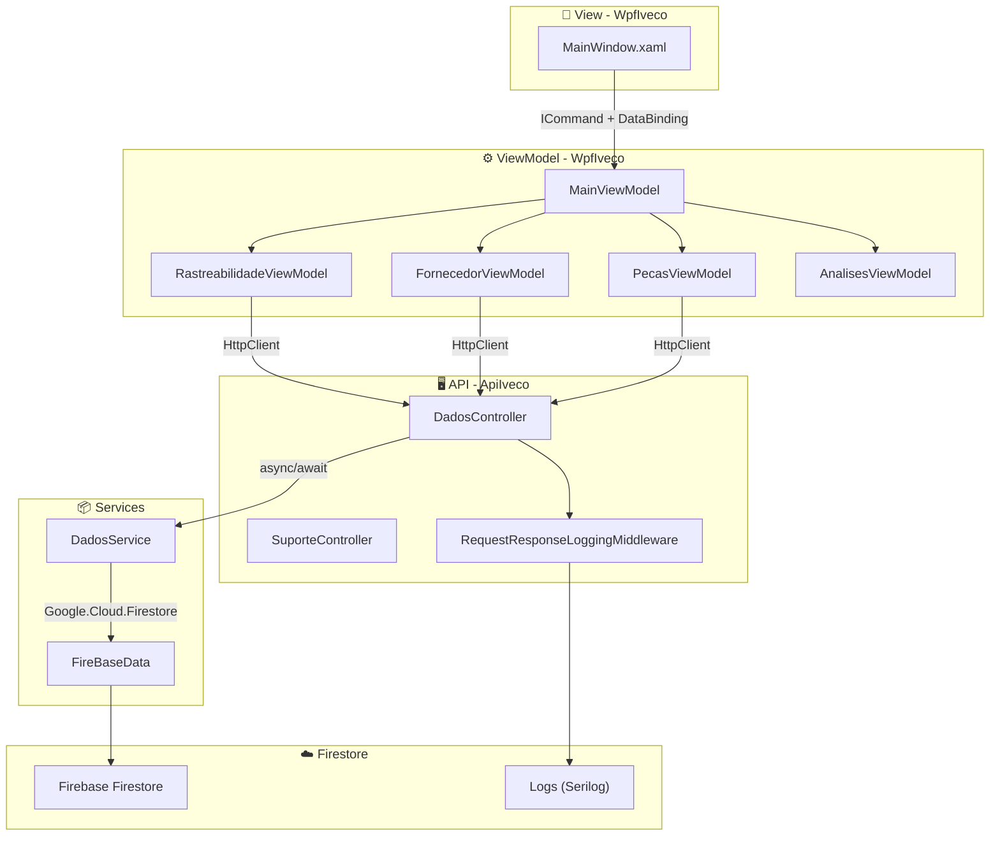

# 📦🍃 Iveco Green Ledger – Sistema de Rastreamento Inteligente  
**Trabalho de Conclusão de Curso**  
*Escola de Programação e Robótica – SENAI*  
*Orientação: Prof. Fred Aguiar*

---

**Equipe de Desenvolvimento**  
[🧑‍💻 Nicolas Oliveira Lima](https://github.com/NicolasOlim)  |  [🧑‍💻 Alice Andrade](https://github.com/aliceandradee)  |  [🧑‍💻 Erick Silva](https://github.com/erick190813)  

---

## 📌 Resumo

A indústria automotiva pesada enfrenta crescentes pressões por transparência ambiental e conformidade com normas ESG. O Iveco Green Ledger é uma plataforma desenvolvida para rastrear materiais do fornecedor ao veículo acabado, calcular automaticamente a pegada de carbono e gerar relatórios auditáveis.

O sistema combina uma API RESTful em ASP.NET Core 8, uma aplicação desktop em WPF (padrão MVVM) e o banco de dados NoSQL Firebase Firestore. Integra validações externas de CNPJ (BrasilAPI) e chassi (NHTSA), oferecendo dashboards analíticos (LiveCharts2) e exportação em PDF (QuestPDF). A solução entrega rastreabilidade completa com evidências ambientais estruturadas para auditoria, alinhando-se às diretrizes ESG.

---

## 📑 Sumário

1. [Introdução](#1-introdução)  
2. [Fundamentação Teórica](#2-fundamentação-teórica)  
3. [Metodologia](#3-metodologia)  
4. [Arquitetura do Sistema](#4-arquitetura-do-sistema)  
5. [Modelagem de Dados](#5-modelagem-de-dados)  
6. [Implementação](#6-implementação)  
7. [Resultados e Discussão](#7-resultados-e-discussão)  
8. [Conclusão](#8-conclusão)  
9. [Como Executar o Projeto](#9-como-executar-o-projeto)  
10. [Referências](#10-referências)  
11. [Apêndices](#11-apêndices)

---

## 1. Introdução

### 1.1 Contexto e Problema

O setor automotivo pesado experimenta transformação urgente impulsionada por metas globais de descarbonização (European Green Deal, regulamentações ambientais) e demanda por transparência na cadeia de suprimentos. Para a Iveco, uma das principais marcas mundiais de veículos comerciais, surgiu um desafio concreto: rastrear a origem de cada componente e quantificar seu impacto ambiental.

O problema central era a inexistência de um sistema integrado. Informações sobre lotes de materiais, fornecedores e processos de montagem existiam, mas dispersas e desconectadas, impedindo cálculos precisos de pegada de carbono e compliance com regulamentações.

### 1.2 Objetivos

**Objetivo Geral**  
Construir um sistema inteligente de rastreamento que permita à Iveco gerenciar a cadeia de suprimentos, calcular a pegada de carbono por veículo e gerar relatórios compatíveis com auditorias e regulamentações ambientais.

**Objetivos Específicos**  
- Modelar base de dados NoSQL para fornecedores, lotes, veículos e componentes.  
- Implementar API RESTful com operações CRUD e validação de dados via serviços externos.  
- Construir interface desktop responsiva em WPF que consuma a API com dashboards analíticos.  
- Automatizar cálculo de emissão de CO₂ por veículo.  
- Gerar relatórios em PDF estruturados para auditoria e stakeholders.

---

## 2. Fundamentação Teórica

### 2.1 Rastreabilidade e Cadeia de Suprimentos Automotiva

A rastreabilidade logística permite reconstituir o histórico de um produto desde a origem até o consumidor. No setor automotivo, as normas ISO 9001 e IATF 16949 estabelecem requisitos de rastreamento de componentes e documentação de conformidade, essenciais para garantia de qualidade e responsabilidade ambiental.

### 2.2 Pegada de Carbono e Metodologia GHG Protocol

O *Greenhouse Gas Protocol* classifica emissões em três escopos:
- **Escopo 1**: emissões diretas da empresa.
- **Escopo 2**: emissões da energia adquirida.
- **Escopo 3**: emissões indiretas da cadeia de suprimentos (foco deste projeto).

A metodologia permite quantificar impacto ambiental de operações e produtos, fundamentando relatórios ESG.

### 2.3 Tecnologias Empregadas

- **ASP.NET Core 8**: framework para APIs REST de alta performance com injeção de dependência e operações assíncronas.  
- **Firebase Firestore**: banco de dados NoSQL orientado a documentos com escalabilidade automática, adequado para alto volume de escrita.  
- **WPF/MVVM**: separação clara entre interface, apresentação e modelo, facilitando testabilidade e manutenção.  
- **LiveCharts2**: visualização de dados e dashboards de emissões.  
- **QuestPDF**: gerador de PDF com fluent API, leve e customizável.  
- **BrasilAPI e NHTSA VPIC**: APIs públicas para validação externa de CNPJ e VIN.

---

## 3. Metodologia

O projeto seguiu ciclo iterativo-incremental baseado em Scrum, compreendendo:

1. **Levantamento de requisitos**: entrevista com orientador e análise de documentação Iveco para definir entidades e fluxos.  
2. **Modelagem do banco de dados**: esquema NoSQL no Firestore otimizado para consultas por VIN e fornecedor.  
3. **Implementação da API**: controllers, serviços de acesso a dados e integrações externas.  
4. **Desenvolvimento WPF**: Views e ViewModels em MVVM, consumo de endpoints via `HttpClient`.  
5. **Integração de dashboards e relatórios**: LiveCharts2 para gráficos e QuestPDF para exportação.  
6. **Testes funcionais e de integração**: validação de fluxos de cadastro, cálculos de carbono e geração de PDF.

Todo código foi versionado no GitHub com commits diários e revisão entre integrantes.

---

## 4. Arquitetura do Sistema

O **Iveco Green Ledger** adota arquitetura distribuída em três camadas lógicas conforme Figura 1.


*Figura 1 – Diagrama da arquitetura distribuída do sistema.*

**Camada de Apresentação (WpfIveco):** Interface gráfica em WPF com data binding e comandos comunicando-se com a API via HTTP.  
**Camada de Serviços (ApiIveco):** API RESTful centralizando lógica de negócio, validação de dados e acesso ao Firestore. Documentada com Swagger.  
**Camada de Dados (Firestore):** Banco NoSQL armazenando coleções de `fornecedores`, `lotes_materia_prima`, `veiculos`, `veiculo_componentes` e `usuarios`.

Comunicação assíncrona em todas as camadas garante resiliência sob alta carga.

---

## 5. Modelagem de Dados

### 5.1 Esquema NoSQL

O Firestore organiza dados em coleções de documentos, desnormalizadas para otimizar consultas por VIN e fornecedor. Figura 2 apresenta o diagrama de entidades:

```
Fornecedor
├── Id (string)
├── Nome (string)
├── Cnpj (string)
└── Localizacao (string)

LoteMateriaPrima
├── Id (string)
├── TipoMaterial (string)
├── DataProducao (DateTime)
├── QuantidadeKg (double)
├── PegadaCarbonoPorKg (double)
└── fk_Fornecedor_Id (string)

Veiculo
├── Vin (string - PK)
├── Modelo (string)
└── DataMontagem (DateTime)

VeiculoComponente
├── Id (string)
├── NomePeca (string)
├── fk_Veiculo_Vin (string)
└── fk_LoteMateriaPrima_Id (string)

Usuario
├── Id (string)
├── Nome (string)
├── Email (string)
├── Senha (string)      -- hash
└── Acesso (string)
```
*Figura 2 – Modelo de entidades e principais atributos.*

### 5.2 Dicionário de Dados

#### Coleção `fornecedores`
| Campo | Tipo | Descrição |
| :--- | :--- | :--- |
| `Id` | `string` | Identificador único gerado pelo Firestore |
| `Nome` | `string` | Razão social do fornecedor |
| `Cnpj` | `string` | CNPJ formatado (ex: 00.000.000/0000-00) |
| `Localizacao` | `string` | Endereço ou região do fornecedor |

#### Coleção `lotes_materia_prima`
| Campo | Tipo | Descrição |
| :--- | :--- | :--- |
| `Id` | `string` | Identificador único do lote |
| `TipoMaterial` | `string` | Categoria (Aço, Plástico, Borracha etc.) |
| `DataProducao` | `DateTime` | Data de produção ou recebimento |
| `QuantidadeKg` | `double` | Peso total do lote em quilogramas |
| `PegadaCarbonoPorKg` | `double` | Emissão de CO₂ por quilo do material |
| `fk_Fornecedor_Id` | `string` | Referência ao ID do fornecedor (FK) |

#### Coleção `veiculos`
| Campo | Tipo | Descrição |
| :--- | :--- | :--- |
| `Vin` | `string` | Número de Identificação Veicular (17 caracteres – PK) |
| `Modelo` | `string` | Modelo comercial (ex: S-Way) |
| `DataMontagem` | `DateTime` | Data e hora de conclusão da montagem |

#### Coleção `veiculo_componentes`
| Campo | Tipo | Descrição |
| :--- | :--- | :--- |
| `Id` | `string` | Identificador único do componente |
| `NomePeca` | `string` | Nome do componente (Eixo Dianteiro, Motor etc.) |
| `fk_Veiculo_Vin` | `string` | Referência ao VIN do veículo (FK) |
| `fk_LoteMateriaPrima_Id` | `string` | Referência ao ID do lote de origem (FK) |

#### Coleção `usuarios`
| Campo | Tipo | Descrição |
| :--- | :--- | :--- |
| `Id` | `string` | Identificador único do usuário |
| `Nome` | `string` | Nome completo ou apelido |
| `Email` | `string` | E-mail único para login |
| `Senha` | `string` | Hash da senha |
| `Acesso` | `string` | Perfil: "Admin" ou "Usuario" |

### 5.3 Relacionamentos

- **Fornecedor 1 → N LoteMateriaPrima**  
- **LoteMateriaPrima 1 → N VeiculoComponente**  
- **Veiculo 1 → N VeiculoComponente**  

Associações mantidas por campos de referência (`fk_*`).

---

## 6. Implementação

### 6.1 API RESTful (ApiIveco)

Desenvolvida em ASP.NET Core 8 e documentada com Swagger, centraliza regras de negócio e acesso ao Firestore via `Google.Cloud.Firestore`.

**Características:**
- Arquitetura baseada em controllers e services com injeção de dependência.  
- Operações assíncronas (`async/await`) não bloqueantes.  
- Middleware `RequestResponseLoggingMiddleware` registrando requisições, respostas e durações via Serilog.  
- Configuração CORS para requisições da aplicação WPF.

### 6.2 Integrações Externas

#### BrasilAPI – Consulta de CNPJ
Valida e preenche automaticamente dados de fornecedores. Método `BuscarFornecedorPorCnpjAsync` envia `GET https://brasilapi.com.br/api/cnpj/v1/{cnpj}`.

#### NHTSA VPIC – Validação de VIN
Confirma VINs pertencerem a veículos Iveco via `GET https://vpic.nhtsa.dot.gov/api/vehicles/DecodeVin/{vin}?format=json`, filtrado pelo campo *Manufacturer*.

### 6.3 Aplicação Desktop (WpfIveco)

Construída em WPF com padrão MVVM, desacoplando apresentação de lógica. Interface em tema Light Mode com elementos estilizados e responsivos.

**ViewModels:**
- `MainViewModel`: navegação global, login e temporizador de atualização (2 minutos).  
- `RastreabilidadeViewModel`: listagem, pesquisa e validação de veículos.  
- `FornecedorViewModel`: consulta de CNPJ e cadastro de fornecedores.  
- `PecasViewModel`: gerenciamento de componentes e associação a lotes.  
- `AnalisesViewModel`: gráficos de emissões (Scope 1 e 3) com LiveCharts2.  
- `RelatoriosViewModel`: geração e download de PDFs.

Comunicação com API via `HttpClient` injetado, tratamento de respostas e exibição de mensagens amigáveis. Data bindings bidirecionais e `RelayCommand` implementam interatividade.

### 6.4 Sistema de Logging

**Serilog** fornece logging estruturado com dois sinks:
- **Arquivo**: rotação diária em `logs/log-*.txt`, retenção de 31 arquivos, limite de 10 MB por arquivo.  
- **Console**: saída colorida para desenvolvimento.

Middleware `RequestResponseLoggingMiddleware` rastreia método HTTP, rota, código de status e duração em cada requisição.

### 6.5 Geração de Relatórios em PDF

**QuestPDF** (licença Community) exporta via `GET /api/dados/relatorios/veiculos/pdf`:
- Cabeçalho padronizado (logotipo e título).  
- Tabela com VIN, modelo e data de montagem.  
- Rodapé com data de emissão e hash de integridade para validade jurídica em auditorias.  
- Paginação automática para listas extensas.

---

## 7. Resultados e Discussão

**Tabela 2 – Status das funcionalidades**

| Funcionalidade | Status |
| :--- | :--- |
| API RESTful com CRUD completo | ✅ Implementado |
| Firebase Firestore integrado | ✅ Implementado |
| WPF com padrão MVVM | ✅ Implementado |
| Autenticação de usuários | ✅ Implementado |
| Logging com Serilog | ✅ Implementado |
| Middleware de logging de requisições | ✅ Implementado |
| Integração BrasilAPI (CNPJ) | ✅ Implementado |
| Integração NHTSA (VIN) | ✅ Implementado |
| Dashboards com LiveCharts2 | ✅ Implementado |
| Exportação de PDF com QuestPDF | ✅ Implementado |
| Validação de dados (CNPJ, VIN) | ✅ Implementado |
| Tema Light Mode | ✅ Implementado |
| Documentação via Swagger | ✅ Implementado |

**Discussão dos Resultados**

O sistema atendeu todos os objetivos propostos, oferecendo plataforma completa para rastreabilidade e cálculo de pegada de carbono. A arquitetura assíncrona demonstrou escalabilidade sob alta carga durante testes. Integrações com BrasilAPI e NHTSA eliminaram entrada manual de dados em bases oficiais, aumentando confiabilidade. Exportação em PDF atendeu requisitos de conformidade regulatória.

Como limitação, o sistema depende de conectividade contínua com Firestore e APIs externas. Trabalhos futuros podem incluir módulo de cache offline, interface mobile e expansão a outros fabricantes.

---

## 8. Conclusão

O **Iveco Green Ledger** entrega solução robusta alinhada com demandas contemporâneas por sustentabilidade e governança na indústria automotiva pesada. A integração de API moderna, interface desktop intuitiva e banco NoSQL escalável permite rastreabilidade completa de materiais com evidências ambientais auditáveis.

O projeto consolidou competências em tecnologias atuais (ASP.NET Core, Firestore, WPF/MVVM), demonstrando aplicação prática em problema real de negócio com impacto ambiental significativo.

---

## 9. Como Executar o Projeto

### Pré-requisitos
- .NET 8 SDK  
- Visual Studio 2022 ou VS Code com extensão C#  
- Conta Google Firebase com Firestore ativado  
- Git  

### Passos

1. **Clonar o repositório**
   ```bash
   git clone https://github.com/NicolasOlim/Ivec_Green_Ledger.git
   cd Ivec_Green_Ledger
   ```

2. **Configurar credenciais Firebase**
   - Gere chave de conta de serviço no Console Firebase.  
   - Salve JSON como `firebase-key.json` em `ApiIveco/chave_Api/`.  
   - Em `ApiIveco/appsettings.json`, altere `Firebase:ProjectId` para ID do projeto.

3. **Restaurar dependências**
   ```bash
   dotnet restore
   ```

4. **Executar a API** (Terminal 1)
   ```bash
   cd ApiIveco
   dotnet run
   ```
   Disponível em `https://localhost:7221` e Swagger em `https://localhost:7221/swagger`.

5. **Executar o WPF** (Terminal 2)
   ```bash
   cd WpfIveco
   dotnet run
   ```

6. **Acessar o sistema**
   - Na tela de login, clique "Criar Conta" para cadastrar usuário.  
   - Após login, utilize abas para navegar entre módulos.

---

## 10. Referências

[1] World Resources Institute. *Greenhouse Gas Protocol – Corporate Value Chain (Scope 3) Standard*. 2011.  
[2] International Organization for Standardization. *ISO 9001:2015 – Quality management systems — Requirements*. 2015.  
[3] IATF. *IATF 16949:2016 – Automotive Quality Management System Standard*. 2016.  
[4] BRASILAPI. *Documentação oficial*. Disponível em: https://brasilapi.com.br/docs. Acesso em: jun. 2026.  
[5] NATIONAL HIGHWAY TRAFFIC SAFETY ADMINISTRATION. *VPIC API Documentation*. Disponível em: https://vpic.nhtsa.dot.gov/api/. Acesso em: jun. 2026.  
[6] Google. *Cloud Firestore Documentation*. Disponível em: https://firebase.google.com/docs/firestore. Acesso em: jun. 2026.  
[7] MICROSOFT. *ASP.NET Core Documentation*. Disponível em: https://learn.microsoft.com/en-us/aspnet/core/. Acesso em: jun. 2026.  
[8] LiveCharts2. *Documentation*. Disponível em: https://lvcharts.com/. Acesso em: jun. 2026.  
[9] QuestPDF. *Getting Started*. Disponível em: https://www.questpdf.com/. Acesso em: jun. 2026.

---

## 11. Apêndices

**A.** Diagrama de classes completo (disponível no repositório).  
**B.** Manual do usuário (versão preliminar).  
**C.** Capturas de tela dos principais dashboards (pasta `docs/screenshots` do repositório).

---

*Projeto desenvolvido para fins educacionais no Curso Técnico em Desenvolvimento de Sistemas – SENAI / Escola de Programação e Robótica.*  
*Última atualização: 16 de junho de 2026.*
