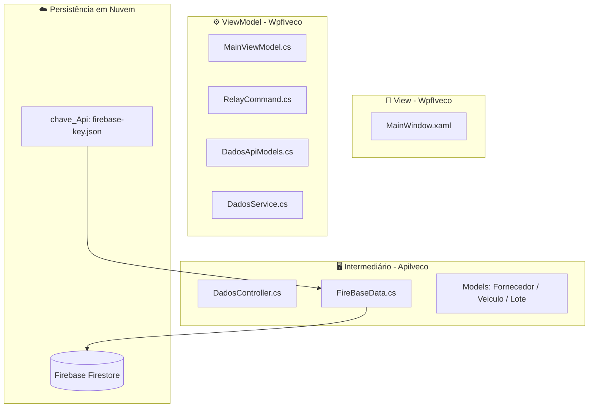
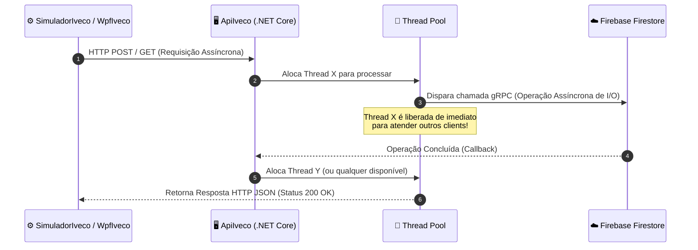
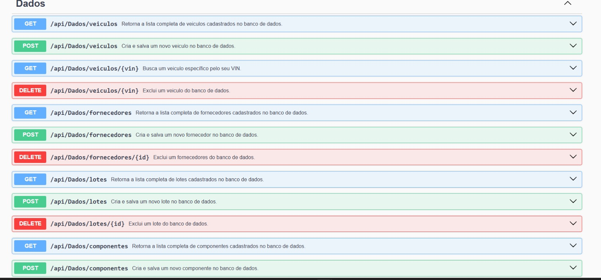
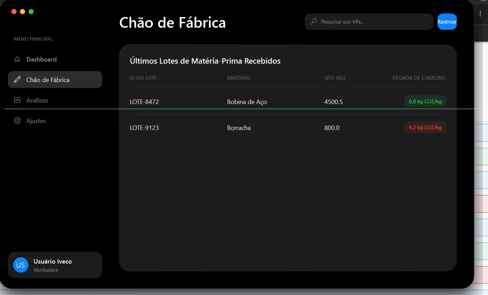

# 📦🍃 Sistema de Rastreamento Inteligente

### Trabalho de Conclusão de Curso - Desenvolvimento de Sistemas

### Escola De Programação e Robótica - SENAI 

#### Orientado por: Fred Aguiar

  👥 Equipe de Desenvolvimento

 <strong>Colaboradores:</strong>  <a href="https://github.com/aliceandradee">🧑‍💻 Alice Andrade</a> | <a href="https://github.com/erick190813">🧑‍💻 Erick Santos</a> | <a href="https://github.com/NicolasOlim">🧑‍💻 Nicolas Olim</a> | <a href="https://github.com/vnxtry">🧑‍💻 Vinicius Auusto</a> 

# Proposta de Valor: Sistema de Rastreamento Inteligente (Projeto Iveco)

**Contexto:** Solução tecnológica voltada para a rastreabilidade logística e a transparência ambiental na cadeia de suprimentos da indústria automotiva pesada.

---

## 🎯 Principais Pilares de Valor

### 📦 1. Gerenciamento e Rastreabilidade Logística
* **Monitoramento em Tempo Real:** Capacidade de catalogar insumos e rastrear a produção instantaneamente.
* **Controle de Suprimentos:** Gestão integrada que atende à complexidade logística da manufatura de veículos industriais.

### 🌱 2. Sustentabilidade e Conformidade ESG
* **Cálculo da Pegada de Carbono:** Automação no cálculo da emissão de gases de efeito estufa para a frota.
* **Alinhamento a Diretrizes:** Facilita o atendimento aos rigorosos requisitos de conformidade e auditoria estabelecidos pelas políticas Ambientais, Sociais e de Governança Corporativa (ESG).

### ⚙️ 3. Infraestrutura de Alta Performance e Resiliência
* **Arquitetura Distribuída:** Solução escalável, migrada para um ecossistema em nuvem (NoSQL) e estruturada para suportar a demanda de uma produção em escala industrial.
* **Processamento Concorrente:** Absorve alta demanda de telemetria e sensores IoT sem interrupções (Thread Pool e fluxo assíncrono), garantindo integridade e resposta ágil às linhas de produção.

### 📊 4. Ferramenta Estratégica de Monitoramento
* **Inteligência de Dados:** Atua como o núcleo de governança e painel de controle administrativo das operações logísticas (Dashboards ricos e interativos).
* **Comprovação Ecológica:** Estruturada para atuar como prova estratégica de responsabilidade ecológica e eficiência da operação.

## 🛠️ Tecnologias e Stack

  
  
  
  
  
  
  
  
  
  
  
  
  
  
  

---

## Documentação do Ecossistema: Cadeia de Suprimentos, Veículos e Persistência em Nuvem

Bem-vindo à documentação do ecossistema de software desenvolvido para o gerenciamento, rastreabilidade e monitoramento ambiental da cadeia de suprimentos de veículos Iveco. Este ecossistema é distribuído, composto por uma **API REST Core**, uma interface visual **WPF (Desktop)** baseada no padrão **MVVM**, um **Simulador** e armazenamento distribuído via **Firebase Firestore**. O nosso projeto é uma evolução do protótipo entregue no SAGA SENAI, onde foi remodelado para operarmos com a arquitetura e codificação do código com base os conhecimentos adquiridos no curso técnico de Desenvolvimento De Sistemas e como nosso projeto de conclusão de curso, sendo assim dividimos a nossa solução em três projetos, sendo eles:
1. **`ApiIveco` (Back-End)**: API Web construída em ASP.NET Core que centraliza as regras de negócio, expõe endpoints documentados via **Swagger** e faz a comunicação segura com a nuvem utilizando o SDK oficial do Google Cloud.
2. **`WpfIveco` (Front-End Desktop)**: Aplicação visual rica desenvolvida para o painel de controlo (dashboard) que consome os microsserviços da API, estruturada estritamente sob o padrão **MVVM (Model-View-ViewModel)** e com gráficos interativos via **LiveCharts2 (SkiaSharp)**.
3. **`SimuladorIveco` (Utilitário)**: Aplicação em modo Console responsável por simular e injetar dados contínuos de telemetria e produção para testes de carga e desempenho do ecossistema.
4. **`Firebase Firestore` (Banco de Dados)**: Banco de dados NoSQL baseado em nuvem, garantindo a persistência assíncrona, escalabilidade e atualizações em tempo real.

Contendo assim a seguinte arquitetura e estrutura de pastas:

---
    
## 📊 Diagramas e Modelagem

Para facilitar o entendimento da arquitetura, consulte a evolução e os fluxos de modelagem do projeto:

### Modelo Conceitual e Fluxo de Dados (NoSQL)
O fluxo de persistência opera de forma assíncrona, onde os clients se comunicam com a API centralizada, que por sua vez gerencia o estado das coleções na nuvem de maneira isolada.

### Modelo Lógico / Estrutura de Documentos
Diferente do modelo puramente relacional inicial (SQLite), os dados agora são mapeados em documentos NoSQL expansíveis, mantendo IDs de amarração lógica para garantir integridade analítica e cálculos corretos de pegada de carbono.

---

## 🚨 Migração de Infraestrutura (Incidentes de Git & Firebase)

Durante o ciclo de desenvolvimento do projeto, a equipa de engenharia enfrentou um **incidente crítico de controlo de versão (Git)** ao tentar sincronizar e subir um novo conjunto de alterações com refatorações complexas de código. Esse conflito gerou uma dessincronização severa no histórico de commits e corrompeu a árvore de rastreamento local das migrações do banco de dados relacional anterior. Sabendo disso deixamos o nosso git antigo e com as versões que estavam sendo trabalhadas anteriormente para consulta: 

https://github.com/NicolasOlim/Implementacao-do-MVVM-no-Projeto-Iveco.git

### A Solução e Transição para Nuvem:
Para mitigar a perda de dados, contornar os gargalos locais criados pelo Git e evoluir a infraestrutura para um cenário de produção robusto e moderno, tomamos as seguintes decisões de arquitetura:

1. **Descarte do Banco Local**: O banco de dados SQLite local foi completamente descontinuado devido à corrupção e histórico quebrado.
2. **Adoção do Firebase Firestore**: Implementamos a persistência de dados em nuvem utilizando o **Firebase Firestore**. Toda a árvore de dados foi reestruturada para o modelo NoSQL orientado a documentos.
3. **Segurança e Isolamento por API**: Para evitar que chaves privadas de serviços em nuvem ficassem vulneráveis ou expostas diretamente no cliente Desktop (WPF), isolamos a conexão do Firebase dentro do projeto `ApiIveco`, protegida por autenticação via conta de serviço em arquivo `.json`.

## Metodologia e Desenvolvimento (Comunicação e Protocolos de Rede)

Para sustentar um ecossistema distribuído onde múltiplos clientes realizam requisições simultâneas, a camada de Back-End (`ApiIveco`) foi desenvolvida utilizando o paradigma de **Programação Assíncrona** nativo do .NET 8, baseado no padrão `async/await`.

#### Funcionamento do Thread Pool do Servidor:
Quando o `SimuladorIveco` (injetando milhares de registros de telemetria) e a interface visual `WpfIveco` (solicitando atualizações para os gráficos) realizam requisições HTTP **concorrentemente**, o servidor gerencia o fluxo sem sofrer com gargalos de travamento:

* **Devolução de Threads:** Ao iniciar uma operação de I/O (como salvar ou buscar um documento no banco de dados remoto Firebase Firestore), a thread que estava tratando aquela requisição HTTP é devolvida instantaneamente ao *Thread Pool* da aplicação.
* **Entrada e saída:** O servidor não fica parado esperando a resposta da nuvem do Google Cloud. Ele continua livre para responder a novas requisições vindas da fábrica ou do dashboard.
* **Retorno Eficiente:** Assim que o Firebase responde informando que a gravação ou leitura foi concluída, o .NET designa a próxima thread disponível para finalizar a resposta HTTP, enviando o JSON de volta ao cliente.

Este mecanismo garante que a interface desktop (`WpfIveco`) permaneça fluida, responsiva e com taxas de atualização em tempo real, sem congelamentos de tela enquanto aguarda o processamento de grandes volumes de dados enviados pelo simulador.

---

## Conhecendo cada camada do projeto

### 🗂️ Camada de serviços intermediários - API (ApiIveco)

A ApiIveco atua como o núcleo inteligente e centralizador de dados de todo o ecossistema. Desenvolvida sob o ecossistema .NET 8 com o ecossistema ASP.NET Core Web API, ela adota o estilo arquitetural REST (Representational State Transfer), utilizando o protocolo HTTP/HTTPS e payloads em formato JSON para a comunicação entre sistemas. A principal justificativa para a implementação desta camada intermediária é o desacoplamento e a segurança da informação: em vez de expor as regras de negócio e as credenciais confidenciais de nuvem diretamente nas pontas (clientes), a API encapsula o acesso ao banco de dados e expõe apenas portas controladas (endpoints). Adicionalmente, a API desempenha um papel fundamental na governança dos dados ao integrar o SDK oficial do Google Cloud para a comunicação com o Firebase Firestore. As requisições recebidas passam por processos de validação de dados nas entidades antes de dispararem os métodos assíncronos de persistência em nuvem. Para garantir a transparência no desenvolvimento e facilitar a integração contínua entre os colaboradores, a aplicação conta com a documentação automatizada via Swagger (OpenAPI), fornecendo uma interface interativa onde todos os endpoints de consulta, inserção e agregação podem ser validados e testados em tempo real.

---

### 🗂️ Camada da Interface Gráfica - WPF (WpfIveco)

A camada **WpfIveco** foi desenvolvida utilizando a tecnologia Windows Presentation Foundation (WPF) e estruturada rigorosamente sob o padrão de projeto arquitetural **MVVM (Model-View-ViewModel)**. O objetivo primordial dessa abordagem é a completa separação de responsabilidades entre a interface gráfica com o usuário (View escrita em XAML) e a lógica de apresentação e regras de negócio (ViewModel escrita em C#). 

Essa arquitetura elimina a dependência de códigos complexos e acoplados diretamente no arquivo de eventos da tela (*code-behind*), delegando a renderização e o controle de dados aos mecanismos nativos de **Data Binding** bidirecional e à implementação da interface `INotifyPropertyChanged`. Dessa forma, a interface reage e se atualiza automaticamente a cada alteração de estado no domínio da aplicação.

#### 🚀 Detalhamento Técnico e Implementações Avançadas

* **Padrão MVVM Puro e Data Binding:** A interface utiliza intensamente o motor de binding do WPF para conectar propriedades da `ViewModel` (como indicadores de `TotalVeiculos`, `MediaCarbono` e inputs de `CnpjBusca`) diretamente aos componentes visuais[cite: 1]. Isso garante que a UI seja apenas um reflexo do estado atual dos dados[cite: 1].
* **Renderização Dinâmica de Coleções (ItemsControl):** Na aba de rastreabilidade, a exibição de dados estáticos foi substituída por um componente inteligente `ItemsControl`[cite: 1]. Ele consome a coleção observável `ListaVeiculos`, mapeando automaticamente propriedades do banco de dados (como `{Binding Modelo}`, `{Binding Vin}` e `{Binding DataMontagem}`) para dentro de um `DataTemplate` customizado, gerando cards de forma dinâmica conforme o banco é atualizado[cite: 1].
* **State Management e Navegação Declarativa:** O roteamento entre os módulos do sistema (Dashboard, Gestão de Fornecedores, Análises ESG e Configurações) descarta o uso tradicional de múltiplas janelas (Windows) ou frames de navegação complexos. Em vez disso, utiliza um sistema inteligente de `DataTriggers` que escuta a propriedade `AbaAtiva` e altera a visibilidade (`Visibility`) das `Grids` conteinerizadas[cite: 1]. A transição é despachada via `ICommand` (`MudarAbaCommand`)[cite: 1].
* **Arquitetura Orientada a Comandos (Command Pattern):** Interações do utilizador (cliques, submissões de formulário) não acionam eventos de clique convencionais (`Click=""`). Tudo é controlado via comandos injetáveis, como:
  * `ConsultarCnpjCommand`: Para integração via API com a Receita Federal[cite: 1].
  * `PesquisarVinCommand`: Para busca de ativos (Gêmeos Digitais) na rede[cite: 1].
  * `SalvarFornecedorCommand`: Para registo de novos nós permissionados[cite: 1].
* **Design System Customizado e UI/UX Premium:** A aplicação adota uma estética *Dark Mode* moderna e imersiva. Para alcançar esse resultado, a moldura padrão do Windows foi removida (`WindowStyle="None"`, `AllowsTransparency="True"`) e os controlos de janela foram recriados do zero[cite: 1]. O projeto conta com um dicionário de recursos rico, definindo `Styles` globais (como `PremiumCardStyle` e `PremiumTextBoxStyle`) que padronizam cores institucionais, sombras em tempo real (`DropShadowEffect`), bordas fluidas (`CornerRadius`) e iconografia vetorial via *Segoe MDL2 Assets*[cite: 1].
* **Ferramentas de Teste Integradas na UI:** A interface foi projetada para suportar monitorização de testes de carga, incluindo um painel de configurações (`Ajustes`) que permite acionar um "Simulador de Chão de Fábrica (Mock IoT)" via `LigarDesligarSimuladorCommand`, gerando telemetria em tempo real para os bancos de dados em nuvem[cite: 1].
---

