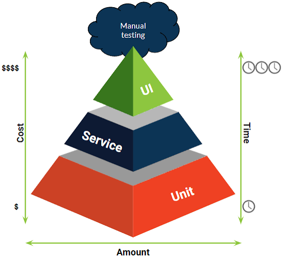

# 📦🍃  Iveco Green Ledger – Testes Executados Na Service

 <div class="logo-container" align="center">
 
</div>

## **Informações Gerais**
- **Nome do Sistema:** Iveco Green Ledger
- **Componente Testado:** `EmailValidationService` e `DadosService`
- **Arquivo de Teste:** `EmailValidationServiceTestes.cs` e `DadosServiceTestes.cs`
- **Autor da Suíte:** [🧑‍💻 Alice Andrade](https://github.com/aliceandradee)
- **Data de Entrega:** 25 de Agosto de 2026
- **Arquitetura Técnica dos Testes:** 

  * **Framework de Testes:** xUnit (v2.9.3)
  * **Simulação de Dependências (Mocks):** Moq (v4.20.72) para isolamento de `ILogger` e `IMemoryCache`
  * **Testes Parametrizados:** Utilização de `[Theory]` e `[InlineData]` para validação de múltiplos cenários por método
  * **Padrão de Execução:** AAA (Arrange, Act, Assert) com asserções `Assert.True`, `Assert.False`, `Assert.Equal` e `Assert.ThrowsAsync`

---

  ## **Objetivo e Responsabilidade dos Componentes:**

  As classes de serviço centralizam as regras de negócio cruciais de segurança de acesso e integridade de dados na API do projeto.

  **1-) `EmailValidationService`**

  * **O que faz?** Valida se o email informado no cadastro / login pertence estritamente ao domínio corporativo `@iveco.com`, tratando espaços extras e caracteres maiúsculos / minúsculos.
  * **Problema que resolve:** Impede o acesso indevido por emails de provedores públicos (`gmail`, `yahoo`) ou com extensões incorretas (`.com.br`).

**2-) DadosService:** 

 * **O que faz?** Intercepta chamadas de criação de lotes de matéria prima, cadastro de peças e exclusões de registros.
 * **Problema que resolve:** Impede a gravação de dados inconsistentes (pesos zerados, pegada de carbono negativa, datas no futuro e IDs / VINs nulos) no banco de dados Firebase / SQLite.

---

## **Mapeamento da Estrutura de Diretórios:**

Os arquivos de testes unitários estão organizados na pasta `Service` do projeto de testes:


 * **`DadosServiceTestes.cs`:** Contém 6 métodos de testes focados em validações de domínio de lotes, peças, fornecedores e veículos.
 * **`EmailValidationServiceTestes.cs`:** Contém 3 métodos de teste focados nas regras de email corporativo.

  ---

  ## **Detalhamento dos 9 Testes Unitários**

  A suíte completa é composta por 9 métodos de teste que se desdobram em 19 execuções individuais no Gerenciador de Testes devido o uso do `InlineData`. 

  **Módulo 1 - Validações de Email (`EmailValidationServiceTestes.cs)`**

- ***Teste 01: Emails válidos com domínio IVECO:*** 

  * **Método:** `ValidateEmailAsync_EmailComDominioIveco_DeveRetornarTrue`
  * **Entradas:** `[InlineData]: " funcionario@iveco.com ", " ADMIN@IVECO.COM ", " teste.ponto@iveco.com "` (3 execuções)
  * **O que verifica:** Confirma que os emails com domínio @iveco.com são aceitos, mesmo com espaços extras ou letras maiúsculas

```csharp

[Theory]
[InlineData("funcionario@iveco.com")]
[InlineData("  ADMIN@IVECO.COM  ")]
[InlineData("teste.ponto@iveco.com")]
public async Task ValidateEmailAsync_EmailComDominioIveco_DeveRetornarTrue(string email)
{
    // Arrange
    var service = new EmailValidationService();

    // Act
    var resultado = await service.ValidateEmailAsync(email);

    // Assert
    Assert.True(resultado.isValid);
    Assert.Equal("E-mail válido (domínio IVECO).", resultado.message);
}

```

---

- ***Teste 02: Emails sem domínio IVECO:*** 

  * **Método:** `ValidateEmailAsync_EmailSemDominioIveco_DeveRetornarFalse`
  * **Entradas:** `[InlineData]: " usuario@gmail.com ", " funcionario@iveco.com.br ", " iveco.com@yahoo.com "` (3 execuções)
  * **O que verifica:** Bloqueia emails fora do padrão corporativo ou com falsos domínios

```csharp

[Theory]
[InlineData("usuario@gmail.com")]
[InlineData("funcionario@iveco.com.br")]
[InlineData("iveco.com@yahoo.com")]
public async Task ValidateEmailAsync_EmailSemDominioIveco_DeveRetornarFalse(string email)
{
    // Arrange
    var service = new EmailValidationService();

    // Act
    var resultado = await service.ValidateEmailAsync(email);

    // Assert
    Assert.False(resultado.isValid);
    Assert.Equal("Apenas e-mails com domínio @iveco.com são permitidos.", resultado.message);
}

```

---

- ***Teste 03: Email nulo, vazio ou apenas espaços:*** 

  * **Método:** `ValidateEmailAsync_EmailNuloOuVazio_DeveRetornarFalse`
  * **Entradas:** `[InlineData]: "", "  ", null` (3 execuções)
  * **O que verifica:** Impede o prosseguimento da validação caso o campo esteja em branco.

```csharp

[Theory]
[InlineData("")]
[InlineData("   ")]
[InlineData(null)]
public async Task ValidateEmailAsync_EmailNuloOuVazio_DeveRetornarFalse(string email)
{
    // Arrange
    var service = new EmailValidationService();

    // Act
    var resultado = await service.ValidateEmailAsync(email);

    // Assert
    Assert.False(resultado.isValid);
    Assert.Equal("O e-mail é obrigatório.", resultado.message);
}

```

---

**Módulo 2 - Validações de Dados (`DadosServiceTestes.cs)`**

- ***Teste 04: Quantidade de matéria-prima inválida:*** 

  * **Método:** `CriarLoteMateriaPrima_QuantidadeInvalida_DeveLancarArgumentException`
  * **Entradas:** `[InlineData]: 0, -10.5` (2 execuções)
  * **O que verifica:** Bloqueia a criação de lotes com quantidade menor ou igual a zero

```csharp

[Theory]
[InlineData(0)]
[InlineData(-10.5)]
public async Task CriarLoteMateriaPrima_QuantidadeInvalida_DeveLancarArgumentException(double quantidadeInvalida)
{
    // Arrange
    var lote = new LoteMateriaPrima
    {
        QuantidadeKg = quantidadeInvalida,
        PegadaCarbonoPorKg = 1.0
    };

    // Act & Assert
    var excecao = await Assert.ThrowsAsync<ArgumentException>(() => _dadosService.CriarLoteMateriaPrima(lote));
    Assert.Equal("A quantidade de matéria-prima (Kg) deve ser maior que zero.", excecao.Message);
}

```

---

- ***Teste 05: Pegada de carbono negativa:*** 

  * **Método:** `CriarLoteMateriaPrima_PegadaCarbonoNegativa_DeveLancarArgumentException`
  * **Entradas:** `[InlineData]: PegadaCarbonoPorKg = -0.5` (1 execução)
  * **O que verifica:** Impede a inserção de fatores de emissão negativos

```csharp

[Fact]
public async Task CriarLoteMateriaPrima_PegadaCarbonoNegativa_DeveLancarArgumentException()
{
    // Arrange
    var lote = new LoteMateriaPrima
    {
        QuantidadeKg = 100,
        PegadaCarbonoPorKg = -0.5
    };

    // Act & Assert
    var excecao = await Assert.ThrowsAsync<ArgumentException>(() => _dadosService.CriarLoteMateriaPrima(lote));
    Assert.Equal("O fator de Pegada de Carbono não pode ser um número negativo.", excecao.Message);
}

```

---

- ***Teste 06: Data de Produção no futuro:*** 

  * **Método:** `CriarLoteMateriaPrima_DataNoFuturo_DeveLancarArgumentException`
  * **Entradas:** `[Fact]: DataProducao = DateTime.UtcNow.AddDays(1)` (1 execução)
  * **O que verifica:** Rejeita registros de produção com data posterior ao dia atual

```csharp

[Fact]
public async Task CriarLoteMateriaPrima_DataNoFuturo_DeveLancarArgumentException()
{
    // Arrange
    var lote = new LoteMateriaPrima
    {
        QuantidadeKg = 100,
        PegadaCarbonoPorKg = 1.0,
        DataProducao = DateTime.UtcNow.AddDays(1)
    };

    // Act & Assert
    var excecao = await Assert.ThrowsAsync<ArgumentException>(() => _dadosService.CriarLoteMateriaPrima(lote));
    Assert.Equal("Violação Temporal: A data de produção do lote não pode estar no futuro.", excecao.Message);
}

```

---

- ***Teste 07: Peso de peça / componente inválido:*** 

  * **Método:** `CriarLoteMateriaPrima_PesoInvalido_DeveLancarArgumentException`
  * **Entradas:** `[InlineData]: 0, -5` (2 execuções)
  * **O que verifica:** Impede o cadastro de componentes veiculares sem peso

```csharp

[Theory]
[InlineData(0)]
[InlineData(-5)]
public async Task CriarVeiculoComponente_PesoInvalido_DeveLancarArgumentException(double pesoInvalido)
{
    // Arrange
    var componente = new VeiculoComponente { PesoKg = pesoInvalido };

    // Act & Assert
    var excecao = await Assert.ThrowsAsync<ArgumentException>(() => _dadosService.CriarVeiculoComponente(componente));
    Assert.Equal("O peso da peça deve ser maior que zero.", excecao.Message);
}

```

---

- ***Teste 08: Exclusão de fornecedor sem ID:*** 

  * **Método:** `ExcluirFornecedor_IdVazioOuNulo_DeveLancarArgumentException`
  * **Entradas:** `[InlineData]: "", null` (2 execuções)
  * **O que verifica:** Garante que a exclusão exija um ID válido

```csharp

[Theory]
[InlineData("")]
[InlineData(null)]
public async Task ExcluirFornecedor_IdVazioOuNulo_DeveLancarArgumentException(string idInvalido)
{
    // Act & Assert
    var excecao = await Assert.ThrowsAsync<ArgumentException>(() => _dadosService.ExcluirFornecedor(idInvalido));
    Assert.Equal("O ID do fornecedor não pode ser nulo ou vazio.", excecao.Message);
}

```

---

- ***Teste 09: Exclusão de veículo sem VIN:*** 

  * **Método:** `ExcluirVeiculo_VinVazioOuNulo_DeveLancarArgumentException`
  * **Entradas:** `[InlineData]: "", null` (2 execuções)
  * **O que verifica:** Impede tentativas de exclusão de veículos sem informar o Chassi / VIN

```Csharp

[Theory]
[InlineData("")]
[InlineData(null)]
public async Task ExcluirVeiculo_VinVazioOuNulo_DeveLancarArgumentException(string vinInvalido)
{
    // Act & Assert
    var excecao = await Assert.ThrowsAsync<ArgumentException>(() => _dadosService.ExcluirVeiculo(vinInvalido));
    Assert.Equal("O VIN não pode ser nulo ou vazio.", excecao.Message);
}

```

---

## ** Ferramentas, Mocks e Recursos Utilizados**

| Recurso / Ferramenta | Versão / Tipo | Finalidade na suíte de testes |
| :--- | :--- | :--- |
| **xUnit** | 2.9.3 (Framework) | Mapeamento e execução dos testes `[Fact], [Theory], [InlineData]` |
| **Moq** | 4.20.72 (Biblioteca) | Isolamento do logger (`ÌLogger<DadosService>`) e do cache (`IMemoryCache`) |
| **Assert.ThrowAsync** | Método xUnit | Captura e validação de exceções `ArgumentException` em métodos assíncronos |
| **Assert.True / Assert.False** | Método xUnit | Verificação dos retornos booleanos na validação de email |

---

## **Execução e Resultados no Gerenciador de Testes**

A execução completa dos 9 métodos de teste resultou em 19 execuções individuais aprovadas no Visual Studio.


- **Resumo da Suíte:** 

  * **Status Geral:** 100% aprovados
  * **Total de execuções individuais:** 19 testes aprovados (9 do EmailValidation + 10 do DadosService)
  * **Tempo total de execução:** 179 ms

---


*Projeto desenvolvido para fins educacionais no Curso Técnico em Desenvolvimento de Sistemas – SENAI / Escola de Programação e Robótica.*  
*Última atualização: 26 de agosto de 2026.*
