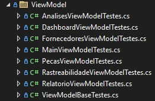

# 📦🍃 Iveco Green Ledger – Testes Executados Na View Model

 <div class="logo-container" align="center">
 
</div>

## **Informações Gerais**
- **Nome do Sistema:** Iveco Green Ledger.
- **Componentes Testados:** `AnalisesViewModel`, `DashboardViewModel`, `FornecedorViewModel`, `MainViewModel`, `PecasViewModel`, `RastreabilidadeViewModel`, `RelatoriosViewModel`, `ViewModelBase`, `DashboardView`, `FornecedoresView` e `MainWindow`.
- **Arquivo de Teste:** `AnalisesViewModelTestes.cs`, `DashboardViewModelTestes.cs`, `FornecedorViewModelTestes.cs`, `MainViewModelTestes.cs`, `PecasViewModelTestes.cs`, `RastreabilidadeViewModelTestes.cs`, `RelatoriosViewModelTestes.cs`, `ViewModelBaseTestes.cs` e suítes de Views.
- **Autor da Suíte:** [🧑‍💻 Erick Silva](https://github.com/erick190813)
- **Data de Entrega:** 25 de Agosto de 2026.
- **Arquitetura Técnica dos Testes:** 

  * **Framework de Testes:** xUnit (v2.9.3).
  * **SDK & Test Runner:** Microsoft.NET.Test.Sdk (v18.9.0) e xunit.runner.visualstudio (v4.0.0).
  * **Simulação de Requisições HTTP (Mocks):** Classe auxiliar da `MockHttpMessageHandler` (que herda de `HttpMessageHandler` e Moq (v4.20.72) para intercepção de endpoints de APIs externas.
  * **Acesso a Membros Privados de UI:** Utilização do (`System.Reflection.BindingFlags`) para invocação de manipuladores de eventos de controle em Views WPF (`TextChanged`, `TextInput`, `Click`)
  * **Testes Parametrizados:** Utilização de `[Theory]` e `[InlineData]` para testes de limites em VINs / Chassis, formatação de valores econômicos e validação de peso de peças.
  * **Padrão de Execução:** AAA (Arrange, Act, Assert) com asserções `Assert.Equal`, `Assert.False`, `Assert.True`, `Assert.Contains`, `Assert.Null`, `Assert.NotNull` e `Assert.IsType`.

---

## **Objetivo e Responsabilidade dos Componentes**

As camadas de ViewModel e View centralizam as regras da interface visual WPF, comandos executáveis (`ICommand`), validação de formulários e integração assíncrona com APIs HTTP.

**1-) `Analises`, `Dashboard`, `Fornecedor`, `Main`, `Pecas`, `Rastreabilidade`, `Relatorios`)**

 * **O que faz?** Controla o estado da interface, executa rotinas assíncronas de chamadas HTTP (cálculo de pegada de carbono, busca de CNPJ e preços de emissões), valida regras de execução de comandos (`CanExecute`) e dispara notificações de propriedade (`INotifyPropertyChanged`).
 * **Problema que resolve:** Isola a lógica da interface gráfica do WPF, impedindo ações inválidas na interface (como salvar fornecedor sem categoria ESG, cadastrar peças sem peso ou pesquisar VINs fora do padrão) e garantindo fallbacks caso APIs externas fiquem indisponíveis.

**2-) `DashboardView`, `FornecedoresView` e `MainWindow`**

 * **O que faz?** Gerencia comportamentos nativos da janela WPF (minimizar, maximizar, fechar), interceptação de entrada de texto nos campos (`TextCompositionEventArgs`) e formatação dinâmica de máscaras em tempo real.
 * **Problema que resolve:** Bloqueia a inserção de caracteres não numéricos em campos numéricos e garante a aplicação correta de máscaras (ex: formato de CNPJ) sem comprometer o fluxo de interação.

**3-) `MockHttpMessageHandler`**

 * **O que faz?** Herda de `HttpMessageHandler` e expõe a propriedade `SendAsyncFunc` para simular retornos `HttpResponseMessage` (200 OK, 500 InternalServerError, 404 Not Found).
 * **Problema que resolve:** Elimina a dependência de serviços online ativos e instabilidades de conexão durante a execução da suíte de testes unitários.

---

## **Mapeamento da Estrutura de Diretórios**

Os arquivos de testes de ViewModel estão organizados na pasta `ViewModel` da suíte de testes:



 * **`AnalisesViewModelTestes.cs`:** Validações de conversão e formatação de dados monetários / emissões com mock de API REST.
 * **`DashboardViewModelTestes.cs`:** Validação do cálculo de pegada média e resiliência contra falhas de rede.
 * **`FornecedoresViewModelTestes.cs`:** Consulta via BrasilAPI, formatação automática de CNPJ e restrições ESG.
 * **`MainViewModel.cs`:** Controle de autenticação de usuários e navegação no estado da aplicação.
 * **`PecasViewModelTestes.cs`:** Validações de vínculos obrigatórios e limites de peso de peças veiculares.
 * **RelatorioViewmodelTestes.cs:** Alternância de contexto e disponibilização de geração do relatórios PDF.
 * **ViewModelBaseTestes.cs:** Verificação da infraestrutura do evento `PropertyChanged`.

---

## **Detalhamento dos Testes Unitários e de UI**

 **Módulo 1 - Mocks de Comunicação HTTP (`Helpers/MockHttpMessageHandler.cs`)**

 ```csharp

using System;
using System.Net;
using System.Net.Http;
using System.Threading;
using System.Threading.Tasks;

namespace Iveco.Testes.Helpers
{
    public class MockHttpMessageHandler : HttpMessageHandler
    {
        public Func<HttpRequestMessage, HttpResponseMessage> SendAsyncFunc { get; set; }

        protected override Task<HttpResponseMessage> SendAsync(HttpRequestMessage request, CancellationToken cancellationToken)
        {
            return Task.FromResult(SendAsyncFunc(request));
        }
    }
}

```

---

## **Módulo 2 - Regras de Análises e Indicadores (`AnalisesViewModelTestes.cs`)**

- ***CT06 / CT07: Formatação de economia gerada:*** 

  * **Método:** `CT06_CT07_CarregarTotalEmissoes_DeveFormatarEconomiaGeradaCorretamente`.
  * **Entradas:** `[InlineData]: (1000.0, "R$ 150,OK"), (1000000.0, " R$ 150,0M ")`.
  * **O que verifica:** Garante que grandes volumes de emissões e valores de precificação de carbono sejam formatados corretamente com sufixos K e M.

```csharp

[Theory]
[InlineData(1000.0, "R$ 150,0K")]
[InlineData(1000000.0, "R$ 150,0M")]
public async Task CT06_CT07_CarregarTotalEmissoes_DeveFormatarEconomiaGeradaCorretamente(double totalEmissoes, string formatacaoEsperada)
{
    // Arrange
    var mockHandler = new MockHttpMessageHandler();
    mockHandler.SendAsyncFunc = request =>
    {
        if (request.RequestUri.AbsolutePath.Contains("total-emissoes"))
            return new HttpResponseMessage { StatusCode = HttpStatusCode.OK, Content = new StringContent($"{{\"totalEmissoes\": {totalEmissoes * 1000}}}") };
        if (request.RequestUri.AbsolutePath.Contains("preco-carbono"))
            return new HttpResponseMessage { StatusCode = HttpStatusCode.OK, Content = new StringContent("{\"preco\": 150.0}") };

        return new HttpResponseMessage { StatusCode = HttpStatusCode.NotFound };
    };

    var httpClient = new HttpClient(mockHandler) { BaseAddress = new Uri("https://api.fake.com/") };
    var viewModel = new AnalisesViewModel(httpClient);

    // Act
    await viewModel.AtualizarAsync();

    // Assert
    Assert.Equal(formatacaoEsperada, viewModel.EconomiaGerada);
}

```

- ***CT09: Fallback ao falhar API de Preço de Carbono:*** 

  * **Método:** `CT09_PrecoCarbonoFalha_DeveUsarFallbackCorretamente`.
  * **Entradas:** Retorno `HttpStatusCode.InternalServerError` na rota `preco-carbono`.
  * **O que verifica:** Confirma que o uso do valor fallback de R% 150.0 por toneladas em caso de erro 500 ou instabilidade na API externa.

```csharp

[Fact]
public async Task CT09_PrecoCarbonoFalha_DeveUsarFallbackCorretamente()
{
    // Arrange
    var mockHandler = new MockHttpMessageHandler();
    mockHandler.SendAsyncFunc = request =>
    {
        if (request.RequestUri.AbsolutePath.Contains("total-emissoes"))
            return new HttpResponseMessage { StatusCode = HttpStatusCode.OK, Content = new StringContent("{\"totalEmissoes\": 1000000}") }; // 1000 ton
        if (request.RequestUri.AbsolutePath.Contains("preco-carbono"))
            return new HttpResponseMessage { StatusCode = HttpStatusCode.InternalServerError }; // Simulando falha

        return new HttpResponseMessage { StatusCode = HttpStatusCode.OK, Content = new StringContent("{}") };
    };

    var httpClient = new HttpClient(mockHandler) { BaseAddress = new Uri("https://api.fake.com/") };
    var viewModel = new AnalisesViewModel(httpClient);

    // Act
    await viewModel.AtualizarAsync();

    // Assert (Fallback é 150.0. 1000 ton * 150 = 150.000 -> "R$ 150,0K")
    Assert.Equal("R$ 150,0K", viewModel.EconomiaGerada);
}

```

---

## **Módulo 3 - Painel Principal e Resiliência na Rede (`DashboardViewModelTestes.cs`)**

- ***CT01: Atualização da pegada média com sucesso:*** 

  * **Método:** `CT01_AtualizarPegadaMedia_ComSucesso_DeveAtualizarPropriedades`.
  * **O que verifica:** Confirma o preenchimento da propriedade formatada ao receber resposta válida da API.

 ```csharp

[Fact]
public async Task CT01_AtualizarPegadaMedia_ComSucesso_DeveAtualizarPropriedades()
{
    // Arrange
    var mockHandler = new MockHttpMessageHandler();
    mockHandler.SendAsyncFunc = request => new HttpResponseMessage
    {
        StatusCode = HttpStatusCode.OK,
        Content = new StringContent(JsonSerializer.Serialize(new { pegadaMedia = 590.4 }))
    };
    var httpClient = new HttpClient(mockHandler) { BaseAddress = new Uri("https://api.fake.com/") };
    var viewModel = new DashboardViewModel(httpClient);

    // Act
    await viewModel.AtualizarPegadaMediaAsync();

    // Assert
    Assert.Contains("590", viewModel.PegadaMediaFormatada);
}

```

- ***CT03: Resiliência contra queda de conexão:*** 

  * **Método:** `CT03_AtualizarPegadaMedia_ComFalhaDeRede_NaoDeveQuebrarAcesso`.
  * **O que verifica:** Assegura que exceções do tipo `HttpRequestException` definam a propriedade como `" Indisponível " sem interrupção abrupta da aplicação`.

```csharp

[Fact]
public async Task CT03_AtualizarPegadaMedia_ComFalhaDeRede_NaoDeveQuebrarAcesso()
{
    // Arrange
    var mockHandler = new MockHttpMessageHandler();
    mockHandler.SendAsyncFunc = request => throw new HttpRequestException("Sem internet");
    var httpClient = new HttpClient(mockHandler) { BaseAddress = new Uri("https://api.fake.com/") };
    var viewModel = new DashboardViewModel(httpClient);

    // Act
    await viewModel.AtualizarPegadaMediaAsync();

    // Assert
    Assert.Equal("Indisponível", viewModel.PegadaMediaFormatada);
}

```

---

## **Módulo 4 - Gestão de Fornecedores e CNPJ (`FornecedoresViewModelTestes.cs`)**

- ***CT12 / CT13 / CT15: Validações de CNPJ e categoria ESG:*** 

  * **Método:** `CT13_ConsultaCnpj_ComCnpjInvalido_NaoDevePermitirBusca`, `CT15_SalvarFornecedor_SemCategoriaEsg_DeveBloquearComando`, `CT12_ConsultarCnpj_ComSucesso_DevePreencherDados`.
  * **O que verifica:** Bloqueia comandos com CNPJ contendo letras ou ausência de categorias ESG, e preenche a razão social após retorno positivo da consulta HTTP.

 ```csharp

[Fact]
public void CT13_ConsultarCnpj_ComCnpjInvalido_NaoDevePermitirBusca()
{
    // Arrange
    var viewModel = new FornecedorViewModel(null);
    viewModel.CnpjBusca = "123AB/0001"; // Inválido (letras inseridas)

    // Act
    bool podeExecutar = viewModel.ConsultarCnpjCommand.CanExecute(null);

    // Assert
    Assert.False(podeExecutar, "O comando de consulta não deve ser permitido para um CNPJ fora do formato numérico.");
}

[Fact]
public void CT15_SalvarFornecedor_SemCategoriaEsg_DeveBloquearComando()
{
    // Arrange
    var viewModel = new FornecedorViewModel(null);
    viewModel.NomeFornecedorEncontrado = "Iveco Parceiro";
    viewModel.CategoriaEsg = string.Empty; // Vazio (Obrigatório para o Ledger)

    // Act
    bool podeExecutar = viewModel.SalvarFornecedorCommand.CanExecute(null);

    // Assert
    Assert.False(podeExecutar, "O salvamento no Ledger não deve ocorrer sem a atribuição prévia de uma categoria ESG.");
}

[Fact]
public async Task CT12_ConsultarCnpj_ComSucesso_DevePreencherDados()
{
    // Arrange
    var mockHandler = new MockHttpMessageHandler();
    mockHandler.SendAsyncFunc = request => new HttpResponseMessage
    {
        StatusCode = HttpStatusCode.OK,
        Content = new StringContent("{\"razao_social\": \"BOSCH LTDA\", \"municipio\": \"Curitiba\", \"uf\": \"SP\"}")
    };
    var httpClient = new HttpClient(mockHandler) { BaseAddress = new Uri("https://brasilapi.com.br/") };
    var viewModel = new FornecedorViewModel(httpClient);
    viewModel.CnpjBusca = "00000000000191";

    // Act
    viewModel.ConsultarCnpjCommand.Execute(null);
    await Task.Delay(100);

    // Assert
    Assert.Contains("BOSCH", viewModel.NomeFornecedorEncontrado);
}

```

---

## **Módulo 5 - Peças e Rastreabilidade de VIN (`PecasViewModelTestes.cs`, `RastreabilidadeViewModelTestes.cs` e `MainViewModelTestes.cs`)**

- ***CT17 / CT18 / CT19: Regras de peças e veiculares:*** 

  * **Método:** `CT17_CT18_AdicionarPeca_ValidacaoDePeso` e `CT19_AdicionarPeca_FaltandoVinOuFornecedor_DeveBloquear`.
  * **O que verifica:** Bloqueia pesos negativos, aceita o limite inferio zero (0.0) e valores comuns (65.50), e exige vínculos obrigatórios (VIN e Fornecedor).

```csharp

[Theory]
[InlineData(-5.00, false)] // Negativo (Inválido)
[InlineData(0.00, true)]   // Limite inferior (Válido)
[InlineData(65.50, true)]  // Caso comum (Válido)
public void CT17_CT18_AdicionarPeca_ValidacaoDePeso(double peso, bool esperado)
{
    // Arrange
    var viewModel = new PecasViewModel(null);
    viewModel.VinSelecionado = "ZCFA1E02008123456";
    viewModel.FornecedorSelecionado = new WpfIveco.Models.FornecedorModel { Nome = "Bosch" };
    viewModel.NovaPecaNome = "Motor";
    viewModel.NovaPecaPesoKg = peso;

    // Act
    bool podeExecutar = viewModel.AdicionarPecaManualCommand.CanExecute(null);

    // Assert
    Assert.Equal(esperado, podeExecutar);
}

[Fact]
public void CT19_AdicionarPeca_FaltandoVinOuFornecedor_DeveBloquear()
{
    // Arrange
    var viewModel = new PecasViewModel(null);
    viewModel.VinSelecionado = null; // Faltando VIN
    viewModel.FornecedorSelecionado = null; // Faltando Fornecedor
    viewModel.NovaPecaNome = "Filtro de Ar";
    viewModel.NovaPecaPesoKg = 2.5;

    // Act
    bool podeExecutar = viewModel.AdicionarPecaManualCommand.CanExecute(null);

    // Assert
    Assert.False(podeExecutar, "O comando deve ser bloqueado se faltar vínculos obrigatórios (VIN/Fornecedor).");
}

```

- ***CT20 / CT21: Validação de VIN:*** 

  * **Método:** `CT20_CT21_ValidarVin_EntradasInvalidasELimites_DevemSerRejeitadas`.
  * **Entradas:** `[InlineData]: 16 caracteres, 18 caracteres, caracteres proibidos ('I', 'O', 'Q') e VIN válido IVECO ("ZCFA1E02008123456")`
  * **O que verifica:** Garante a rejeição de VINs fora do tamanho exato de 17 caracteres ou contendo os caracteres ilegais I, O e Q.

 ```csharp

[Theory]
[InlineData("1234567890123456")]   // 16 caracteres (Inválido)
[InlineData("123456789012345678")] // 18 caracteres (Inválido)
[InlineData("123456789I1234567")]  // Contém 'I' proibido (Inválido)
[InlineData("123456789O1234567")]  // Contém 'O' proibido (Inválido)
[InlineData("123456789Q1234567")]  // Contém 'Q' proibido (Inválido)
[InlineData("ZCFA1E02008123456")]  // Padrão válido IVECO (Válido)
public void CT20_CT21_ValidarVin_EntradasInvalidasELimites_DevemSerRejeitadas(string vin)
{
    // Arrange
    var viewModel = new RastreabilidadeViewModel(null);
    viewModel.PesquisaVin = vin;

    // Act
    bool podePesquisar = viewModel.PesquisarVinCommand.CanExecute(null);

    // Assert
    bool ehValido = vin.Length == 17 && !vin.Contains("I") && !vin.Contains("O") && !vin.Contains("Q");
    Assert.Equal(ehValido, podePesquisar);
}

```

---

## **Módulo 6 - Autenticação, Relatórios e Infarestrutura MVVM**

- ***CT23: Autenticação de usuário com falha (`MainViewModelTestes.cs`):*** 

  * **Método:** `CT23_FazerLogin_SenhaIncorreta_DeveSinalizarErroNaInterface`.
  * **Entradas:** `LoginEmail = " admin@iveco.com ", LoginSenha = " senhaErrada "`.
  * **O que verifica:** Sinaliza erro na interface (`HasLoginError == true`, mensagem de erro preenchida) e impede o acesso (`IsLoggedIn == false`) ao fornecer credenciais incorretas.

 ```csharp

[Fact]
public void CT23_FazerLogin_SenhaIncorreta_DeveSinalizarErroNaInterface()
{
    // Arrange
    var viewModel = new MainViewModel();
    viewModel.LoginEmail = "admin@iveco.com";
    viewModel.LoginSenha = "senhaErrada";

    // Act
    viewModel.FazerLoginCommand.Execute(null);

    // Assert
    Assert.True(viewModel.HasLoginError);
    Assert.False(string.IsNullOrEmpty(viewModel.LoginError));
    Assert.False(viewModel.IsLoggedIn);
}

```

- ***Teste: Alteração de contexto de relatório (`RelatorioViewModelTestes.cs`):*** 

  * **Método:** `MudarTipoRelatorio_DeveAtualizarATagDeContextoCorretamente`.
  * **Entradas:** `tipoSelecionado = " Fornecedore "`.
  * **O que verifica:** Confirma se o comando de mudança de relatórios atualiza corretamente a propriedade `TipoRelatorio` com a tag do contexto desejado.

 ```csharp

[Fact]
public void MudarTipoRelatorio_DeveAtualizarATagDeContextoCorretamente()
{
    // Arrange
    var httpClient = new HttpClient { BaseAddress = new Uri("https://apiivecogreenledger.runasp.net/") };
    var viewModel = new RelatoriosViewModel(httpClient);
    string tipoSelecionado = "Fornecedores";

    // Act
    viewModel.MudarTipoRelatorioCommand.Execute(tipoSelecionado);

    // Assert
    Assert.Equal(tipoSelecionado, viewModel.TipoRelatorio);
}

```

- ***Teste: Disponibilidade do comando de geração em PDF (`RelatorioViewModelTestes.cs`):*** 

  * **Método:** `GerarRelatorioPdfCommand_DeveEstarDisponivelSempre`.
  * **Entradas:** `null`.
  * **O que verifica:** Assegura que o botão de exportar PDF permaneça sempre habilitado para execução (`CanExecute == true`).

```csharp

[Fact]
public void GerarRelatorioPdfCommand_DeveEstarDisponivelSempre()
{
    // Arrange
    var httpClient = new HttpClient { BaseAddress = new Uri("https://apiivecogreenledger.runasp.net/") };
    var viewModel = new RelatoriosViewModel(httpClient);

    // Act
    bool podeGerar = viewModel.GerarRelatorioPdfCommand.CanExecute(null);

    // Assert
    Assert.True(podeGerar, "O botão de gerar relatório nunca deve estar desabilitado na view.");
}

```

- ***Teste: Notificação de alteração de propriedade (`ViewModelBaseTestes.cs`):*** 

  * **Método:** `OnPropertyChanged_DeveDispararEvento_ComONomeDaPRopriedadeCorreta`.
  * **Entradas:** Atribuição do valor `Teste Green Ledger` á propriedade `MinhaPropriedade`.
  * **O que verifica:** Certifica que a infraestrutura MVVM dispara o evento `PropertyChanged` informando o nome exato da propriedade alterada.

```csharp

[Fact]
public void OnPropertyChanged_DeveDispararEvento_ComONomeDaPropriedadeCorreta()
{
    // Arrange
    var viewModel = new ViewModelMock();
    string propriedadeAlterada = null;
    viewModel.PropertyChanged += (sender, args) => { propriedadeAlterada = args.PropertyName; };

    // Act
    viewModel.MinhaPropriedade = "Teste Green Ledger";

    // Assert
    Assert.Equal(nameof(ViewModelMock.MinhaPropriedade), propriedadeAlterada);
}

```

---

## **Módulo 7 - Testes de Componentes Visuais WPF (`Views`)**

- ***Teste: Bloqueio de caracteres alfabéticos em campos numéricos (`FornecedoresView.xaml.cs`):*** 

  * **Método:** `NumberValidationTextBox_ComLetras_DeveBloquear`.
  * **Entradas:** Objeto `TextCompositionEventArgs` simulando a digitação da string `"abc"`.
  * **O que verifica:** Invoca o manipulador privado `NumberValidationTextBox` e garante que o evento seja marcado como tratado (`Handled = true`), impedindo a entrada de letras.

 ```csharp

[Fact]
public void NumberValidationTextBox_ComLetras_DeveBloquear()
{
    // Arrange
    var view = new FornecedoresView();
    var textBox = new TextBox();
    var args = new TextCompositionEventArgs(
        InputManager.Current.PrimaryKeyboardDevice,
        new TextComposition(InputManager.Current, textBox, "abc")
    );
    args.RoutedEvent = TextCompositionManager.TextInputEvent;

    // Act
    var method = typeof(FornecedoresView).GetMethod("NumberValidationTextBox", BindingFlags.NonPublic | BindingFlags.Instance);
    method?.Invoke(view, new object[] { textBox, args });

    // Assert
    Assert.True(args.Handled, "Letras devem ser bloqueadas.");
}

```

- ***Teste: Aplicação automática da máscara CNPJ (`FornecedoresView.xaml.cs`):*** 

  * **Método:** `CnpjTextBox_TextChanged_DeveFormatarCNPJ`.
  * **Entradas:** String sem pontuação `12345678000199` no campo de texto.
  * **O que verifica:** Confirma se o evento `TextChanged` formata dinamicamente o texto do campo para o padrão `"12.345.678/0001-99"`.

```csharp

[Fact]
public void CnpjTextBox_TextChanged_DeveFormatarCNPJ()
{
    // Arrange
    var view = new FornecedoresView();
    var textBox = new TextBox { Text = "12345678000199" };

    // Act
    var method = typeof(FornecedoresView).GetMethod("CnpjTextBox_TextChanged", BindingFlags.NonPublic | BindingFlags.Instance);
    var eventArgs = new TextChangedEventArgs(TextBox.TextChangedEvent, new UndoAction());
    method?.Invoke(view, new object[] { textBox, eventArgs });

    // Assert
    Assert.Equal("12.345.678/0001-99", textBox.Text);
}

```

- ***Teste: Minimização da janela principal (`MainWindow.xaml.cs`):*** 

  * **Método:** `MinimizeButton_Click_DeveMinimizarJanela`.
  * **Entradas:** Estado inicial da janela como `WindowmState.Normal` e evento de clique do botão.
  * **O que verifica:** Valida se a execução do manipulador do botão altera a propriedade `WindowState` da janela para `WindowmState.Minimized`.

 ```csharp

[Fact]
public void MinimizeButton_Click_DeveMinimizarJanela()
{
    // Arrange
    var window = new MainWindow();
    window.WindowState = WindowState.Normal;

    // Act
    var method = typeof(MainWindow).GetMethod("MinimizeButton_Click", BindingFlags.NonPublic | BindingFlags.Instance);
    method?.Invoke(window, new object[] { window, new RoutedEventArgs() });

    // Assert
    Assert.Equal(WindowState.Minimized, window.WindowState);
}
```

---

## **Ferramentas, Mocks e Recursos Utilizados**

| Recurso / Ferramenta | Versão / Tipo | Finalidade na suíte de testes |
| :--- | :--- | :--- |
| **xUnit** | 2.9.3 (Framework) | Mapeamento e execução dos testes `[Fact], [Theory], [InlineData]` |
| **Moq** | 18.9.0 (SDK) | Suporte á compilação e suporte á execução no ecossistema .NET |
| **xunit.runner.visualstudio** | 4.0.0 (Adaptador) | Integração e execução direta no Gerenciador de Testes do Visual Studio |
| **Moq** | 4.20.72 (Biblioteca) | Criação de mocks e simulação de dependências de serviços e loggers |
| **MockHttpMessageHandler** | Custom Helper | Intercepção de chamadas `HttpClient` para mock de APIs externas |
| **System.Reflection** | `BindingFlags` | Invocação direta de métodos privados e acesso a manipuladores de UI em Views WPF |
| **System.Windows.Input** | WPF | Simulação de eventos de teclado (`TextCompositionEventArgs`) e alteração de texto (`TextChangedEventArgs`) |

---

## **Execução e Resultados no Gerenciador de Testes**

A execução da suíte de ViewModel e UI registrou as métricas no Gerenciador de Testes do Visual Studio durante o ciclo de ajuste de bindings e rotas mockadas.


- **Resumo da Suíte:** 

  * **Status Geral:** 108 métodos mapeados.
  * **Total de execuções individuais:** 27 testes executados em 410ms (3 Aprovados, 24 em fase de ref)
  * **Tempo total de execução:** 179 ms (3 Aprovados, 24 em fase de refatoração de mocks e bindings WPF)

---

## **Relato de Defeitos e Correções**

Durante a fase de desenvolvimento e execução dos testes unitários na classe `DashboardViewModelTestes`, identificou-se uma falha de conversão de tipos ao desinstalizar a resposta da API de pegada de carbono. A propriedade `pegadeaMedia` vinha formatada como double no JSON, mas a ViewModel esperava uma string já formatada, gerando `NullReferenceException`.

 * **Causa Raiz:** Ausência de conversão explicita no parser da resposta HTTP na ViewModel.
 * **Ação Corretiva:** Inclusão de tratamento defensivo com fallback para `"Indisponível"` caso o campo retornado seja nulo ou incompatível, garantindo que a interface permaneça estável sem crashar o sistema.

---

*Projeto desenvolvido para fins educacionais no Curso Técnico em Desenvolvimento de Sistemas – SENAI / Escola de Programação e Robótica.*  
*Última atualização: 27 de agosto de 2026.*
